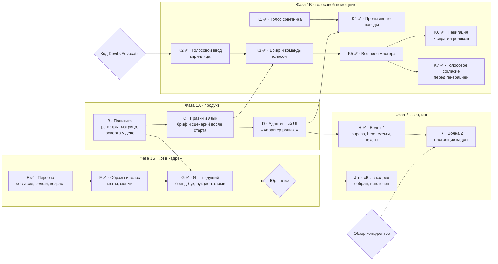

# ТЗ Greeting 2.0: адаптивные правила, личный бренд-бук и аватары «Я в кадре», лендинг по образцу обучалки

Версия 1.11 · 30.09.2026 · **Реализованы этапы A, B, C, D, H (лендинг, волна 1 — схемы), ветка K голосового помощника целиком (K1–K7) и E, F, G «Я в кадре» — за флагом `PERSONA_ENABLED` (выключен), до юридического шлюза людям не открывается (§12). I — кодовая часть сделана, кадры снимает владелец на стенде. J («Вы в кадре») собран и выключен до юридического шлюза; черновик для юриста — `LEGAL-GATE-Persona-DRAFT.md`.**

Редакция 1.7: документ сверен с кодом на 30.09.2026 — статусы этапов в §7, приёмка §8 (отмечено то, что закрыто автотестами), снятые противоречия §4А.3.1, §4А.5 и §10 (Т-23, Т-25), сводный список «Перед деплоем» в конце §12.

Редакция 1.6: §4А сверен с кодом Devil's Advocate (§12, «Сверка с Devil's Advocate») — блокер В-9 снят; требование «язык распознавания задаётся явно» заменено упорядоченными подсказками двух языков; добавлены согласие и уборка у провайдера; движок распознавания — Gemini (В-12, решение владельца).

Редакция 1.4: сделан этап C (§12) — правка брифа и сценария после старта, язык поздравления; снята временная блокировка брифа этапа A.

Редакция 1.5: полное голосовое управление мастером (§4А.7, этапы
K5–K7) — решение владельца продукта 29.09.2026.
Редакция 1.3: сделан этап B (§12); добавлена Фаза 1В — проактивный голосовой помощник по образцу Devil's Advocate (§4А), с этапами K1–K4, приёмкой и аудитом нового раздела (Т-23…Т-29).

Редакция 1.2: сделан этап A (§12).

Редакция 1.1: проведён аудит редакции 1.0 свежим взглядом — 22 находки, все исправлены в тексте, перечень в §10.

Greeting ломается в трёх местах: правила ролика не согласованы с поводом (шутливое соболезнование проходит через «Особый повод»), правки после старта сессии молча не доходят до ролика, а бренд-бук и аватар почти не участвуют в генерации. Фаза 1А чинит правила и делает шаг адаптивным, Фаза 1Б добавляет режим «Я в кадре» (селфи, свой голос, возраст, образы без лимита), Фаза 1В — проактивного голосового помощника по образцу Devil's Advocate, Фаза 2 приводит лендинг к стандарту лендинга обучалки.

---

## 1. Контекст и границы

Запрос владельца продукта от 29.09.2026 (пунктуация выправлена, слова сохранены):

> «В greeting очень много проблем и несоответствий, и нужно добавить новые breaking features. Набор guidelines для генерации greeting позволяет задать соболезнование в юмористическом стиле и т. д. Нужно перебрать все варианты и сделать адаптивным этот шаг. Необходимо дать возможность создать как личный brand book, так и аватара и скетч-аватара без ограничений по количеству (например, девушка может это сделать в разных образах). Фото-селфи и собственный голос для этого режима, ИИ-определение возраста и возможность подстроить возраст для аватара. Фаза 2 — привести greeting landing в соответствие по образцу tutorial landing.»

Как этот документ соотносится с соседними:

| Документ | Что с ним |
| --- | --- |
| `docs-tz/AUDIT-Greeting-Landing-And-Upgrade-Plan.md` | Действует. Этапы 1–5 и ветка H не отменяются. Три его принципа — проверка на сервере, а не в интерфейсе; честный отказ вместо тихой подмены; лендинг не обещает того, чего нет в проде — распространяются на все новые правила. |
| `docs-tz/AUDIT-Greeting-Video-Full-Pipeline.md` | Действует. Его находка 3 (устаревший доккомментарий ввёл аудит в заблуждение) — причина пункта Г-12 ниже. |
| `doc/AI-ACTORS-NO-REFERENCE-SPEC.md` §0 и §2 | Модель согласия «по объекту, а не по аккаунту» (`consentGivenAt` + `consentText`) берётся оттуда. Обученный «цифровой двойник» (§2.3) НЕ делается: режим «Я в кадре» остаётся на референс-изображениях, и тексты не обещают «то же лицо в каждом кадре». |
| `doc/AI-SKETCH-SPEC.md` §4 п.3 | Меняется в одном месте, с обоснованием: для проверенной персоны появляется скетч без замены лица (§4.5). Для всех остальных слотов инвариант «лицо с фото всегда меняется» остаётся. |
| `docs-tz/TZ-Enterprise-Tutorial-Landing.md`, `docs-tz/TZ-Client-Site-Tutorial-Landing.md` | Образец для Фазы 2. Запрет §4.5 на правку общих селекторов `globals.css` соблюдается. |
| `TZ-Greeting-Video-Project-Type.md`, `…-Landing.md`, `…-Upgrade-40-Features.md` | В репозитории отсутствуют (проверено и 30.09.2026), хотя на них ссылаются код и аудиты (Г-13). Этот документ самодостаточен и на их §-номера не опирается. |

**Метод.** Каждое утверждение о коде проверено чтением файла 29.09.2026 и дано с путём и строкой. Компиляция и тесты не запускались. Всё, что зависит от поведения внешних провайдеров (xAI, Hedra, Gemini, Resemble), помечено «проверить», а не выдано за факт.

**Термины:**

- **Правила ролика** (guidelines) — всё, что задаёт характер ролика помимо слов: повод, тон, сеттинг, выражение лица ведущего, раскадровка, голос, музыка, наклейка, карточки.
- **Регистр повода** — класс повода по настроению: праздничный, тёплый нейтральный, торжественный, деликатный, траурный. Новое понятие Фазы 1А.
- **Персона** — реальный человек, который сам снялся на селфи, дал согласие и по желанию записал голос. В этой редакции персона — только сам владелец аккаунта.
- **Образ** — вариант внешности персоны: фото-аватар и, по желанию, его скетч. Образов у персоны сколько угодно.
- **Личный бренд-бук** — `BrandManifest` нового вида `PERSONAL`, привязанный к персоне.

---

## 2. Аудит текущего greeting

Четырнадцать находок, четыре из них высокой серьёзности. Главная причина одна: сервер сверяет с поводом только тон, а остальные семь правил ролика живут сами по себе.

| № | Серьёзность | Что не так и где | Следствие |
| --- | --- | --- | --- |
| Г-1 | Высокая | «Особый повод» (`OTHER`) разрешает FUNNY и считается праздничным: `backend/src/common/greeting-occasions.ts:244–251`. Проверка пары повод–тон (`greeting-brief.service.ts:106–113`, `project.service.ts:243–250`) сверяет именно с этим списком. | «Особый повод: похороны бабушки» + «с юмором» проходит. Сеттинг просят «праздничный» (`greeting-scene-settings.ts:53`), запрет шаров в кадре не включается (`greeting-frame-prompt.ts:80–85`), запасной текст — «…поздравляем с этим особым днём! Пусть всё будет хорошо.» (`greeting-occasions.ts:314–316`). Это ровно пример владельца. |
| Г-2 | Высокая | Кроме тона, ни одно правило не знает о поводе. Наклейки — свободный поиск Pixabay (`greeting-sticker.service.ts:77–80`). Музыка: тема с `occasions: null` подходит любому поводу (`common/greeting-music.ts:175`), загрузка, ссылка и библиотека повод не смотрят (`greeting-music.service.ts:196`, `:290`). Карточки — свободный текст без модерации (`greeting-cards.service.ts:45–60`). Раскадровка одна на все поводы, в трёхсценной «a smile» (`common/greeting-scenes.ts:82`). Сцена видео при нашей озвучке всегда «smiling» (`greeting-prompt.service.ts:357`), хотя кадр-референс для RESPECTFUL просит «no smile» (`greeting-frame-prompt.ts:99`). | Конфетти, праздничная музыка и улыбка в соболезновании при формально допустимом тоне. Кадр и видео одного ролика просят разное выражение лица. |
| Г-3 | Высокая | Правка брифа после старта сессии не доходит до ролика. Сессия получает копию брифа (`project-session.service.ts:229`), дальше копию пишут только музыка, карточки, голос и наклейка — каждый своё поле. В `BriefStep` поля «от кого», «тон», «текст», «дата» после старта не заблокированы (`frontend/src/features/projects/GreetingVideoWizard.tsx:579–612`, `:658–664`), сохранение показывает успех (`:682–687`). `frontend/src/lib/greeting-steps.ts:78–80` обещает: «к брифу возвращаются править повод и текст… именно так чинят помеченный модерацией сценарий», а сценарий читает копию (`greeting-prompt.service.ts:134`). Повод после старта вообще заблокирован. | Человек меняет тон или текст, видит «сохранено» и получает ролик со старыми. Сценарий, помеченный модерацией, из интерфейса не починить — только новым проектом. |
| Г-4 | Высокая | Сценарий нельзя поправить руками: `ScriptStep` — только показ и «перегенерировать» (`GreetingVideoWizard.tsx:1225–1270`). Общий `PATCH /sessions/:id/prompt` (`prompt.service.ts:761`) правку примет, но разведёт тексты: реплика вшита в `finalText` строкой «Spoken line…» (`greeting-prompt.service.ts:370–372`), а озвучка берёт `finalVoiceoverScript`. | Лендинг обещает «можно поправить руками до генерации» и «впишите свой текст на шаге сценария» — этого нет. С пресетным голосом модель произнесла бы старый текст, субтитры — новый. |
| Г-5 | Средняя | Сценарий пишется только по-русски (`greeting-prompt.service.ts:98`), запасные тексты тоже (`greeting-occasions.ts:296–317`). | Интерфейс на пяти языках, поздравление — на одном; язык озвучки потом угадывается по тексту. |
| Г-6 | Средняя | Бренд-бук копируется в сессию целиком, с персонажами и сценами (`project-session.service.ts:194–205`, `:231`), но поздравление читает из него только `voiceMode` (`greeting-prompt.service.ts:201`, `greeting-video.service.ts:269–271`). | Персонажи, сцены, `styleNotes`, `ttsVoiceId` в ролик не попадают. Выбор бренда в брифе открыт для любого повода (`GreetingVideoWizard.tsx:666–679`) и почти ничего не делает. |
| Г-7 | Средняя | Портрет говорящего аватара — «первое фото, какое есть» (`greeting-video.service.ts:340–343`). | Портретом станет фото места, торта или сгенерированный кадр. Проверки «на фото одно лицо» и согласия изображённого нет. |
| Г-8 | Средняя | Политика реальных лиц противоречива. Промпт кадра запрещает «any recognisable real person» (`greeting-frame-prompt.ts:78`), а загрузка фото людей в референсы открыта без согласия (`greeting-reference.service.ts:140–200`). Скетч такого фото считается слотом-сценой (`image-sketch/sketch-targets.ts:409`), поэтому принудительная замена лица к нему не применяется. Проверка «похож на знаменитость» смотрит только текст (`greeting-prompt.service.ts:153–155`). | Чужое лицо уходит в видеомодель без единой проверки. Режим «Я в кадре» нельзя строить поверх этого как есть. |
| Г-9 | Средняя | Скетч человека по фото всегда меняет лицо — это инвариант (`image-sketch.service.ts:242–249`, `common/sketch-prompts.ts:9–10`). | «Скетч-аватар себя» существующим скетчем даст чужое лицо. Нужен отдельный режим, см. §4.5. |
| Г-10 | Низкая | Лимит три клона голоса на пользователя (`user-voices.service.ts:47`) — из-за оплаты Resemble за голоса на общем аккаунте. | Сталкивается с «без ограничений», если голос вешать на образ, а не на персону. Решено в §4.2. |
| Г-11 | Низкая | `customOccasionText`: интерфейс режет до 120 символов (`GreetingVideoWizard.tsx:562`), DTO принимает 200 (`update-greeting-brief.dto.ts:46`). | Два источника правды об одном лимите. |
| Г-12 | Низкая | Доккомментарий «'hedra': NOT wired… refuses with a clear, honest error» (`greeting-video.service.ts:59–70`) устарел: ветка реализована (`:319–435`). | Такой же комментарий уже однажды сбил аудит (находка 3 аудита пайплайна). |
| Г-13 | Низкая | Исходных ТЗ поздравлений в репозитории нет (`find -name "TZ-Greeting*"` — пусто). | Ссылки кода на «§5.3 ТЗ» нечем проверить. |
| Г-14 | Средняя | Лендинг: шаг 3 и FAQ про правку сценария неверны (Г-4). FAQ «На каком языке» верен сегодня, но станет неверным после Фазы 1А. | Страница обещает то, чего нет, — нарушение главного правила плана лендинга. |

**Проверить на проде** (не находки, пока не подтверждено):

- «Бесплатно · Без регистрации» в hero: проекты закрыты `TelegramIdentityGuard` (`project.controller.ts:54`). Вход через Telegram можно считать «без регистрации», но путь из обычного браузера нужно пройти руками.
- «Сейчас нисколько… перегенерация ничего не стоит»: рендер проходит `renderAccess.assertCanRender` и кредиты (`greeting-video.service.ts:227–230`). Если бесплатный режим упирается в суточный лимит, FAQ врёт.

**В порядке и не трогается:** серверная проверка пары повод–тон на создании и правке; тон по умолчанию от повода; запрет праздничных декораций в кадре при `festive: false`; модерация сценария и отказ рендера по флагу; квота аватара и возврат кредита при сбое; принцип «снимок — копия, а не ссылка» (Г-3 — про интерфейс и отсутствие пересборки, а не про принцип). Вне объёма: формат только 9:16 (`greeting-video.service.ts:389`, `:626`) и отключённый перерендер tier B.

---

## 3. Фаза 1А — адаптивные правила ролика

Все девять правил ролика выводятся из одной таблицы-политики по регистру повода. Сервер проверяет каждое правило при записи и весь набор ещё раз перед списанием кредита; интерфейс строится из той же таблицы и объясняет недоступное.

### 3.1 Политика — один источник правды

- Новый файл `backend/src/common/greeting-policy.ts`. В `GreetingOccasionSpec` добавляется поле `register`; рядом — `REGISTER_POLICY: Record<GreetingRegister, RegisterPolicy>` со всеми строками матрицы §3.3.
- Чистая функция `evaluateGreetingPolicy(snapshot) → { ok, violations: [{ field, code, message }] }`. Вызывается в создании и правке брифа, в каждом `PATCH` музыки, наклейки, сцен, голоса и карточек, в `generateGreetingPrompt` и в `startVideo` — до `assertCanRender`, чтобы отказ не стоил кредита. Проверка у денег нужна по той же причине, что у тарифного гейта аватара (`greeting-video.service.ts:328–332`): снимок мог быть собран до вступления правила в силу.
- Публичный `GET /greeting/policy` отдаёт всю таблицу; фронтенд строит выбор из неё. Собственная копия `allowedTonesFor` во фронтенде (`frontend/src/types/project.ts:120`) удаляется: две копии правила — именно то, что уже дало Г-11. **Удалена на этапе D (29.09.2026)**; возврат копии ловит шов check-docs «тоны по поводу — только с сервера (Т-18)».

### 3.2 Регистры — перебор всех 24 поводов

Пять регистров упорядочены по строгости: праздничный < тёплый нейтральный < торжественный < деликатный < траурный. Порядок нужен «Особому поводу» (§3.4): проверки могут только повысить регистр, но не понизить.

| Повод (код) | Регистр | Допустимые тоны (первый — по умолчанию) | Изменение против сегодня |
| --- | --- | --- | --- |
| BIRTHDAY, WEDDING, ANNIVERSARY, NEW_YEAR, CHRISTMAS, GRADUATION, VALENTINES_DAY, WOMENS_DAY, MOTHERS_DAY, FATHERS_DAY, TEACHERS_DAY, FIRST_SCHOOL_DAY, NEW_BABY, HOUSEWARMING, PROMOTION, RETIREMENT (16) | Праздничный | WARM, FUNNY, FORMAL | Тоны прежние. Меняются остальные правила по матрице §3.3. |
| CORPORATE | Праздничный | FORMAL, WARM, FUNNY | Умолчание FORMAL вместо WARM: схема уже называет FORMAL «в основном для CORPORATE» (`schema.prisma`, `enum GreetingTone`). |
| FAREWELL_COLLEAGUE | Тёплый нейтральный | WARM, FUNNY, FORMAL | Декор без праздничной атрибутики (`festive: false` уже сейчас). |
| DEFENDERS_DAY, BAPTISM | Торжественный | WARM, FORMAL, RESPECTFUL | Наклейки запрещены, сцен не больше трёх. |
| APOLOGY | Деликатный | RESPECTFUL, WARM | Умолчание RESPECTFUL (сейчас WARM). Наклейки запрещены, сцен не больше двух. |
| GET_WELL | Деликатный | SUPPORTIVE, WARM | Умолчание SUPPORTIVE (сейчас WARM). Наклейки запрещены, сцен не больше двух. |
| CONDOLENCE | Траурный | RESPECTFUL, SUPPORTIVE | Тоны прежние; запрещены наклейки, улыбка в кадре и более двух сцен; музыка по умолчанию выключена. |
| OTHER | По результату §3.4; до него — тёплый нейтральный | По регистру | Главное изменение (Г-1): сегодня всегда праздничный и с FUNNY. |

Смена умолчаний тона у CORPORATE, APOLOGY и GET_WELL делается перестановкой списка `tones`: `defaultToneFor` уже берёт первый элемент (`greeting-occasions.ts:287–289`). Уже сохранённые брифы не меняются: их тон остаётся допустимым.

### 3.3 Матрица «правило × регистр»

| Правило | Праздничный | Тёплый нейтральный | Торжественный | Деликатный | Траурный |
| --- | --- | --- | --- | --- | --- |
| Декор сцены | Праздничный | Без атрибутики праздника | Сдержанный, достойный | Спокойный (`CALM_SCENE`) | Спокойный, приглушённые цвета |
| Лицо ведущего (кадр и видео) | По тону | По тону | Собранное, без широкой улыбки | APOLOGY — серьёзное, без улыбки; GET_WELL — мягкое | Серьёзное, тихое, без улыбки |
| Раскадровка | 1–4 сцены, текущие `BEATS` | 1–4, `BEATS` без «smile» | 1–3, сдержанные | 1–2, сдержанные | 1–2, без улыбки и «жеста прощания» |
| Наклейки | Да | Да | Нет | Нет | Нет |
| Музыка из каталога | Темы повода + темы без поводов (`occasions: null`) | То же | Только темы, где повод указан явно | То же | То же; по умолчанию «без музыки» |
| Своя музыка (файл, ссылка, библиотека) | Да | Да | Да | Да, с предупреждением | Да, с предупреждением |
| Пресетный голос xAI | Любой | Любой | Любой | Любой | Любой |
| Карточки | Текст + модерация | То же | То же | То же | То же |
| Запасной текст | «Поздравляем…» | Нейтральный | Нейтральный | По поводу (как сейчас) | Соболезнование |
| Стили скетча | Все | Все | Все | Все | Все |

Два решения в таблице выглядят мягкими и приняты намеренно. Своя музыка в соболезновании не запрещена: любимая песня ушедшего — законный и частый случай, запрет сломал бы его. Пресетные голоса не ограничены: у роестра xAI нет данных о настроении голоса (`greeting-voice.service.ts:48` проверяет только формат id), а тон несёт текст. Наклейки запрещены уже с торжественного регистра, потому что свободный поиск Pixabay нельзя ограничить настроением; курируемый набор (голубь, свеча) — отдельная задача после этой фазы.

### 3.4 «Особый повод»: как определяется регистр

Итоговый регистр = самый строгий из трёх сигналов. Ни один сигнал не может понизить регистр, выбранный другим.

1. **Выбор человека.** После «Особый повод» — один обязательный вопрос: «Какое это событие по настроению?» — радостное / тёплое без праздника / торжественное / непростое / траурное. Без ответа бриф не сохраняется.
2. **Детерминированный пол по ключевым словам** на пяти языках. Только однозначные корни: «похорон», «помин», «соболезн», «співчут», «funeral», «condolence», «bereavement», «Beileid», «Beerdigung», «pésame», «condolencia» и подобные. Многозначные («смерт», «умер») в список не входят: «до смерти рада за тебя» не должно становиться трауром. Совпадение поднимает регистр до траурного. Приём тот же, что у `celebrity-likeness.ts`: узкие триггеры, высокая точность.
3. **Классификатор** — один дешёвый текстовый вызов Gemini при сохранении брифа (не на каждое нажатие клавиши). Возвращает регистр; учитывается, только если он строже выбора человека. Сбой или мусорный ответ игнорируется — остаются пункты 1 и 2.

Когда регистр поднят проверкой, экран говорит почему («в описании есть слово «похороны» — шутливый тон недоступен»). Данные: `GreetingBrief.occasionRegister` (итог, обязателен при OTHER), `registerSource` (`user` / `keywords` / `classifier`) и `userOccasionRegister` — сам ответ человека, отдельно от итога, чтобы подъём регистра его не стирал; то же — в снимке сессии. У поводов из списка регистр задаёт каталог, и поменять его нельзя.

### 3.5 Адаптивный интерфейс

- Порядок вопросов: повод → (для «Особого» — настроение) → всё остальное. Каждый контрол строится из `GET /greeting/policy`.
- Недоступное не прячется молча: тон «С юмором» у соболезнования виден серым с подписью «недоступен для этого повода», секция наклеек заменена одной строкой объяснения. Сегодня тон просто исчезает из списка (`GreetingVideoWizard.tsx:594`), и человек не понимает, куда он делся.
- Смена повода или настроения сбрасывает несовместимые выборы к умолчаниям регистра, и экран показывает список изменений («Тон: с юмором → уважительный; наклейка снята»). Сервер делает то же и возвращает `resetFields`.
- Кнопка «Рекомендуемые настройки» ставит умолчания регистра одним нажатием.
- Пять карточек после сценария (голос, музыка, карточки, наклейка, сцены — `GreetingVideoWizard.tsx:407–415`) объединяются в блок «Характер ролика» со сводкой выбранного сверху; в степпере остаются четыре шага (`greeting-steps.ts`).

### 3.6 Правка брифа и сценария после старта (Г-3, Г-4)

1. Новый `PATCH /sessions/:id/greeting-brief` правит снимок сессии и заодно бриф проекта, прогоняет политику и тарифный гейт `resolveGreetingConfig`.
    - Меняются повод, настроение, тон, получатель, отправитель, текст или язык → `generationPrompt` сбрасывается, сценарий собирается заново; несовместимые музыка, наклейка и число сцен сбрасываются с `resetFields`.
    - Во время рендера (`PENDING`/`PROCESSING`) — 409.
    - После готового ролика — новая сессия-версия с копией выбранного; старый ролик остаётся доступным, новый рендер стоит как обычный.
2. `BriefStep` после старта сессии сохраняет через этот эндпоинт; повод и получатель снова редактируются. «Сохранено» показывается с перечнем сброшенного. Лимит `customOccasionText` — 200 символов в обоих местах, со ссылкой на одну константу (Г-11).
3. Новый `PATCH /sessions/:id/greeting-script { speech }`: проверка `findCelebrityLikeness`, модерация, проверка регистра (§3.7), затем пересборка сцены через `buildSceneDescription`. `finalText` и `finalVoiceoverScript` меняются только вместе. `ScriptStep` получает поле редактирования.
4. Общий `PATCH /sessions/:id/prompt` для сессий с `greetingBriefSnapshot` отвечает 400 со ссылкой на правильный путь: иначе он разведёт тексты (Г-4).
5. Комментарий `greeting-steps.ts:78–80` переписывается под новое поведение.

### 3.7 Проверка готового текста на регистр

- Текст, написанный Gemini для деликатного и траурного регистров, проходит проверку: нет поздравлений, восклицательных знаков и шуток. Провал → одна перегенерация, затем запасной текст регистра. Правила уже есть в `intent` поводов (`greeting-occasions.ts:220–243`) — здесь они становятся проверкой, а не только просьбой.
- Свой текст человека за стиль не блокируется — это его слова. При несовпадении показывается мягкое предупреждение: «Текст звучит празднично, а повод — соболезнование. Оставить как есть?» Модерация по ключевым словам — как сейчас.
- Карточки (`title`, `closing`) проходят ту же `moderateText`, что и сценарий (Г-2).

### 3.8 Язык поздравления (Г-5)

- Новое поле `GreetingBrief.scriptLanguage`: `ru | uk | en | de | es`, по умолчанию — язык интерфейса автора. В брифе оно называется «Язык поздравления»: язык получателя не обязан совпадать с языком интерфейса.
- Промпт просит текст на этом языке; запасные тексты — по языку и регистру (5 × 5 = 25 строк). В TTS язык передаётся явно, `detectLanguage` остаётся запасным.

### 3.9 Промпты

- `buildSceneDescription`: убрать жёсткое «smiling» (`greeting-prompt.service.ts:357`). Выражение лица берётся из политики (регистр × тон) — одна таблица для кадра и видео вместо теперешних двух (`TONE_LOOK` в `greeting-frame-prompt.ts:94–100` и ветка `mood` в `buildSceneDescription`).
- `BEATS` (`common/greeting-scenes.ts:73`) — по регистру: для торжественного, деликатного и траурного свои наборы без «smile» и «farewell gesture».
- Выбранный сеттинг (фича №36) сохраняется в снимок как `sceneSetting` и идёт и в кадр, и в видео-промпт. Сегодня видео получает общий сеттинг повода (`greeting-prompt.service.ts:363`), а сгенерированный кадр подписан лишь «Сгенерированный кадр» (`greeting-reference.service.ts:91`, `description: null`) — выбранная обстановка в текст видео-промпта не попадает.
- `buildSettingsPrompt` берёт настроение из регистра (пять градаций), а не из `festive` (две).
- Доккомментарий `greeting-video.service.ts:59–70` переписывается под действительное поведение (Г-12).

---

## 4. Фаза 1Б — режим «Я в кадре»

Человек один раз снимает селфи, даёт согласие и по желанию записывает голос. После этого он создаёт сколько угодно образов, скетч-аватаров и личных бренд-буков и ставит себя ведущим любого поздравления. Режим строится на референс-изображениях, а не на обученной модели лица: сходство близкое, но не гарантированное, и тексты продукта это говорят.

### 4.1 Путь пользователя

1. **Согласие.** Экран «Создать себя»: что сервис делает с лицом и голосом, где они хранятся, как удалить. Галочка согласия — до камеры.
2. **Селфи с камеры**, не из галереи: фото анфас и ролик 3 с с поворотом головы.
3. **Автопроверка:** одно лицо, анфас, достаточный свет, не снимок экрана; ИИ-оценка возраста диапазоном.
4. **Базовый образ** — нейтральный портрет по селфи (ровный свет, чистый фон). Показывается рядом с селфи; принять или перегенерировать.
5. **Новые образы:** пресет (деловой, вечерний, праздничный, спортивный, зимний) или описание словами — одежда, причёска, макияж, фон — плюс желаемый возраст ползунком. Кнопка «Скетч» делает скетч-аватар этого образа в одном из четырёх стилей (`pencil`, `lineart`, `flat`, `watercolor` — `common/types/sketch.types.ts:12–17`).
6. **Голос:** запись в приложении с фразой согласия вслух. Один голос на персону, подходит ко всем образам.
7. **Личный бренд-бук:** подпись, образ по умолчанию, голос, стиль карточек, сцены, тон по умолчанию. Бренд-буков сколько угодно.
8. **В брифе поздравления** — «Кто в кадре»: ИИ-ведущий / я (образ …) / я (скетч …).

### 4.2 Что значит «без ограничений»

- **Число хранимых образов, скетч-аватаров и личных бренд-буков — без лимита.** Константы-потолка нет, как сегодня нет потолка на число `BrandManifest`.
- **Ограничены деньги, а не количество.** Генерация образа, скетча и возрастной правки расходует дневную и месячную квоту тарифа — по образцу квот скетча (`image-sketch.service.ts:295–308`). Без квоты один аккаунт может сжечь бюджет на картинки.
- **Персона на аккаунт — одна.** Это не лимит на образы (девушка делает тридцать образов одной персоны), а правило идентичности: вторая «я» — это чужое лицо.
- **Голос персоны не входит в лимит трёх клонов** (`user-voices.service.ts:47`): он один на персону. Сам лимит для остальных клонов — решение владельца (В-5).

### 4.3 Селфи, живость, согласие

- Согласие — по модели `AI-ACTORS-NO-REFERENCE-SPEC.md` §2.4: `consentGivenAt` и `consentText` обязательны, плюс `consentTextVersion`. Без них запись персоны не создаётся. Согласие на голос — уже существующий `UserVoice.consentAt`.
- Съёмка только камерой в приложении. Проверить, что камера открывается в WebView Telegram Mini App на iOS и Android; где нет — вести в веб-версию.
- Живость: ролик 3 с с поворотом головы, один мультимодальный вызов Gemini — тот же человек, что на фото, живое движение, не экран и не распечатка. **Это заслон от «загрузил чужое фото», а не проверка личности**, и тексты продукта не говорят «подтверждена личность».
- Персоны третьих лиц (мама, партнёр, ребёнок) в этой редакции не поддерживаются: их согласие нельзя получить через аккаунт отправителя (`AI-ACTORS-NO-REFERENCE-SPEC.md` §2.6.1).

### 4.4 Возраст

- **Оценка.** Один мультимодальный вызов по селфи → `{ ageMin, ageMax, faces, frontal, quality }`. Хранится диапазон, а не точное число, и показывается человеку: «ИИ оценил возраст на фото как 28–34».
- **Несовершеннолетие.** Нижняя граница оценки младше 18 → режим недоступен. Оценка ошибается у молодо выглядящих взрослых; порог и способ апелляции — решение владельца (В-4).
- **Желаемый возраст образа** — ползунок от 18 до 90. Нижняя граница 18 — всегда, независимо от оценки: сервис не создаёт несовершеннолетнюю версию реального человека. Правило совпадает с запретом на несовершеннолетних в каждом промпте скетча (`common/sketch-prompts.ts:11–12`).
- Смена возраста создаёт новый образ, исходный не перезаписывается. При сдвиге больше 20 лет — предупреждение, что сходство может упасть.
- Оценка возраста — данные, выведенные из лица. Она не используется ни для чего, кроме этого режима: не в аналитике, не в сегментации, не в маркетинге.

### 4.5 Образы и скетч-аватары

- Образ создаётся **только** из селфи персоны или из другого её образа (image-to-image, `gemini-3.1-flash-image` — `common/gemini-image-model.ts:26`). Загрузка произвольного фото как образа запрещена: иначе любая чужая фотография проходит мимо селфи и согласия.
- Промпт образа: сохранить черты лица; менять одежду, причёску, макияж, фон, свет, возраст. Запреты: откровенный контент, несовершеннолетие, текст и логотипы. Описание образа проходит `findCelebrityLikeness` («в образе Монро» — отказ с объяснением).
- **Скетч-аватар.** Новый тип слота `persona-look` в `image-sketch/sketch-targets.ts` с режимом `likeness: 'self'`: лицо не анонимизируется. Только для персоны с действующим согласием и пройденной живостью. Для всех остальных слотов принудительная замена лица (`image-sketch.service.ts:242–249`) остаётся. Инвариант в `common/sketch-prompts.ts:9–10` переписывается явно: «лицо меняется всегда, кроме слота persona-look проверенной персоны». Отдельный тест: `character`, `scene` и `product` не получают `likeness: 'self'` ни при каком входе клиента.
- Хранение — под `users/{userId}/personas/{personaId}/…`. Префикс `users` уже в `SWEEP_SCOPES` (`common/orphan-sweep.ts:56–62`), уборка осиротевших файлов работает без новой области.

### 4.6 Голос

- Запись в приложении, первой фразой — текст согласия вслух («Я, <имя>, разрешаю создать синтетическую копию моего голоса…»): запись сама становится свидетельством согласия. Поток — существующий `UserVoicesService` (presigned-загрузка → Resemble), плюс `personaId` на `UserVoice`.
- Проверить по документации Resemble требования к согласию, длине образца и API удаления голоса — не принимать на веру.
- Голос персоны подставляется в `senderVoice` автоматически при «Я в кадре»; человек может сменить. Hedra-путь синтезирует клон уже сейчас (`greeting-video.service.ts:446–483`).

### 4.7 Личный бренд-бук

- `BrandManifest.kind = PERSONAL` + `personaId` + `defaultLookId`. Новые поля: `signature` (строка «от кого» по умолчанию), `defaultTone`, `cardStyle` (шрифт и цвет карточек — сегодня жёстко Arial белым, `common/greeting-cards.ts:218–221`). Остальное уже есть: `voiceMode`, `styleNotes`, `BrandScene`.
- Образы живут у персоны, а не в `BrandCharacter`: один образ доступен из любого личного бренд-бука без копирования.
- **Аукцион.** Личный бренд-бук и ролики с персоной никогда не продаются: отказ на сервере при создании лота, признак `usesPersona` в снимке сессии. Сегодня аукцион продаёт связку «видео + бренд-бук» и закрепляет бренд-бук за покупателем (`BrandManifest.isLocked`, `auction-payment.service.ts:119`) — лицо и голос человека такой сделкой продаваться не могут.
- Тариф: сегодня `brandManifest` закрыт на LITE (`common/plans.ts:215`). Для личного — отдельный признак `personalBrand` (В-1).

### 4.8 Встраивание в поздравление (закрывает Г-6, Г-7, Г-8)

- Бриф: `presenter = { kind: 'ai' } | { kind: 'persona', lookId, variant: 'photo' | 'sketch' }`. Снимок сессии копирует образ (URL, pathname, вариант): удаление образа не ломает уже снятый ролик.
- **Grok:** образ — первый референс, и промпт говорит прямо: «The presenter is the person shown in <IMAGE_1>». Сегодня референсы идут «where they naturally fit the scene» (`greeting-prompt.service.ts:367–369`), и лицо может достаться не ведущему.
- **Hedra:** портрет — выбранный образ, а не «первое фото» (Г-7). Поддержку рисованных портретов у Hedra Character-3 — проверить до того, как предлагать скетч-ведущего на этом пути.
- Прочие референсы (места, предметы) остаются; общий потолок 7 (`MAX_GREETING_REFERENCE_IMAGES`), образ занимает один слот.
- Из бренд-бука в ролик наконец идут сцены, `styleNotes`, подпись и стиль карточек — и у личного, и у корпоративного (Г-6).
- **Реальные лица в обычных референсах (Г-8).** При загрузке референса тот же мультимодальный вызов отвечает, есть ли на фото лицо. Есть — человек подтверждает «у меня есть согласие этого человека», факт записывается в `SceneAsset`; без подтверждения фото можно только превратить в скетч с заменой лица. Запрет в промпте кадра (`greeting-frame-prompt.ts:78`) остаётся — он про то, чтобы модель не дорисовала знаменитость сама.

### 4.9 Отзыв, хранение, удаление

- `DELETE /personas/me` удаляет селфи, ролик живости, образы, скетчи и клон голоса (у Resemble — если API позволяет); личные бренд-буки остаются без персоны. Готовые ролики остаются у автора; опубликованные страницы экран предлагает снять одним нажатием.
- Селфи и ролик живости хранятся ограниченный срок (В-3); после его истечения источником новых образов служит базовый образ. Цена — накопление дрейфа сходства, и это сказано человеку заранее.
- URL селфи и ролика живости не отдаются на фронтенд после проверки: только образы.
- Витрина лендинга (`featured`): ролик с персоной попадает туда только с отдельной галочкой автора при публикации.

### 4.10 Юридический шлюз

Разработка идёт за флагом `PERSONA_ENABLED`. Выпуск для пользователей блокируется до двух проверок: юридического ревью по `AI-ACTORS-NO-REFERENCE-SPEC.md` §0 (маркировка ИИ-контента, согласие, обработка лица и оценка возраста) и проверки условий xAI, Hedra, Google и Resemble на использование лица и голоса реального человека и на редактирование возраста. Это тот же открытый вопрос, что ветка H плана поздравлений называет «не закрыт решением».

---

## 4А. Фаза 1В — проактивный голосовой помощник

Голосовой слой поверх уже работающего советника мастера: помощник сам проговаривает, что делать дальше, и принимает ответы голосом — повод, имя, текст поздравления, «сделай серьёзнее». Образец — проект Devil's Advocate. Его код прочитан 29.09.2026, и решает он меньше, чем здесь предполагалось: DA решает выбор провайдера под ru/uk, смешанную речь, согласие и уборку записи у субподрядчика — но **не** решает транслитерацию, имена и числа. Что переносится, что нет и почему — §4А.3 и §12.

### 4А.1 На чём строится (проверено чтением кода)

| Что уже есть | Где | Что берём |
| --- | --- | --- |
| Проактивный советник: строка подсказки на шаге, включается чекбоксом в начале сценария, кеш подсказок по классификации состояния | `frontend/src/components/HintLine.tsx`, `backend/src/modules/wizard-guide/wizard-hint.service.ts`, модель `WizardHintCache`; ТЗ `docs-tz/TZ-Tonkaya-Krasnaya-Liniya.md` | Когда и что говорить. Голос — второй канал того же советника, а не второй советник |
| Распознавание речи через Gemini: аудио `inlineData` + текстовая инструкция, все форматы `MediaRecorder` без перекодирования, запись удаляется после чтения | `backend/src/modules/voice/voice-transcription.service.ts`, `voice.service.ts` | Транспорт и контракт «никогда не бросает». Маршрут был привязан к товару (`projects/:projectId/items/:itemId/voice`) — для поздравления заведён свой, сессионный (K2, §4А.5 «Эндпоинты»); Soniox — вариант движка из админки (§4А.3.1) |
| Запись с микрофона и корректное освобождение микрофона при уходе с экрана | `frontend/src/lib/mic-recorder.ts` | Как есть |
| Синтез речи: Resemble / ElevenLabs / Soniox через `TtsProviderResolverService` | `backend/src/modules/tts/` | Голос помощника (K1: настройка `voice_assistant_voice`, умолчание Soniox) |
| Политика регистров (этап B) | `backend/src/common/greeting-policy.ts` | Тон самого помощника: в траурном регистре он говорит тихо и без шуток |

Код Devil's Advocate получен и прочитан 29.09.2026 (В-9 снят). Распознавание там — `apps/api/src/stt/` (`stt-language.ts` — выбор провайдера и подсказки языка, `stt-provider.interface.ts` — контракт и полосы, `soniox-stt.provider.ts`, `elevenlabs-stt.provider.ts`, `assemblyai-stt.provider.ts`), живой клиент — `apps/tma/src/lib/live-transcription.ts`, ввод — `apps/tma/src/components/domains/VoiceTextInput.tsx`, разбор смысла — голосовой квиз `docs/devils-advocate-domain-ui-and-voice-intake-tz.md` §2. **Оговорка самого DA** (`docs/devils-advocate-stt-provider-2026-09-02.md` §7.4): код Soniox и ElevenLabs написан по документации и против живых API не проверялся. «Перенести решение DA» поэтому значит перенести РЕШЕНИЯ, а не проверенную интеграцию.

### 4А.2 Что делает помощник

1. **Говорит сам, когда есть что сказать.** Поводы: вход на шаг; простой больше 20 секунд на шаге без действия; отказ сервера (недопустимый тон, модерация, квота) — помощник объясняет его человеческими словами; готовность ролика. Текст реплики — та же подсказка советника, из того же кеша.
2. **Слушает по решению В-15 (29.09.2026):** у включившего «голосом» — с открытия вкладки, до 20 секунд тишины; дальше — по кнопке «управление голосом». На сервер уходит только речь, открытый микрофон видно всегда (§4А.7.5).
3. **Заполняет бриф голосом.** «Поздравь маму с юбилеем, тепло, от Андрея» → повод, получатель, тон, отправитель. Разобранное показывается карточкой «я понял так» и применяется только после «Да». Ничего не применяется молча.
4. **Правит по команде.** «Серьёзнее», «короче», «без шуток», «другую музыку» — переводится в действия мастера, которые уже существуют (тон, пересборка сценария, выбор темы). Команда, которую политика регистра запрещает («сделай смешнее» на соболезновании), получает тот же отказ, что и кнопка, — голосом и с объяснением.
5. **Отвечает на вопросы о шаге** («зачем фото?», «сколько ждать?») — теми же фактами, что строка подсказки (`hint-facts.ts`), без выдумок.

### 4А.3 Кириллица: что должно быть решено

Сверено с кодом Devil's Advocate 29.09.2026. Средняя колонка — что там
сделано на самом деле (файл и строка поведения), правая — требование
к поздравлению после сверки. Где DA пункт не решает, требование
остаётся нашим и так и помечено: переносить нечего.

| Проблема | В Devil's Advocate (прочитано в коде) | Требование для поздравления |
| --- | --- | --- |
| Путаница русского и украинского | Язык задаётся **не** одним значением: `sttLanguageHints` всегда отдаёт оба кириллических (`ru` → `['ru','uk']`, `uk` → `['uk','ru']`, неизвестный → `['uk','ru']`) и включает определение языка с переключением внутри фразы; наружу — преобладающий язык по токенам (`dominantSonioxLanguage`) | **Изменено против редакции 1.5.** Язык поздравления из брифа (§3.8), затем язык интерфейса, задаёт ПОРЯДОК подсказок, а не единственный язык: «язык поздравления, затем второй кириллический». Единственный жёстко заданный язык противоречил бы строке про суржик ниже — модели велели бы «исправлять» украинскую вставку в русскую |
| Ответ латиницей (транслитерация) | **Не решено.** Проверки письменности нет ни в распознавании, ни в клиенте | Наше: доля латиницы в ответе на кириллическом языке выше порога — один повтор разбора с явным указанием письменности; второй раз — показать как есть и спросить. Порог — константа с тестом на границу |
| Имена и склонения | **Не решено.** Подсказки словаря провайдеру не передаются ни в одном вызове | Наше: имена из брифа — подсказкой распознаванию (для Gemini — строкой инструкции; для провайдера со словарём — его механизмом, проверенным по его документации); имя в ответе сверяется с брифом и не подменяет его |
| Суржик и смешанная речь | **Решено и мотивировано:** «суржик и ru↔uk смесь в одном разговоре — норма, а не край» (`stt-language.ts`); одна мультиязычная модель, ничего не нормализуется | Переносится как есть: смешанный фрагмент не приводится к литературному языку. Для этого и нужны обе подсказки из первой строки |
| Числа, даты, возраст | **Не в распознавании.** Распознавание отдаёт только текст; извлечение полей — отдельный вызов модели в `jsonMode` (квиз, §2 его ТЗ) | Переносится разделение: распознавание → текст, затем отдельный разбор в поля (`/voice/understand` внутри — два шага, а не один). Даты — в ISO, возраст — числом; неуверенность — вопрос, а не догадка |
| Тишина, шум, обрывок | Служебные токены (`<end>`) и звуковые события (смех, музыка — `is_audio_event`) в текст не попадают; пустые реплики выбрасываются; диктовка сама останавливается после 30 с тишины (`SILENCE_AUTO_STOP_MS`) | Пустой результат — «не расслышал», не выдуманный текст (наш `cleanTranscript` уже такой). Добавлено из DA: неречевые события не превращаются в текст; у «удерживать и говорить» — потолок длительности записи |
| Отсутствие Web Speech API | **Не используется вовсе** (в коде TMA ни одного обращения). Захват — `getUserMedia` + `AudioContext` с явным состоянием ошибки; нестабильность захвата в WebView Telegram названа прямо; текст равноправен микрофону всегда | Совпадает с нашим: распознавание — на сервере, браузерное API не основной путь. Из DA: состояние «микрофон не дал» показывается честно, текстовый ввод рядом на каждом шаге |

#### 4А.3.1 Движок распознавания — решено: Gemini по умолчанию, Soniox вариантом (В-12, 29.09.2026)

DA ушёл от AssemblyAI к Soniox по одной причине: у AssemblyAI нет ru/uk
в **потоковом** режиме (живой прогон дал галлюцинацию на английском и
иврите). У нас другой режим: «удерживать и говорить» — это короткая
запись и ответ в том же вызове, то есть полоса `sync` в терминах DA, а
не `realtime`. Довод DA на наш случай не переносится автоматически.

| | Gemini, уже в проекте (`voice-transcription.service.ts`) | Soniox по образцу DA |
| --- | --- | --- |
| ru/uk | в пакетном режиме — да | да, включая переключение внутри фразы |
| Подсказки языка | строкой инструкции | параметром запроса |
| Новый ключ, договор, субподрядчик | нет | да: ключ, строка в разделе 7.8 Условий |
| Запись у провайдера | `inlineData` — файлом не хранится | хранится до 30 дней, если не удалить (DA удаляет файл и транскрипт после чтения) |
| Проверен против живого API | да, работает в продукте | нет — оговорка самого DA |

**Решение владельца 29.09.2026: Gemini.** K2 строится на
`voice-transcription.service.ts` с решениями DA из таблицы выше
(порядок подсказок, отказ от нормализации, неречевые события,
раздельные распознавание и разбор).

**Пересмотрено в тот же день:** владелец добавил Soniox **вариантом** —
и для распознавания, и для озвучки, выбор в админке («Распознавание
речи»), умолчание по-прежнему Gemini (§12, «Soniox»). Поэтому раздел 7.8
Условий и 2.3 оферты всё-таки изменились: Soniox (а заодно потерянные
ранее ElevenLabs, Resemble AI, Replicate) вписан в ту же, ещё не
выпущенную редакцию `2026-09-29`; полноту списка держит шов check-docs
«субподрядчики».

### 4А.4 Голос помощника

- Синтез — существующий провайдер; голос помощника — отдельный пресет, не голос пользователя и не голос ведущего ролика (В-11).
- Реплики кешируются аудиофайлом по ключу кеша подсказки + голос + язык: одна и та же подсказка не синтезируется дважды.
- Автовоспроизведение в iOS и WebView без жеста пользователя запрещено браузером: первая реплика звучит только после первого касания; до него — текстом.
- Кнопка «без звука» всегда на виду; состояние запоминается на устройстве.
- В траурном и деликатном регистрах помощник говорит коротко и спокойно, без восклицаний: его реплики проходят `textFitsRegister` (§3.7), как и сценарий.

### 4А.5 Данные, приватность, деньги

- Запись голоса — транзитная, удаляется после распознавания (как сейчас в `voice.service.ts`). Хранится только текст, и только если он применён к брифу.
- **Запись не остаётся у субподрядчика файлом** (из DA: Soniox по умолчанию хранит файл и транскрипт 30 дней, DA удаляет оба сразу после чтения и после ошибки — best-effort, без потери результата). Для Gemini правило — только `inlineData`, без Files API; для Soniox (вариант В-12) — `DELETE` файла и транскрипции в `finally`, файл первым (§12, «Soniox» и «Сквозной аудит»). Оба правила держит шов check-docs «голос не остаётся у провайдера».
- **Согласие.** DA не выдаёт доступ к распознаванию без согласия `THIRD_PARTY_AUDIO_RECORDING`, проверяемого на сервере. У нас голосовое описание товара покрыто офертой (Условия, 2.1, 3.4, 7.8), но пункт 3.4 говорит именно про «голосовое описание». Голосовое управление мастером поздравления — новая цель обработки той же категории данных. **Решено 29.09.2026 (В-13):** пункт 3.4 расширен с «голосового описания» до любого голосового ввода, включая управление мастерами и мастер поздравления; версия документов поднята до `2026-09-29`, и каждый пользователь принимает её заново. Действующий текст 3.4 (после сквозного аудита, §12): запись удаляется у Сервиса сразу после расшифровки; у ИИ-провайдера она не сохраняется как файл — Soniox удаляет её по запросу Сервиса сразу после расшифровки, Google (Gemini) получает её внутри запроса и по своим правилам может ограниченное время хранить запросы только для выявления нарушений; хранится только текст. Первоначальное обещание «не передаётся на хранение ИИ-провайдеру» заменено этим текстом — для Gemini оно было неверным. Отдельного согласия сверх переакцепта не заводится; перечень получателей в 7.8 дополнен (Soniox, ElevenLabs, Resemble AI, Replicate) в той же редакции `2026-09-29`.
- Голос помощника включается тем же чекбоксом советника в начале сценария, отдельным переключателем «голосом»; по умолчанию выключен (В-10).
- Расход: распознавание — операция `voice-assistant-stt`, разбор реплики — `voice-assistant-understand`, синтез — `voice-assistant-tts`, отдельными строками отчёта. Все три входят в суточный потолок голоса на пользователя (В-14); синтез — ещё и в суточный бюджет советника; выключенный оператором советник выключает и разбор реплик. Превышение — помощник замолкает, мастер работает. *(Уточнено при реализации K1–K7, §12.)*
- Эндпоинты (как реализованы, §12 «Ветка K»): `POST /projects/:projectId/greeting-voice/upload-url` и `…/understand` — до старта сессии; `POST /sessions/:sessionId/voice/upload-url`, `…/transcribe` (K2) и `…/understand` — после; запрос разбора — `{ pathname, screen, pending?, current? }` (`current` — значения полей брифа на экране, ещё не сохранённые: сервер проверяет их правилами брифа и накладывает на сохранённый бриф только для разбора); ответ разбора `{ status: ok|not-heard|unavailable|budget-exhausted, transcript, language, intent, confidence, reply, scriptMismatch, reason? }` (`reason`: `operator-off|login-required|account-limit|too-long`; запись длиннее 60 с — `unavailable`/`too-long` без платного разбора); `POST /projects/:projectId/wizard-guide/hint-audio` с телом `{ key }` → `{ url }` (ссылка на аудио в хранилище) либо `{ url: null, reason: 'budget-exhausted' }`, либо 204; `GET/PATCH /projects/:projectId/wizard-guide` — поле `voice`; `GET/PATCH /admin/settings/voice-assistant`. Ограничение частоты — по человеку (`by: 'user'`), не по адресу: голосовые маршруты (выдача ссылки на запись; распознавание и разбор — одно общее окно) — 20/мин и 300/ч; подсказка советника и её озвучка — каждая своё окно 20/мин и 120/ч.

### 4А.6 Этапы фазы

| Этап | Что | Зависит от |
| --- | --- | --- |
| K1 ✅ | Голос советника: синтез подсказок, аудиокеш, кнопка «без звука», жест для автовоспроизведения | — |
| K2 ✅ | Голосовой ввод для поздравления: сессионный маршрут, распознавание через Gemini с требованиями §4А.3 (сверены с Devil's Advocate) — сделан 29.09.2026, §12 | — (В-12, В-13 решены) |
| K3 ✅ | Заполнение брифа и команды голосом, карточка подтверждения | K2, B, C |
| K4 | Проактивные поводы: простой, отказ сервера, готовность ролика | K1, D |
| K5 ✅ | Голосовое заполнение ВСЕХ полей мастера (§4А.7.1) | K3, каталог хуков |
| K6 ✅ | Голосовая навигация по шагам и голосовая справка роликом (§4А.7.2, §4А.7.3) | K5, обучалки поздравления |
| K7 ✅ | Явное голосовое согласие перед генерацией (§4А.7.4) | K5 |

## 4А.7 Полное голосовое управление мастером

Решение владельца продукта 29.09.2026. Этапы K3–K4 описывали голос как
помощь: помощник говорит, человек отвечает по брифу. Здесь голос
становится ПОЛНОЦЕННЫМ способом управления — всем мастером, а не одним
шагом.

Требование целиком: заполнять голосом все поля, селекторы и галочки;
листать шаги вперёд и назад; по слову «помощь» или «информация»
показывать обучающий ролик; и перед генерацией — обязательное явное
голосовое согласие.

### 4А.7.1 Все поля, а не только бриф

Голос адресует элементы теми же `data-qa`, которыми их адресуют
сценарии обучалки (`backend/src/modules/tutorial-scenario/qa-hooks.ts`).
Это не экономия: каталог уже сверяется швом с фронтендом в обе стороны,
и элемент, потерявший хук, ломает и обучалку, и голос ОДИНАКОВО — то
есть заметно, а не молча в одном из двух мест.

Следствие: каталог придётся расширить. До ветки K в нём было 18 хуков
поздравления — карточки и ключевые кнопки; для голоса нужен хук на
КАЖДОМ управляемом элементе: поле, список, переключатель, галочка.
*(После K3/K5 — 44 хука поздравления, из них 11 полей брифа и 15
элементов карточек сессии; §12 «Ветка K».)*

Три вида элементов — три вида команд, и различать их обязан сервер, а
не фронтенд:

- **поле** — «получатель Анна», «текст: спасибо, что ты есть». Значение
  уходит в поле как есть; правила поля (длина, обязательность) не
  ослабляются ни на букву;
- **список** — «повод день рождения», «качество 1080p». Распознанное
  сопоставляется с ДОСТУПНЫМИ вариантами этого списка в текущем
  состоянии, а не со всеми существующими: тон, недоступный регистру
  повода (§3.4), голосом тоже недоступен, и отказ звучит той же
  причиной, что написан на экране;
- **галочка** — «с музыкой», «без наклейки». Только два исхода, и
  «выключи» обязано быть так же выполнимо, как «включи»: голос, умеющий
  только включать, оставляет человека без способа отменить.

Неоднозначное распознавание НЕ применяется. Ниже порога уверенности
помощник переспрашивает названием поля, а не молча пишет ближайшее
похожее: «не расслышал имя получателя, повторите».

### 4А.7.2 Листание шагов

«Дальше», «назад», «к сценарию» — переход между четырьмя позициями
степпера. Правило доступности шага НЕ дублируется: голос спрашивает то
же `greetingSteps`/`toStepsView`, что и сам степпер, и подчиняется тому
же ограничению — текущий шаг и шаг без цели недоступны. Отказ
проговаривается причиной («сценарий ещё не собран»), а не «не могу».

Второго списка шагов не заводится ни при каких обстоятельствах: он
разойдётся, и голос начнёт водить человека по экрану не туда.

### 4А.7.3 «Помощь» и «информация» показывают ролик

Слова «помощь», «информация», «что здесь», «как это работает» и их
эквиваленты на пяти языках открывают обучающий ролик ТОЙ карточки, на
которой человек сейчас стоит, — те же пять тем, что у кнопки (i)
(§11-септдециес `TZ-Tutorial-Video-Voiced.md`).

Разрешает тему ОДИН резолвер «карточка → тема», общий с кнопкой: две
копии этого соответствия разойдутся, и голос покажет ролик не про то,
что на экране.

Ролик не запускается сам по себе: голос открывает его так же, как
кнопка, — с тем же пояснением и той же кнопкой воспроизведения. Человек
просил помощи, а не автоматического звука поверх своего голоса.

### 4А.7.4 Явное согласие перед генерацией

Самое строгое место раздела, потому что единственное, которое ТРАТИТ
ДЕНЬГИ.

**Согласие — только явная команда из закрытого списка** («генерируй»,
«создавай», «согласен» и эквиваленты на пяти языках). Не «да», не
«ага», не молчание, не кивок: «да» — обычное слово разговора, и
оплатить рендер словом, которое человек мог сказать соседу, нельзя.

**Перед согласием помощник проговаривает, с чем соглашаются**: кому
поздравление, по какому поводу, каким качеством и СКОЛЬКО это спишет.
Согласие без названной цены — не согласие.

**Ниже порога уверенности согласия нет.** Порог здесь выше, чем у
остальных команд: ошибка в имени получателя стоит переспроса, ошибка
здесь — списанного кредита. Неуверенное распознавание — переспрос, а не
«кажется, он сказал да».

**Голос — способ ввода, а не право.** Он проходит ровно те же проверки
на сервере, что и клик: тариф, суточный потолок, `evaluateGreetingPolicy`
у денег (§3.1). Ни одна из них не ослабляется оттого, что команда
пришла голосом; отдельного «голосового» пути к рендеру не существует —
голос нажимает ту же кнопку.

**Кнопка остаётся.** Всё, что можно сделать голосом, обязано остаться
доступным руками: человек в метро, человек с неработающим микрофоном и
человек, которому неудобно говорить вслух, — это не крайние случаи, а
обычные посетители.

### 4А.7.5 Чего этот раздел НЕ решает

- **Блокер В-9 снят 29.09.2026**; K2 сделан 29.09.2026, K5–K7 — 30.09.2026
  (§12). Движок — Gemini по умолчанию, Soniox вариантом (В-12), Условия
  расширены и версия поднята (В-13).
- **Стоимость — решено 29.09.2026 (В-14): потолок на пользователя в
  сутки, долей суточного лимита тарифа.** Голосу в сутки: Lite $0.50
  (из $2), Standard $2 (из $10), Premium $10 (из $100). Числа —
  настройки в админке, как сами суточные лимиты. Дошёл до потолка —
  голос выключается до конца суток, мастер работает руками, помощник
  говорит об этом один раз. Потолок ловит сбой (зависший микрофон,
  телевизор, цикл), а не честного человека.

  Владелец предлагал $2 / $5 / $20 **на сессию**. Отклонено по двум
  доводам, которые владелец принял: (1) сессия — новый проект
  поздравления, заводится за секунду, и потолок на сессию обходится
  бесплатно, упираясь лишь в суточный лимит; у Lite $2 на сессию равны
  всему суточному бюджету — голос мог съесть деньги, предназначенные
  ролику; (2) замер по прайсу проекта: реплика целиком (распознавание ≈
  $0.0001–0.001, разбор в поля ≈ $0.002, ответ голосом ≈ $0.002–0.026 в
  зависимости от провайдера) — $0.004–0.03; тяжёлая честная сессия на
  60 реплик — $0.25–1.80. Потолок в 3–5 раз выше этого ловит сбои и не
  мешает людям.
- **Прослушивание — решено 29.09.2026 (В-15): сценарий владельца с тремя
  условиями.** Сценарий: микрофон открывается при открытии вкладки
  (выборе типа работы); после 20 секунд тишины гаснет, и активной
  становится кнопка «управление голосом», которая ждёт нажатия.
  Условия, принятые владельцем:
  1. **Только у включивших голос.** Автопрослушивание — у того, кто один
     раз САМ включил «голосом» (переключатель советника, по умолчанию
     выключен, В-10), и первое включение — нажатием: окно разрешения
     микрофона появляется в ответ на действие человека, а не само при
     открытии вкладки (иначе — «Запретить» навсегда, Telegram на iOS
     спрашивает в каждой сессии).
  2. **На сервер — только речь.** Детектор речи на телефоне (по образцу
     `silence-watchdog` Devil's Advocate); тишина, шум и паузы не
     уходят на платное распознавание. Двадцать секунд тишины меряются
     тоже на телефоне.
  3. **Открытый микрофон видно всегда**, выключается одним касанием.
  Посторонние голоса рядом условия закрывают не полностью: названо
  здесь, чтобы не потерялось при реализации K1/K3.

---

## 5. Фаза 2 — лендинг по образцу обучалки

«По образцу» — это перенос визуальной системы, кадров продукта и дисциплины правды, а не копия списка секций. Аудитория другая: человек покупает подарок и решает за минуты (`TZ-Client-Site-Tutorial-Landing.md` §1), поэтому витрина примеров остаётся, а таблица сравнения ждёт обзора конкурентов.

### 5.1 Сравнение с образцом

| Элемент | Обучалка (образец) | Поздравления сегодня | Что делаем |
| --- | --- | --- | --- |
| Область стилей | `<main className="tutorial-page">`, типографика под ним (`landing/src/app/globals.css:2141` и далее) | Класса нет (`greetings/page.tsx:102`) | `greeting-page` со своим блоком правил; общие селекторы не трогаем |
| Hero | Текст + кадр продукта в оправе `.frame-shot`, `priority` (`site-tutorial/page.tsx:149–180`) | Только текст (`greetings/page.tsx:103–115`) | Кадр справа на ≥900 px, ниже — под текстом |
| «Как это работает» | 4 кадра в оправе, номер на кадре, ритм 1+2+1; схемы и настоящие кадры переключает один список (`lib/tutorial-frames.ts`) | 4 карточки с иконкой 16 px (`greetings/page.tsx:139–165`) | 4 кадра в той же оправе + `lib/greeting-frames.ts` с `REAL_FRAME_LOCALES` |
| Витрина примеров | Нет — нечем наполнить | `GreetingSampleGallery` | Оставить: сильнейшая сторона поздравлений |
| Сравнение с рынком | `CompetitorComparisonTable` | Нет | Только после обзора конкурентов; вторая волна |
| «Для кого» | Секция `audience` | Нет | Семья, друзья, коллеги и HR, деликатные поводы |
| Ответ на главное возражение | Секция «сайты за логином» | Нет | «Данные и деликатные поводы»: имя получателя, фото, сюрприз, соболезнование; после Фазы 1Б — лицо и голос |
| OG-карточки | Перевыпущены в новом языке | `public/og/greetings-*.jpg` старые | Перевыпустить тем же способом (вне приложения, SVG → JPG) |
| Токены | `--surface-raised`, `--shadow-lift` и др. в `:root` (`globals.css:1–33`) | Не используются | Использовать — они уже глобальные; `.frame-shot` тоже объявлен без области (`globals.css:1876`) |

### 5.2 Порядок секций

1. **Hero с кадром.** Статичный файл в `public/`, а не ролик из витрины: витрину меняет оператор, а лица из пользовательских роликов в рекламном первом экране требуют отдельного согласия.
2. **Витрина примеров** — как сейчас; пустая — не рендерится.
3. **«Как это работает»** — четыре кадра: повод и бриф; характер ролика (адаптивный блок Фазы 1А); сценарий; готовый ролик.
4. **Поводы** — сгруппированы по регистрам: «Праздники», «Без праздника», «Деликатные». Группировка берётся из того же каталога и закрепляется тестом, как уже закреплены коды поводов.
5. **«Вы в кадре»** — только когда Фаза 1Б в проде и юридический шлюз пройден. Включается одной константой с тестом — тем же приёмом, что `REAL_FRAME_LOCALES`; до того секции нет в разметке.
6. **Возможности** — существующие пять карточек.
7. **Для кого.**
8. **Данные и деликатные поводы.**
9. **Цена** — текст сверен с продом (§2, «Проверить на проде»).
10. **FAQ** — с исправлениями §5.4, без `data-faq-index`.
11. **Финальный CTA** и свой футер — как сейчас.

### 5.3 Кадры

- **Волна 1 — схемы.** SVG `greet-frame-{1..4}.svg` и `greet-hero.svg` по правилам Уровня 1 обучалки: без текста, имён, цифр и доменов, с глубиной слоями; холст 840×540, как у схем обучалки (`lib/tutorial-frames.ts`, `SCHEME`). Оговорка «это схемы, а не снимки» — в подводке секции и переключается вместе с картинками.
- **Волна 2 — настоящие кадры.** Конвейер снимков уже умеет маршрут `greeting-video` (`backend/src/modules/tutorial-runner/route-templates.ts:224–227`), но фикстура проекта четвёртого типа не заводится (`tutorial-scenario-runner.service.ts:1743`). Нужны: фикстурный GREETING_VIDEO-проект (upsert по фиксированному id); `data-qa-mask` на полях с именами и текстом в `GreetingVideoWizard` — выдуманные имена на маркетинговом кадре запрещены правилом §5.5 образца; `greeting-video` в список предлагаемых маршрутов.
- Кадр «готовый ролик» — из ролика, снятого на фикстуре с ИИ-ведущим, не из роликов пользователей.
- Бюджеты — как у образца (`TZ-Enterprise-Tutorial-Landing.md` §5): ≤90 КБ на hero, ≤120 КБ на кадр в AVIF, ноль новых npm-пакетов, ноль новых `'use client'`, немецкая локаль на 360 px без горизонтальной прокрутки.

### 5.4 Тексты

- Шаг 3 «его можно поправить руками до генерации» становится правдой с выпуском §3.6. До него — «его можно собрать заново». Эта правка выходит сразу (этап A), не дожидаясь Фазы 2.
- FAQ «Впишите свой текст на шаге сценария» — исправить сразу на «на шаге брифа, до сборки сценария». FAQ «На каком языке?» — после §3.8: «на любом из пяти, выбирается в брифе».
- FAQ «Можно ли записать не поздравление?» — после Фазы 1А дополнить: «шутливый тон, наклейки и праздничная музыка для таких поводов недоступны».
- Бейдж «Без регистрации» и цена — по итогам проверки на проде (§2).
- Новые секции — в пяти словарях, с программной проверкой совпадения ключей.
- Правило очерёдности: текст о новой возможности выходит в том же релизе, что и сама возможность, не раньше.

### 5.5 Чего на странице не будет

- ИИ-консультанта — причина прежняя: его база и `faqIndex` принадлежат главной (`greetings/page.tsx:34–39`).
- Таблицы сравнения в первой волне: обзора конкурентов для поздравлений в репозитории нет, а таблица без него была бы выдуманной (В-8).
- Анимаций по скроллу, каруселей, веб-шрифтов — по тем же причинам, что у образца (§4.4, §6).

---

## 6. Данные и API

Все новые колонки необязательные или со значением по умолчанию: миграции не требуют перезаписи существующих строк. Исключение — `20270114090000_greeting_user_occasion_register`: она переносит в `userOccasionRegister` уже сохранённые ответы (`registerSource = 'user'` у «Особого повода»); перенос безопасен при повторе и ничего не удаляет. TS-зеркала Prisma-енумов (`common/types/greeting.types.ts`) обновляются в том же коммите — их расхождение уже описано как риск в самом файле.

| Изменение схемы и типов | Фаза | Примечание |
| --- | --- | --- |
| `enum GreetingRegister { CELEBRATORY WARM_NEUTRAL SOLEMN SENSITIVE MOURNING }` | 1А | Порядок значений = порядок строгости |
| `GreetingBrief.occasionRegister`, `registerSource`, `scriptLanguage` | 1А | `occasionRegister` обязателен при OTHER — проверка в сервисе |
| `GreetingBrief.userOccasionRegister` (+ в снимке сессии) | 1А | Ответ человека о настроении отдельно от итога; бэкфилл из `occasionRegister` при `registerSource = 'user'` (миграция `20270114090000_greeting_user_occasion_register`) |
| `GreetingBriefSnapshot`: `register`, `scriptLanguage`, `sceneSetting` | 1А | JSON сессии, без миграции |
| `model Persona`: `userId @unique`, `consentGivenAt`, `consentText`, `consentTextVersion`, `selfiePathname`, `livenessPathname`, `livenessCheckedAt`, `ageMin`, `ageMax`, `ageEstimatedAt`, `revokedAt` | 1Б | Поля согласия — NOT NULL |
| `model PersonaLook`: `personaId`, `label`, `prompt`, `targetAge`, `sourceLookId`, `photoPathname`, `photoUrl`, `activeSketchId @unique` → `ImageSketch`, `status`, `deletedAt` | 1Б | Скетч — тем же приёмом, что у `BrandCharacter.activeSketchId` |
| `UserVoice.personaId` | 1Б | Голос персоны не считается в `MAX_USER_VOICES` |
| `enum BrandManifestKind { COMPANY PERSONAL }`; `BrandManifest.kind @default(COMPANY)`, `personaId`, `defaultLookId`, `signature`, `defaultTone`, `cardStyle Json` | 1Б | Существующие бренд-буки становятся COMPANY |
| `GreetingBrief.presenterLookId`, `presenterVariant`; в снимке — `presenter` (копия образа) и `usesPersona` | 1Б | Копия, не ссылка |
| `SceneAsset.faceConsentAt` | 1Б | Факт подтверждения согласия для фото с лицом (Г-8) |
| Признак тарифа `personalBrand`; квота `persona-look` (день/месяц по тарифу) | 1Б | `common/plans.ts`, по образцу квот скетча |

| Эндпоинт | Фаза | Что делает |
| --- | --- | --- |
| `GET /greeting/policy` | 1А | Вся матрица регистров и поводов; публичный, кешируемый |
| `PATCH /sessions/:id/greeting-brief` | 1А | Правка снимка и брифа → `{ sessionId, newVersion, brief, resetFields, promptCleared }`; 409 во время рендера; после готового ролика — новая версия сессии |
| `PATCH /sessions/:id/greeting-script` | 1А | `{ speech }` → проверки и пересборка сцены → `{ sessionId, newVersion, prompt, registerMismatch, registerWarning }` |
| `PATCH /sessions/:id/prompt` (существующий) | 1А | Для сессий поздравления — 400 со ссылкой на `greeting-script` |
| `POST /personas` | 1Б | Согласие → `{ personaId, selfieUploadUrl, livenessUploadUrl }` |
| `POST /personas/me/verify` | 1Б | Одно лицо, живость, возраст → базовый образ; отказ при `ageMin < 18` |
| `GET /personas/me` | 1Б | Персона, образы, голос, квота; без URL селфи |
| `POST /personas/me/looks` | 1Б | `{ preset?, description?, targetAge?, sourceLookId? }` → новый образ; расходует квоту |
| `PATCH` / `DELETE /personas/me/looks/:id` | 1Б | Переименование, мягкое удаление |
| `POST /sketches` (существующий) | 1Б | Новый `target.type = 'persona-look'` |
| `DELETE /personas/me` | 1Б | Отзыв согласия и удаление (§4.9) |
| `POST /brand-manifests` (существующий) | 1Б | Принимает `kind: 'PERSONAL'`, `defaultLookId` |
| Создание лота аукциона (существующее) | 1Б | Отказ для `PERSONAL` и для роликов с `usesPersona` |

---

## 7. Этапы

Лендинг меняет тексты только после того, как Фаза 1А в проде, а режим «Я в кадре» строится параллельно за флагом и открывается людям только через юридический шлюз. Сроки не проставлены намеренно — их ставит исполнитель, как и в плане поздравлений.

Сделано на 30.09.2026: A, B, C, D, H, K1–K7, E–G (за флагом), I — код (кадры снимаются на стенде), J — собран и выключен. Ждут: юр. шлюз (черновик готов).

Этап A — правка неверных текстов лендинга и устаревших комментариев — ни от чего не зависит и выходит первым.

| Этап | Что входит | Зависит от | Закрывает |
| --- | --- | --- | --- |
| A ✅ | Тексты лендинга про правку сценария; доккомментарии `greeting-video.service.ts:59–70` и `greeting-steps.ts:78–80`; один лимит `customOccasionText`; временная блокировка брифа после старта сессии (§12) | — | Г-11, Г-12, часть Г-3 и Г-14 |
| B ✅ | `greeting-policy.ts`, регистры, матрица, «Особый повод», проверка в `startVideo`, промпты §3.9, модерация карточек, `GET /greeting/policy` | — | Г-1, Г-2 |
| C ✅ | `PATCH …/greeting-brief`, `PATCH …/greeting-script`, запрет общего `PATCH …/prompt`, язык поздравления | B | Г-3, Г-4, Г-5 |
| D ✅ | Адаптивный интерфейс, блок «Характер ролика», выбор из `GET /greeting/policy` | B, C | — |
| E ✅ (за флагом) | `Persona`, согласие, селфи, живость, оценка возраста, флаг `PERSONA_ENABLED` | — | — |
| F ✅ (за флагом) | Образы, возрастная правка, слот скетча `persona-look`, голос персоны, квоты | E | Г-9, Г-10 |
| G ✅ (за флагом) | Личный бренд-бук, ведущий-образ в Grok и Hedra, бренд-бук в ролике, лица в референсах, запрет аукциона, отзыв | F, B | Г-6, Г-7, Г-8 |
| Шлюз | Юридическое ревью и условия провайдеров | G | Выпуск E–G пользователям |
| H ✅ | `greeting-page`, hero с кадром, схемы, группы поводов, «Для кого», «Данные», OG, тексты после 1А | D | Г-14 |
| I ◐ (код ✅, съёмка — на стенде) | Фикстура GREETING_VIDEO, маски, настоящие кадры; таблица сравнения — после обзора конкурентов | H | — |
| J ◐ (собран, выключен) | Секция «Вы в кадре» | G, шлюз | — |
| K1 ✅, K2 ✅, K3 ✅ | Голосовой помощник: голос советника, голосовой ввод, бриф и команды голосом (§4А.6, §12) | K2 — код Devil's Advocate; K3 — K2, B, C | — |
| K4 ✅ | Проактивные поводы: простой, отказ сервера, готовность ролика; ответы на вопросы о шаге; речь только из серверных шаблонов (§12) | K1, D | — |
| K5 ✅, K6 ✅, K7 ✅ | Полное голосовое управление: все поля, навигация и справка роликом, голосовое согласие (§4А.7, §12) | K3, каталог хуков, обучалки поздравления | — |

---

## 8. Приёмка

Измеримое, а не «стало лучше». «Перебрать все варианты» из запроса владельца превращается в автоматический перебор, а не в ручную проверку.

*Сверено с кодом 30.09.2026:* `[x]` стоит только там, где пункт покрыт автотестом (файл — в скобках); «(живая проверка)» — пункт проверяется только на стенде или на проде; «(частично: …)» — автотест покрывает часть пункта, остальное названо.

### 8.1 Фаза 1А

- [ ] **Перебор комбинаций.** 24 повода × 5 тонов × наклейка {нет, есть} × музыка {тема повода, тема `occasions: null`, свой файл} × сцены 1–4 = 2880 комбинаций, плюс OTHER × 5 регистров. Для каждой ожидаемый вердикт из `REGISTER_POLICY` совпадает с ответом (а) `PATCH` брифа и сессии, (б) проверки в `startVideo`. *(Частично: все 2880 + OTHER × 5 × 5 перебираются против `evaluateGreetingPolicy` и отдельно записанной таблицы ожиданий — `backend/src/common/greeting-policy.spec.ts`; `startVideo` и запись наклейки и сцен зовут ту же функцию, но перебором через `PATCH` и `startVideo` не прогоняются — там выборочные случаи в `greeting-video.service.spec.ts`, `greeting-brief.service.spec.ts`, `greeting-session-edit.service.spec.ts`.)*
- [x] OTHER «похороны бабушки» + FUNNY → 400 с объяснением; без ответа на вопрос о настроении бриф не сохраняется. (`greeting-policy.spec.ts`, `greeting-brief.service.spec.ts`, `greeting-session-edit.service.spec.ts`)
- [ ] Snapshot-тесты видео- и кадр-промптов по пяти регистрам: в траурном и деликатном нет «smil», «farewell gesture», «festive», «confetti». *(Частично: лицо ведущего без улыбки в трауре и извинении, раскадровка серьёзных регистров без «a smile» и прощального жеста, кадр траурного «Особого повода» без праздника — `greeting-policy.spec.ts`, `greeting-prompt.spec.ts`; снимков полного видео- и кадр-промпта по всем пяти регистрам нет.)*
- [x] Запасной текст в 25 комбинациях «язык × регистр» не содержит поздравления вне праздничного регистра. (`backend/src/common/greeting-language.spec.ts` — все 35 строк, включая извинение и выздоровление)
- [ ] Классификатор: размеченный набор из 50 описаний «Особого повода» на пяти языках — ни одного траурного, определённого как праздничный. (живая проверка: набора нет, нужен живой Gemini; разбор ответа классификатора покрыт `greeting-register-classifier.spec.ts`)
- [x] Правка тона после старта сессии меняет следующий сценарий; интерфейс показывает `resetFields`. (сервер — `greeting-session-edit.service.spec.ts`; сам показ перечня в интерфейсе — живая проверка)
- [x] Правка сценария: новая реплика стоит и в `finalText`, и в `finalVoiceoverScript`; общий `PATCH /sessions/:id/prompt` на сессии поздравления → 400. (`greeting-session-edit.service.spec.ts`, `prompt.greeting-guard.spec.ts`)
- [x] Карточка с запрещённым словом → флаг модерации, рендер отклонён. (реализовано строже — карточка отклоняется при сохранении и до рендера не доходит: `greeting-cards.service.spec.ts`)
- [x] Сценарий пишется на выбранном языке из пяти; TTS получает язык явно. (`greeting-prompt.spec.ts`, `greeting-language.spec.ts`)
- [ ] Отказ политики в `startVideo` не списывает кредит. *(Частично: в коде проверка стоит до `assertCanRender`; `greeting-video.service.spec.ts` проверяет отказ и то, что провайдер не зовётся, но не утверждает отсутствие резерва кредита.)*

### 8.2 Фаза 1Б

Этапы E–G не начаты — пунктов, закрытых кодом, нет.

- [ ] Без согласия запись персоны не создаётся (NOT NULL + тест сервиса).
- [ ] Файл из галереи вместо камеры не проходит; снимок экрана и распечатка отклоняются (ручная проверка на 10 примерах каждого вида).
- [ ] `ageMin < 18` → режим недоступен; `targetAge < 18` → 400.
- [ ] Слоты `character`, `scene`, `product` никогда не получают `likeness: 'self'`; `persona-look` получает его только при действующем согласии.
- [ ] Тридцать образов одной персоны создаются без ошибки лимита; при исчерпании квоты — 429 с понятным текстом.
- [ ] Голос персоны не уменьшает лимит обычных клонов.
- [ ] Лот аукциона с `PERSONAL` бренд-буком или роликом `usesPersona` → отказ.
- [ ] `DELETE /personas/me` удаляет файлы (проверка по префиксу в хранилище) и клон голоса.
- [ ] Grok-промпт с персоной содержит «The presenter is the person shown in <IMAGE_1>»; Hedra берёт портрет из образа.
- [ ] Юридический шлюз подписан до включения `PERSONA_ENABLED` на проде.

### 8.3 Фаза 1В

- [ ] Проверочный набор записей: не меньше 100 фраз на русском и 100 на украинском, с именами, датами, возрастом и суржиком. Пороги ошибки распознавания задаются по результату Devil's Advocate на том же наборе, а не заранее; без базовой цифры приёмка не подписывается. (живая проверка: набора нет)
- [ ] Ни одного ответа латиницей для кириллической речи на наборе. (живая проверка; механизм — порог латиницы и один повтор — покрыт `greeting-voice.spec.ts`)
- [ ] Язык ответа совпадает с языком брифа во всех записях набора, где говорящий не переключал язык. (живая проверка)
- [x] Имя получателя из брифа не подменяется распознанным вариантом. (`backend/src/common/greeting-voice-intent.spec.ts`)
- [x] Ничего не применяется к брифу без подтверждения человеком. (`frontend/scripts/voice-confirm.test.ts`)
- [x] Первое включение микрофона — только нажатием; автопрослушивание — только у включившего «голосом» и при уже выданном разрешении (В-15); уход с экрана, скрытие вкладки и сворачивание Telegram освобождают микрофон. (логика — `frontend/scripts/voice-listen-mode.test.ts`; поведение в WebView iOS/Android — живая проверка)
- [x] До первого касания реплики помощника не звучат; «без звука» переживает перезагрузку. (`frontend/scripts/hint-audio.test.ts`)
- [x] В траурном регистре ни одна реплика помощника не содержит восклицательных знаков и праздничных слов (тот же тест, что для сценария). (вслух — `hint-audio.service.spec.ts` через `textFitsRegister`, сама проверка — `greeting-policy.spec.ts`; сводка согласия и отказы пока только текстом, §12)
- [x] Команда, запрещённая регистром, получает тот же отказ, что и кнопка. (`greeting-voice-intent.spec.ts`)
- [x] Запись голоса удалена из хранилища после распознавания (проверка по префиксу). (удаление при любом исходе — `greeting-voice.service.spec.ts`, `greeting-voice-understand.service.spec.ts`, `voice-upload.service.spec.ts`; `finally` + `await` держит шов check-docs «голос не остаётся у провайдера»; проверка префикса в живом хранилище — живая проверка)

### 8.4 Фаза 2

Этап H сделан 30.09.2026 (§12); у I сделана кодовая часть — кадры снимаются на стенде; J не начат.

- [x] Ни одного обещания, которого нет в проде: каждый пункт словаря `greetingsLanding` сверен с кодом в пяти локалях; запрещённые формулировки («без регистрации», «ничего не стоит», «оплаты нет», наклейка в шагах, персона) держит `greeting-landing-copy.test.ts`. Остаток — сверка значений окружения на проде (§12, «Этап H»).
- [~] Hero 8,3 КБ, кадры 5–7 КБ (SVG-схемы), ноль новых npm-пакетов и `'use client'`. LCP до и после — не замерен (нужен живой домен).
- [x] Немецкая локаль на 360 px без горизонтальной прокрутки — замерено в Chromium на сборке (все 5 локалей, 360 и 1280 px).
- [x] Общие селекторы `globals.css` не изменены — первые 76 691 байт совпадают с прежним файлом, добавлен только блок `.greeting-page`.
- [x] Коды и регистры поводов на лендинге совпадают с каталогом (`greeting-occasions.test.ts` + шов check-docs).
- [x] Секции «Вы в кадре» нет в разметке, пока константа выключена (`greeting-sections.test.ts`).
- [x] OG-карточки перевыпущены для пяти локалей (`scripts/og-greetings-cards.mjs`, шов 16-бис).

---

## 9. Решения владельца

| № | Вопрос | Рекомендация |
| --- | --- | --- |
| В-1 | Доступны ли персона и личный бренд-бук на LITE? | Персона и образы — на всех тарифах, различаются квоты; клон голоса — Standard и выше; говорящий аватар — PREMIUM, как сейчас. |
| В-2 | Разрешать ли шутливый траур «по желанию семьи» с подтверждением? | Нет — так же, как у CONDOLENCE сегодня. |
| В-3 | Срок хранения селфи и ролика живости | 30 дней после создания последнего образа, затем удаление. |
| В-4 | Порог возраста и апелляция | Отказ при `ageMin < 18`; апелляция через поддержку, без загрузки документов в этой фазе. |
| В-5 | Лимит обычных клонов голоса (3) | Оставить; голос персоны — вне лимита. |
| В-6 | Маркировка ИИ в ролике с персоной (строка в закрывающей карточке, метаданные) | Решает юрист в рамках шлюза §4.10. |
| В-7 | Размер квот образов по тарифам | Дневная и месячная, как у скетча; числа — от фактической цены `gemini-3.1-flash-image` в `common/ai-pricing.ts`. |
| В-8 | Заказывать ли обзор конкурентов для таблицы сравнения | Да, в формате `OBZOR-Konkurentov-Client-Site-Tutorial.md`, до волны 2 лендинга. |
| В-9 | Доступ к коду Devil's Advocate (репозиторий или файлы модуля распознавания) | **Снят 29.09.2026:** код получен и прочитан, §4А.3 сверен (§12). |
| В-12 | Движок распознавания для K2: Gemini, уже в проекте, или Soniox по образцу DA | **Решено 29.09.2026 дважды:** сначала Gemini; в тот же день — Soniox **вариантом**, выбор в админке («Распознавание речи»), умолчание Gemini. Soniox же — четвёртый провайдер озвучки. См. §12, «Soniox». |
| В-13 | Голосовое управление поздравлением: хватает ли оферты, или нужно отдельное согласие, как в DA | **Решено 29.09.2026:** пункт 3.4 Условий расширен до любого голосового ввода; версия документов поднята до `2026-09-29` — все пользователи принимают её заново. Отдельного согласия нет: получатели данных не изменились. |
| В-14 | Потолок расхода на голос | **Решено 29.09.2026:** на пользователя в сутки, долей суточного лимита — Lite $0.50, Standard $2, Premium $10; настройки в админке (§4А.7.5). |
| В-15 | «Всегда слушать» или по нажатию | **Решено 29.09.2026:** слушать с открытия вкладки у включивших голос (первое включение — нажатием), только речь на сервер, после 20 с тишины — кнопка «управление голосом» (§4А.7.5). |
| В-10 | Голос помощника включён по умолчанию? | Нет: включается вместе с советником, отдельным переключателем «голосом». |
| В-11 | Какой голос у помощника | Отдельный пресет провайдера синтеза, один на локаль; не голос пользователя и не голос ведущего. |

---

## 10. Аудит этого ТЗ

Редакция 1.0 перечитана свежим взглядом против кода и против самой себя — двадцать две находки (Т-1…Т-22). Раздел §4А, добавленный в редакции 1.3, прошёл тот же разбор — ещё семь (Т-23…Т-29). Все исправлены в тексте выше, здесь — что было не так и что сделано.

| № | Что было в редакции 1.0 | Почему это ошибка | Исправление |
| --- | --- | --- | --- |
| Т-1 | Своя музыка в траурном регистре запрещена | Любимая песня ушедшего — законный и частый случай; запрет сломал бы его | Разрешена с предупреждением (§3.3) |
| Т-2 | Пресетные голоса xAI ограничены тегами настроения | У роестра нет данных о настроении (`greeting-voice.service.ts:48` проверяет только формат id) — правило неисполнимо | Ограничение снято, тон несёт текст (§3.3) |
| Т-3 | Скетч-аватар делается существующим ИИ-скетчем | Скетч человека по фото всегда анонимизирует лицо (`image-sketch.service.ts:242–249`) — получилось бы чужое лицо | Новый слот `persona-look` с `likeness: 'self'`; инвариант для остальных слотов сохранён и закреплён тестом (§4.5) |
| Т-4 | «Без ограничений» понято буквально: без квот | Каждый образ — платный вызов картинки; бюджет не ограничен ничем | Без лимита — число хранимых сущностей; генерация — по квотам тарифа (§4.2) |
| Т-5 | Образ можно загрузить готовым фото | Любое чужое фото обходит селфи и согласие | Образ — только из селфи или другого образа персоны (§4.5) |
| Т-6 | Возраст образа регулируется в обе стороны без нижней границы | Можно было бы создать несовершеннолетнюю версию реального человека | Нижняя граница 18 всегда; при оценке младше 18 режим недоступен (§4.4) |
| Т-7 | Правка сценария — через общий `PATCH /sessions/:id/prompt` | Он правит `finalVoiceoverScript` отдельно от `finalText`, где реплика вшита (`greeting-prompt.service.ts:370–372`) | Свой эндпоинт с пересборкой сцены; общий для поздравлений → 400 (§3.6) |
| Т-8 | Личный бренд-бук — обычный `BrandManifest` без оговорок | Аукцион продаёт связку «видео + бренд-бук» и блокирует бренд-бук за покупателем (`auction-payment.service.ts:119`) — лицо и голос ушли бы в продажу | Запрет на сервере для `PERSONAL` и роликов `usesPersona` (§4.7) |
| Т-9 | Секции лендинга скопированы с образца, включая таблицу сравнения | Обзора конкурентов для поздравлений нет — таблица была бы выдуманной | Таблица — во вторую волну, после обзора (§5.5, В-8) |
| Т-10 | Настоящие кадры мастера — без оговорок | На них фикстурные имена, а образец запрещает выдуманные имена на изображениях (§5.5 образца) | `data-qa-mask` на полях имён и текста (§5.3) |
| Т-11 | Секция «Вы в кадре» — в первой волне лендинга | Обещание раньше продукта и раньше юридического шлюза | Включается константой с тестом только после шлюза (§5.2) |
| Т-12 | Регистр «Особого повода» определяет только классификатор | Сбой вызова оставлял бы праздничный регистр — ровно Г-1 | Вопрос человеку + пол по ключевым словам + классификатор только вверх; безопасное умолчание — тёплый нейтральный (§3.4) |
| Т-13 | В ключевых словах были «смерт», «умер» | «До смерти рада за тебя» стало бы трауром | Только однозначные корни (§3.4) |
| Т-14 | Hero — кадр из ролика витрины | Динамический контент в LCP-слоте и лица пользователей в рекламе без согласия на эту цель | Статичный кадр в `public/` (§5.2) |
| Т-15 | Селфи удаляется сразу после оценки возраста | Новые образы потом не из чего делать | Ограниченный срок хранения + базовый образ как источник, с честной оговоркой о дрейфе (§4.9, В-3) |
| Т-16 | Живость названа «подтверждением личности» | Трёхсекундный ролик с проверкой моделью — не KYC; тексты обещали бы больше, чем есть | Формулировка «заслон от чужого фото», запрет слова «подтверждена» в продукте (§4.3) |
| Т-17 | Образ идёт в Grok как обычный референс | Сегодня референсы вставляются «where they naturally fit» — лицо могло достаться не ведущему | Явная инструкция «The presenter is the person shown in <IMAGE_1>» (§4.8) |
| Т-18 | Фронтенд держит свою копию политики, как сейчас `allowedTonesFor` | Две копии правила — источник расхождений того же рода, что Г-11 | `GET /greeting/policy`, копия во фронтенде удаляется (§3.1) |
| Т-19 | «Без регистрации» и «бесплатно» на лендинге объявлены ложью | Не проверено: вход через Telegram может считаться «без регистрации», лимит рендеров на бесплатном режиме не проверялся на проде | Перенесено в «Проверить на проде» (§2) |
| Т-20 | Фактические неточности: «остальные восемь правил», `greeting-voice.service.ts:47`, `sketch-prompts.ts:8–10`, «≥9 сотнях px» | Правил помимо повода и тона — семь; константа на строке 48; инвариант лица — строки 9–10; опечатка в размере | Исправлено по месту |
| Т-21 | Персоны третьих лиц (мама, партнёр) — в объёме | Их согласие нельзя получить через аккаунт отправителя (`AI-ACTORS-NO-REFERENCE-SPEC.md` §2.6.1) | Исключены из этой редакции (§4.3) |
| Т-22 | Смена умолчаний тона у CORPORATE, APOLOGY, GET_WELL без оговорки | Неясно, меняются ли уже сохранённые брифы | Явно: меняется только умолчание для новых, сохранённые тоны остаются допустимыми (§3.2) |
| Т-23 | Черновик §4А описывал, КАК Devil's Advocate решил кириллицу | Кода Devil's Advocate в репозитории нет; описание было бы выдумкой | §4А.3 — классы проблем и требования; решение переносится после получения кода (В-9). *Код получен и сверен 29.09.2026, блокер снят, K2 сделан (§12)* |
| Т-24 | Распознавание — браузерным Web Speech API | В WebView Telegram на iOS его нет; основной канал продукта остался бы без голоса | Распознавание на сервере через существующий путь Gemini (§4А.3) |
| Т-25 | Помощник «слушает постоянно», чтобы быть проактивным | Постоянный микрофон — вопрос приватности и батареи; проактивность — про речь помощника, а не про слух | В редакции 1.3 — только push-to-talk. *Заменено решением владельца В-15 (29.09.2026): слушать с открытия вкладки только у включивших «голосом», первое включение — нажатием, на сервер — только речь, после 20 с тишины — кнопка; открытый микрофон виден всегда (§4А.2 п.2, §4А.7.5)* |
| Т-26 | Помощник сразу применяет разобранные поля | Ошибка распознавания молча переписала бы бриф — например, имя получателя | Карточка «я понял так» и явное «Да» (§4А.2 п.3) |
| Т-27 | Реплики звучат сразу при входе на шаг | Браузеры запрещают автовоспроизведение без жеста; первая реплика потерялась бы или упала с ошибкой | Звук после первого касания, до него — текст (§4А.4) |
| Т-28 | Голос помощника вне политики регистров | Бодрая реплика «Отлично!» на экране соболезнования | Реплики проходят `textFitsRegister` (§4А.4) |
| Т-29 | Пороги точности распознавания заданы числами заранее | Без базовой цифры на своём наборе число — выдуманное | Порог — по результату Devil's Advocate на том же наборе (§8.3) |

Что проверено и оказалось в порядке: все ссылки `файл:строка` в §2 перечитаны после правок; матрица §3.3 не противоречит таблице §3.2 ни в одной ячейке; каждая находка Г-1…Г-14 закрыта хотя бы одним этапом таблицы §7, кроме Г-13 (документальная — закрывается самим этим файлом).

Ограничение аудита: он сделан тем же автором, что и ТЗ, чтением кода без запуска. Перед реализацией этапов E–G стоит отдельное ревью человеком, не видевшим черновик, — это самая рискованная часть документа.

---

## 11. Источники

Код (прочитан 29.09.2026):

- `backend/src/common/greeting-occasions.ts`, `common/types/greeting.types.ts`, `common/greeting-scenes.ts`, `common/greeting-music.ts`, `common/greeting-cards.ts`, `common/celebrity-likeness.ts`, `common/plans.ts`, `common/sketch-prompts.ts`, `common/types/sketch.types.ts`, `common/gemini-image-model.ts`, `common/orphan-sweep.ts`
- `backend/src/modules/greeting-brief/greeting-brief.service.ts`, `project/project.service.ts`, `project/greeting-config.ts`, `project/dto/update-greeting-brief.dto.ts`, `project/project.controller.ts`
- `backend/src/modules/greeting-prompt/greeting-prompt.service.ts`, `greeting-video/greeting-video.service.ts`, `greeting-reference/greeting-reference.service.ts`, `greeting-reference/greeting-frame-prompt.ts`, `greeting-reference/greeting-scene-settings.ts`
- `backend/src/modules/greeting-sticker/greeting-sticker.service.ts`, `greeting-music/greeting-music.service.ts`, `greeting-cards/greeting-cards.service.ts`, `greeting-voice/greeting-voice.service.ts`
- `backend/src/modules/project-session/project-session.service.ts`, `project-session/snapshot.ts`, `prompt/prompt.service.ts`, `prompt/prompt.controller.ts`
- `backend/src/modules/image-sketch/image-sketch.service.ts`, `image-sketch/sketch-targets.ts`, `user-voices/user-voices.service.ts`, `auction/auction-payment.service.ts`
- `backend/src/modules/tutorial-runner/route-templates.ts`, `tutorial-runner/tutorial-scenario-runner.service.ts`
- `backend/prisma/schema.prisma` (модели `GreetingBrief`, `BrandManifest`, `BrandCharacter`, `UserVoice`, енумы `GreetingOccasion`, `GreetingTone`)
- `frontend/src/features/projects/GreetingVideoWizard.tsx`, `frontend/src/lib/greeting-steps.ts`, `frontend/src/types/project.ts`
- Голосовой помощник: `backend/src/modules/voice/voice-transcription.service.ts`, `voice/voice.service.ts`, `voice/voice.controller.ts`, `backend/src/modules/wizard-guide/wizard-hint.service.ts`, `frontend/src/components/HintLine.tsx`, `frontend/src/lib/mic-recorder.ts`, `frontend/src/lib/telegram.ts` (пометка о переносе из Devil's Advocate)
- `landing/src/app/[locale]/greetings/page.tsx`, `landing/src/app/[locale]/site-tutorial/page.tsx`, `landing/src/app/globals.css`, `landing/src/lib/tutorial-frames.ts`, `landing/src/dictionaries/ru.json` (`greetingsLanding`)

Документы:

- `docs-tz/AUDIT-Greeting-Landing-And-Upgrade-Plan.md`
- `docs-tz/AUDIT-Greeting-Video-Full-Pipeline.md`
- `docs-tz/TZ-Enterprise-Tutorial-Landing.md`
- `docs-tz/TZ-Client-Site-Tutorial-Landing.md`
- `doc/AI-ACTORS-NO-REFERENCE-SPEC.md`
- `doc/AI-SKETCH-SPEC.md`
- `docs-tz/TZ-Tonkaya-Krasnaya-Liniya.md` (советник мастера)

---

## 12. Ход реализации

### Этап A ✅ сделан 29.09.2026

Что изменено (патч `greeting-stage-a.patch`, 20 файлов):

- **Лендинг, пять локалей** (`landing/src/dictionaries/*.json`, `greetingsLanding`). Шаг 3: «можно поправить руками до генерации» → «если не подошёл — сервис соберёт его заново». FAQ «На каком языке?»: свой текст вписывается в поле «Текст поздравления» на первом шаге, до начала сборки ролика — а не «на шаге сценария». FAQ «Если не понравится?»: «собрать заново» вместо «поправить». Других копий этих обещаний в репозитории нет (поиск по всему дереву).
- **Единый лимит `customOccasionText`** (Г-11): `MAX_CUSTOM_OCCASION_LENGTH = 200` в `backend/src/common/types/greeting.types.ts`, оба DTO ссылаются на него; зеркало с тем же именем в `frontend/src/types/project.ts`, оба экрана (`GreetingVideoWizard`, `ProjectCreateScreen`) режут по нему вместо 120.
- **Устаревший доккомментарий Hedra** (Г-12) в `greeting-video.service.ts` переписан под действительное поведение и ссылается на решение от 23.09 и на Г-7.
- **Комментарий `greeting-steps.ts`** больше не обещает «так чинят помеченный модерацией сценарий».

**Отступление от таблицы §7, осознанное: временная блокировка брифа (часть Г-3).** В исходном этапе A её не было, но оставлять до этапа C экран, который отвечает «Сохранено» на правку, не доходящую до ролика, — значит сознательно продолжать врать. Поэтому до появления `PATCH /sessions/:id/greeting-brief`:

- в `BriefStep` после старта сессии закрыты все поля (раньше — только повод, получатель, провайдер, разрешение, бренд), кнопки «Сохранить» нет, вместо неё — пояснение `briefLockedHint` (пять локалей): изменить повод, тон или текст можно новым поздравлением;
- отказ рендера по флагу модерации (`GreetingVideoService.startVideo`) советует создать новое поздравление, а не «изменить текст на шаге брифа»;
- пункт готовности «Подписаться: от кого» (`wizard-readiness.session.ts`) засчитывается и по закрывающей карточке: после блокировки брифа она — единственный способ подписаться, и без этого пункт стал бы невыполнимым советом. Три теста в `wizard-readiness.session.spec.ts`.

Этап C снимает блокировку и возвращает правку — уже с доставкой в сессию.

**Проверка.** `npm install` в этой среде падает с 403 (то же ограничение, что во всех прошлых аудитах), поэтому полный `tsc`/`jest` не запускались. Запущено: `frontend/scripts` — `dictionary-parity`, `i18n`, `greeting-steps`, `greeting-entry`, `landing-entry` (все зелёные); `wizard-readiness.spec.ts` и `wizard-readiness.session.spec.ts` через минимальную подмену jest (34 проверки, все зелёные); синтаксис всех изменённых `.ts/.tsx` — через esbuild. Перед деплоем — прогнать `npm test` и `tsc` в обоих пакетах.

### Этап B ✅ сделан 29.09.2026

Патч `greeting-stage-b.patch` (41 файл, применяется поверх этапа A).

**Что сделано.**

- `backend/src/common/greeting-policy.ts` — таблица `REGISTER_POLICY` на пять регистров и все производные: тоны, сцена, лицо ведущего, раскадровка, наклейки, музыка каталога, потолок сцен, проверка текста модели. `evaluateGreetingPolicy` проверяет весь набор правил одним вызовом.
- Регистр у каждого из 24 поводов (`greeting-occasions.ts`); умолчания тона: CORPORATE — FORMAL, APOLOGY — RESPECTFUL, GET_WELL — SUPPORTIVE. «Особый повод» больше не праздничный (`festive: false`, регистр по умолчанию — тёплый нейтральный).
- «Особый повод»: регистр = самый строгий из выбора человека, ключевых слов на пяти языках и классификатора Gemini (`GreetingRegisterClassifier`, операция `greeting-register`). Колонки `occasionRegister`, `registerSource` в `greeting_briefs`, миграция `20270112090000_greeting_occasion_register`; оба поля копируются в снимок сессии.
- Проверки на сервере: тон — при создании и правке брифа, с объяснением («В описании повода есть «похорон». Тон … недоступен…»); наклейка, число сцен, тема каталога — при записи; весь набор ещё раз — в `startVideo` до права на рендер, то есть отказ не стоит кредита.
- Промпты: «smiling» в видео заменён лицом из политики; раскадровка по регистру (праздничная — байт в байт прежняя); сеттинг и кадр читают регистр; запрос текста для «Особого повода» получает замысел регистра; текст модели для деликатного и траурного регистров проверяется, при провале — одна перегенерация, затем запасной текст регистра.
- Музыка: общая тема каталога (`occasions: null`) больше не предлагается торжественному, деликатному и траурному регистрам; поводы темы копируются в выбор, чтобы проверка перед рендером не читала каталог.
- Карточки проходят тот же фильтр модерации, что и сценарий.
- `GET /greeting/policy` — публичная таблица для интерфейса этапа D.
- Интерфейс (минимально, до этапа D): поиск наклеек скрыт, если регистр их запрещает; число сцен уже берётся из ответа сервера; зеркало тонов во фронтенде обновлено и сверяется с сервером тестом. *(Этап D: зеркало удалено, интерфейс читает `GET /greeting/policy`.)*
- Лендинг, пять локалей: ответ «Можно ли записать не поздравление?» теперь говорит, что шутливый тон и праздничная музыка каталога для таких поводов недоступны и что свой повод вроде поминок сервис ведёт как траурный. Наклейки не упомянуты — на лендинге их нет, пока не заданы ключи (комментарий в `greetings/page.tsx`).

**Отступления от §3, осознанные.**

- Вопрос «какое это событие по настроению» (§3.4 п.1) сервер принимает (`occasionRegister` в обоих DTO), но пока не требует: интерфейс его ещё не задаёт (этап D). Без ответа действуют ключевые слова и классификатор поверх безопасного умолчания — тёплого нейтрального. Обязательным поле станет вместе с этапом D. *(Сделано на этапе D: без ответа — 400.)*
- Недоступная секция наклеек пока скрывается молча, а не заменяется строкой объяснения (§3.5) — объяснения появятся с адаптивным блоком этапа D. *(Сделано на этапе D.)*
- В замысел GET_WELL добавлено «не используй восклицательные знаки»: иначе проверка текста §3.7 отбраковывала бы обычные пожелания и тратила вторую попытку впустую.
- Отказ по тону называет тон и подписью, и кодом (`«…» (SUPPORTIVE)`): подпись нужна человеку, код — клиенту API.

**Проверка.** `npm install` здесь по-прежнему падает с 403. Тесты прогнаны через минимальную подмену jest и заглушки пакетов:

- новый `greeting-policy.spec.ts` — 56 проверок, включая перебор 2880 комбинаций против отдельно записанной таблицы ожиданий; мутационная проверка (траурному регистру разрешён шутливый тон, торжественному — наклейки) роняет 122 проверки;
- `greeting-occasions`, `greeting-music`, `greeting-scenes`, `greeting-cards`, `greeting-frame-prompt`, `greeting-scene-settings`, `greeting-prompt` (+4 новых), `wizard-readiness*`, `text-moderation`, `greeting-config` — зелёные;
- сервисные спеки сравнены с исходной веткой: новых падений нет, добавлены проверки отказа перед рендером (3), потолка сцен (2), модерации карточек (1). Остальные падения в сервисных спеках есть и на исходной ветке — это ограничения подмены (`expect.objectContaining`, Prisma без клиента), а не код;
- `tsc` глобальной версией без установленных зависимостей: в изменённых файлах ошибок, кроме следствий отсутствующих пакетов, нет.

Перед деплоем — см. сводный список в конце §12 («Перед деплоем — сводно»).

### Этап C ✅ сделан 29.09.2026

Патч `greeting-stage-c.patch` (применяется поверх этапов A и B).

**Что сделано.**

- **`PATCH /sessions/:id/greeting-brief`** (новый модуль `greeting-session-edit`). Правка идёт в снимок сессии и в бриф проекта одной и той же проверкой: `GreetingBriefService.resolveNext` теперь общая для обоих путей — тон против регистра, классификатор «Особого повода», тарифный гейт провайдера и качества. Порядок: замок `prompt` → перечитать сессию → проверить → записать сессию → записать бриф проекта. Отказ по замку приходит до любой записи.
  - Смысл текста поменялся (повод, регистр, тон, получатель, отправитель, свой текст, язык) — собранный сценарий стирается, `promptCleared: true`. Провайдер и качество смыслом не считаются.
  - Несовместимое с новым регистром сбрасывается и перечисляется в `resetFields`: наклейка, праздничная тема каталога, лишние сцены (урезаются до потолка регистра). Своя музыка не сбрасывается — для неё политика только предупреждает.
  - Во время рендера — 409. После готового ролика — новая сессия-версия: снимок, бренд, фото, наклейка и музыка копируются, причём файлы из папки старой сессии копируются в папку новой (уборка удалённой сессии чистит папку целиком). Не скопировалось — поле в `resetFields`. Сценарий переносится, только если смысл не менялся и все фото на месте.
- **`PATCH /sessions/:id/greeting-script { speech }`.** Проверка чужого образа, пересборка сцены через `buildSceneDescription`, модерация, мягкая проверка регистра (§3.7): праздничный текст при трауре сохраняется, но с предупреждением. `finalText` и `finalVoiceoverScript` меняются только вместе. Исходник модели (`generatedText`, `voiceoverScript`) сохраняется для сравнения. После готового ролика правка уходит в новую версию.
- **Общий `PATCH /sessions/:id/prompt`** для сессии-поздравления отвечает 400 и называет правильный путь.
- **Язык поздравления** (`common/greeting-language.ts`): колонка `greeting_briefs.scriptLanguage` (миграция `20270113090000_greeting_script_language`), оба DTO, снимок. Порядок: язык брифа → язык интерфейса сессии → `ru`. Промпт просит текст на языке явным названием («на украинском языке (Ukrainian)») и для нерусского языка отдельно требует писать только на нём. Запасные тексты — 5 языков × 5 регистров плюс извинение и выздоровление (35 строк); праздничная строка больше не склеивает «поздравляем с День рождения». TTS — в обоих путях (аватар и постобработка) — получает язык явно; `detectLanguage` решает, только если алфавит текста спорит с выбранным языком. Приметы праздника для проверки §3.7 дополнены немецкими и испанскими.
- **Интерфейс.**
  - Блокировка этапа A снята: поля брифа после старта редактируются, сохранение идёт в сессию. Рядом с «Сохранено» — перечень сброшенного, «сценарий нужно собрать заново» и «ушло в новую версию».
  - После старта отправляются только изменённые поля (`lib/greeting-brief-diff.ts`).
  - Поле «Язык поздравления»; при создании проекта язык по умолчанию — язык интерфейса.
  - Шаг «Сценарий» — с полем правки текста; предупреждение о регистре — из словаря, на языке интерфейса.
  - Шаги после сценария перемонтируются после правки, чтобы не показывать сброшенное.
  - Словари — пять локалей.
- **Тексты.**
  - Отказ рендера по флагу модерации снова советует исправить текст.
  - Лендинг, пять локалей: шаг 3 «можно поправить руками», FAQ о языке — «на том, который вы выберете», FAQ «если не понравится» — правка или пересборка, после готового ролика — новая версия.
  - Доккомментарии `greeting-steps.ts` и `wizard-readiness.session.ts` переписаны под новое поведение.

**Отступления от §3.6/§3.8, осознанные.**

- Бренд этим путём не меняется — 400 со ссылкой на `PATCH /sessions/:id/brand-manifest`. Бренд — отдельный снимок сессии, и смена одной ссылки разошлась бы с ним.
- Правка сценария не пишет текст в `personalMessage` брифа. Первый вариант писал — ревью нашло два следствия:
  - следующее «Сохранить» брифа приходило с прежним текстом и стирало правку;
  - «Пересобрать сценарий» возвращал её слово в слово.

  Теперь правка живёт в сценарии; смена смысла брифа стирает её вместе со сценарием, и так и задумано.
- «Пересобрать сценарий» (`POST /sessions/:id/greeting-prompt`) подчиняется тем же правилам: 409 во время рендера и после готового ролика. Там текст меняется правкой, которая заводит версию. В интерфейсе кнопка после готового ролика скрыта.
- Сгенерированные ранее кадры-референсы при смене повода не сбрасываются: это видимые человеку картинки, их можно удалить или пересоздать.
- Остаточное окно, известное: наклейка, музыка, голос и карточки пишут снимок без замка `prompt`. Параллельная запись в тот же миг, что правка брифа, может потерять одну из двух правок. Окно — между перечитыванием под замком и записью. Закрывается общим замком на снимок, отдельной задачей.

**Ревью.** После реализации отдельный агент проверил изменения независимо. Подтверждено и исправлено:

- расхождение правки сценария с брифом;
- ложные срабатывания «feier» на «Trauerfeier» и «celebr» на «celebrate his life»;
- запись брифа проекта до замка и по устаревшему чтению;
- непоказанная потеря фото в новой версии;
- отправка всех полей: тарифная проверка запускалась на опечатке, и сессия на другом языке интерфейса теряла сценарий;
- русская строка предупреждения в других локалях;
- пересборка сценария готового ролика на месте;
- устаревший комментарий в `wizard-readiness.session.ts`.

**Проверка.** `npm install` по-прежнему падает с 403; тесты — через подмену jest.

- `greeting-session-edit.service.spec.ts` — 38 проверок: чистые решения, оба эндпоинта, 409, новая версия с копией файлов, потеря фото, замок до записи. Мутационная проверка (устаревший `finalText`, нет записи брифа проекта, нет версий, `PENDING` пропущен, нет копии наклейки) роняет от 1 до 3 проверок на каждую мутацию.
- `greeting-language.spec.ts` — 27 проверок: порядок выбора языка, озвучка (испанский не становится английским, короткий украинский — русским), все 35 запасных строк против проверки регистра, приметы праздника не задевают траур, язык в снимке.
- `greeting-prompt.spec.ts` (+4, язык в запросе) и `prompt.greeting-guard.spec.ts` (2, отказ общего `PATCH …/prompt`; мутация роняет проверку).
- `greeting-policy`, `greeting-occasions`, `wizard-readiness*` и остальные чистые спеки поздравлений — зелёные. Сервисные спеки сравнены с веткой A+B: новых падений нет.
- Фронтенд: новый `scripts/greeting-brief-diff.test.ts`; `dictionary-parity`, `greeting-steps`, `wizard-steps` и остальные сценарии — зелёные; синтаксис изменённых `.ts/.tsx` проверен через esbuild.
- `tsc` без установленных зависимостей: в изменённых файлах ошибок, кроме следствий отсутствующих пакетов, нет.

Приёмка §8.1, закрытая тестами этого этапа:

- запасной текст «язык × регистр»;
- правка тона после старта и `resetFields`;
- правка сценария в `finalText` и `finalVoiceoverScript`;
- 400 общего `PATCH …/prompt`;
- язык в промпте и в TTS.

Ручная проверка на стенде по-прежнему нужна.

Перед деплоем — см. сводный список в конце §12 («Перед деплоем — сводно»).

### Мердж в проект и аудит после него (29.09.2026)

Этапы A, B и C приехали в проект отдельной передачей (архив
`greeting-2.0-handoff`) и вливались в дерево, которое с тех пор ушло
вперёд. Что выяснилось и что сделано.

**Как вливали — патчем, а не копированием файлов.** Передача предлагала
два равноправных способа: скопировать `files/` поверх корня или
применить `patches/greeting-stages-a-b-c.patch`. Равноправны они были
только для того дерева, от которого собирались. В нашем к тому дню
появилась колонка `client_site_tutorial_drafts.roundVideoFrames`, и
копирование `schema.prisma` целиком снесло бы её: миграция осталась бы
в папке, схема разошлась бы с базой, а заметили бы это на первом
`prisma generate` после деплоя. Патч трогает только свои строки и лёг
на дерево весь, без единого отклонённого куска. После этого каждый из
67 файлов сверен с переданным побайтно: совпали все, кроме
`schema.prisma`, который отличается ровно той колонкой.

Единственный кусок патча, которому не на что было лечь, — само ТЗ:
в нашем репозитории этого файла не существовало ни в песочнице, ни на
Маке. Положен отдельно.

**Столкновение меток миграций.** `20270111090000_greeting_occasion_register`
совпал по штампу с нашей `20270111090000_client_site_round_video_frames`.
Prisma сортирует по полному имени папки, и молча это не сломалось бы, но
читающий `ls migrations` не смог бы сказать, что за чем шло. Обе
миграции поздравлений сдвинуты на сутки: теперь
`20270112090000_greeting_occasion_register` и
`20270113090000_greeting_script_language`. Ни одна ещё не применена
нигде, так что переименование бесплатно.

**Правки, понадобившиеся при вливании.** Передача собиралась там, где
`npm install` падал с 403, поэтому ни `tsc`, ни prettier, ни eslint по
ней не проходили.

- `greeting-session-edit.service.spec.ts`: мок `copyBlob` выводился как
  `Promise<string>`, и `mockResolvedValue(null)` не проходил `tsc`.
  Настоящий `BlobService.copyBlob` возвращает `string | null` — тип мока
  приведён к нему, а не к обратному.
- prettier по всем файлам передачи (кроме `landing/` и `admin/`, где он
  не запускается по правилам репозитория).
- Четыре ошибки eslint, которые `--fix` не берёт: два условных `expect`
  и `require` вместо импорта. Условные `expect` переписаны по существу,
  а не заглушены правилом: проверка раскадровки теперь копит список
  нарушений и называет регистр и число сцен, на которых упала.

**Находка аудита: разбор ответа классификатора терял ответ.**
`parseRegisterAnswer` брал ПЕРВОЕ слово длиннее четырёх заглавных букв и,
если оно не оказывалось названием регистра, возвращал «сигнала нет». На
ответе `Answer: MOURNING` первым словом было `ANSWER`, и траурный повод
оставался с мягким регистром — ошибка ровно в ту сторону, ради которой
этап B и написан. Проверок у функции не было вовсе.

Разбор переписан: ответом считается РОВНО ОДНО название регистра во всём
тексте. Это лечит приставку и заодно закрывает обратную ловушку —
перепечатку списка вариантов из запроса, где первым стоит `CELEBRATORY`,
самый мягкий. Ответ с двумя названиями — не ответ.
`greeting-register-classifier.spec.ts`, 8 проверок (разбор и подстановка
описания как данных); мутации — старый разбор, `>= 1` вместо `=== 1`, без
дедупликации, без снятия переводов строк, без обрезки 300, без замены
кавычек — роняют от 1 до 2 проверок каждая.

**Уточнение, а не правка: классификатор зовётся чаще, чем обещал
комментарий.** Прошлый ответ переиспользуется, только если он тогда
ПОБЕДИЛ (`registerSource === 'classifier'`). В обычном случае —
классификатор согласился с базовым регистром и потому не записан — он
зовётся заново при каждом сохранении брифа. Оставлено как есть: отличить
«ответил, но не поднял» от «не ответил вовсе» негде, победивший сигнал
хранится, проигравший нет. Считать оба за «уже спрашивали» значило бы,
что один сбой Gemini навсегда выключает третий сигнал для этого брифа.
Лишний короткий вызов дешевле. Комментарий приведён в соответствие с
поведением.

**Новый шов: порядок строгости регистров — один на три файла.**
`GREETING_REGISTERS` — не список значений, а порядок: вся защита
«Особого повода» стоит на том, что сигнал может поднять регистр по этому
списку и не может опустить (`stricterRegister` сравнивает `indexOf`).
Тот же набор живёт ещё в двух местах, куда TypeScript не смотрит: enum в
схеме Prisma и `CREATE TYPE` в миграции. Разойтись они могут молча и в
опасную сторону: значение из базы, которого нет в списке, даёт
`indexOf === -1`, то есть «мягче всех», а `REGISTER_POLICY` по такому
ключу — `undefined`, и проверка перед рендером падает пятисоткой у самых
денег. Шов сверяет три списка как СПИСКИ, а не как множества — порядок и
есть смысл. Мутации (перестановка двух значений в типах, удаление
значения из схемы, опечатка в миграции, переименование enum и
переименование папки миграции) роняют шов все пять, причём последние две
— с сообщением «поправьте шов, а не код».

**Проверка.** `make ci` целиком зелёный: **5947 тестов / 343 набора**,
115 миграций, 78 таблиц, 440 маршрутов / 79 контроллеров, 45
unit-скриптов фронтенда, `check-docs` без расхождений.

**Замечено, не сделано.** `doc/API.md` не описывает ни один маршрут
поздравлений — ни новые, ни те, что были до этой передачи. Пробел не
этого этапа: greeting в этом документе не появлялся никогда.

### Сверка §4А с кодом Devil's Advocate ✅ 29.09.2026

Редакция 1.3 честно написала: «как именно они закрыты в Devil's
Advocate, этот документ не утверждает: кода там никто не читал».
Теперь прочитан — `apps/api/src/stt/`, живой клиент и ввод в
`apps/tma/src`, голосовой квиз и решение по провайдеру в `docs/`. §4А.3
переписан с колонкой «что в DA на самом деле»; ниже — расхождения, как
того требовала прежняя редакция.

**Расхождение 1 — требование было неверным, а не просто непроверенным.**
«Язык распознавания задаётся явно; автоопределение — только запасное»
прямо противоречит решению DA: там при ИЗВЕСТНОМ языке передаются обе
кириллические подсказки и включено определение языка внутри фразы,
потому что смешанная речь — норма аудитории. И противоречило оно не
только DA, но и соседней строке этого же ТЗ («суржик не исправляется в
литературный язык без спроса»): модель, которой велели слушать один
язык, ровно этим и займётся. Два требования таблицы тянули в разные
стороны, и заметить это помог только чужой код, где выбор уже сделан и
объяснён. Заменено на упорядоченные подсказки.

**Расхождение 2 — «переносится, а не изобретается» верно на три строки
из семи.** DA решает путаницу ru/uk, смешанную речь, неречевые события
и работу без Web Speech API. Не решает транслитерацию, имена и числа:
подсказок словаря нет ни в одном вызове, проверки письменности нет,
поля извлекает отдельный вызов модели. Эти три строки остаются нашими
требованиями и так помечены — иначе этап K2 начался бы с поиска в DA
того, чего там нет.

**Расхождение 3 — довод DA про провайдера на наш режим не переносится.**
DA ушёл к Soniox из-за потокового режима: у AssemblyAI нет ru/uk в
реальном времени. «Удерживать и говорить» — короткая запись с ответом
в том же вызове (полоса `sync`), и Gemini, уже работающий в продукте,
в ней ru/uk знает. Плюс оговорка самого DA: его Soniox против живых API
не проверялся. Развилка записана с таблицей (§4А.3.1) и отдана
владельцу (В-12), рекомендация — Gemini с решениями DA.

**Расхождение 4 — в §4А.5 не было двух вещей, которые у DA есть.**
Согласие на передачу звука субподрядчику, проверяемое сервером, и
удаление записи у провайдера после чтения (Soniox по умолчанию хранит
её месяц). Второе при Gemini закрывается правилом «только
`inlineData`»; первое — вопрос формулировки Условий, пункт 3.4 которых
говорит про «голосовое описание», а не про управление мастером (В-13).

**Что переносится из DA дословно, по решению, а не по коду:** порядок
подсказок языка; отказ от нормализации смешанной речи; выбрасывание
служебных и неречевых токенов; раздельные распознавание и разбор в
поля; принцип квиза «модель предлагает — человек подтверждает, ничего
не создаётся до подтверждения» и потолок уточняющих вопросов (у DA —
три); честное состояние «микрофон не дал» и текст рядом всегда.

**Не сделано этой сверкой:** кода. Это правка ТЗ.

**Решение по В-12 (тот же день): Gemini.**

**Решение по В-13 (тот же день): расширить и поднять.** Пункт 3.4
Условий теперь говорит про любой голосовой ввод — описание товара, поля
и команды мастеров, мастер поздравления, — и обещает, что запись не
остаётся у ИИ-провайдера. Это обещание верно для текущего пути по
построению: `voice-transcription.service.ts` отдаёт звук в Gemini как
`inlineData`, файлом у провайдера он не хранится; правило §4А.5 «только
`inlineData`, без Files API» стало юридическим, а не только техническим.
Версия обоих документов — `2026-09-29` (`TERMS_VERSION`,
`sync-legal`), оферта поднята вместе без правки текста: документы
принимаются одной версией. В отличие от прецедента II.10, где список
получателей дополнили без подъёма версии, здесь меняется ЦЕЛЬ
обработки, поэтому пользователь соглашается заново.

Обещание Условий держит шов `check-docs.mjs` «голос не остаётся у
провайдера»: в модуле голоса обязателен `inlineData` и запрещены
`files.upload`, `fileData`, `fileUri`, а из Условий не должна исчезнуть
сама фраза обещания. Три мутации убиты — звук через `fileData`, звук
другим путём без `inlineData` (шов сообщает, что ослеп) и переписанное
обещание.

Препятствий к этапу K2 больше нет.

### Этап K2 ✅ сделан 29.09.2026 — голосовая реплика → дословный текст

**Маршруты** (`backend/src/modules/voice/`):
`POST /sessions/:sessionId/voice/upload-url` и
`POST /sessions/:sessionId/voice/transcribe` → `{ status, text,
scriptMismatch, hints }`, где `status` — `ok` / `not-heard` /
`unavailable`. Только для поздравительных сессий; остальные — 404.

**Ничего не применяет.** Разделение взято у Devil's Advocate:
распознавание отдаёт текст, разбор в поля брифа и команды — отдельный
вызов модели, этап K3. Одним вызовом «звук → поля» ошибку
распознавания было бы не отличить от ошибки понимания, а человек не
видел бы, что именно услышано.

**Правила §4А.3 — кодом, а не абзацем** (`common/greeting-voice.ts`,
чистые функции):

- `voiceLanguageHints` — язык поздравления, затем язык интерфейса, и
  второй кириллический, если есть первый; не известно ничего —
  `['uk','ru']`, как у DA;
- инструкция — ДОСЛОВНО, в отличие от диктовки описания товара: там
  «убери повторы и оговорки», здесь «не так, серьёзнее» после чистки
  стало бы «серьёзнее»;
- имена получателя и отправителя — подсказкой, в кавычках, вычищенные
  от кавычек и переводов строк;
- смешанная речь не нормализуется — сказано прямо;
- подписи звуков в квадратных скобках вырезаются (`stripNonSpeech`) —
  у Gemini нет флага `is_audio_event`, но есть привычка писать
  «[смех]»; круглые скобки — пунктуация, остаются;
- доля латиницы от 0,5 на кириллическом поздравлении — ОДИН повтор со
  строгой инструкцией первой строкой; не помогло — текст как есть и
  `scriptMismatch`, клиент переспрашивает, а не применяет;
- потолок записи 4 МБ (несжатый WAV 48 кГц ≈ 43 с) — у диктовки товара
  15 МБ.

**Приватность и деньги.** Запись удаляется из Blob при ЛЮБОМ исходе,
включая отказ по потолку расхода: проверка потолка стоит внутри `try`,
иначе отказ оставлял бы сироту, а Условия (3.4) обещают, что звук не
хранится. Звук — только `inlineData`: новый метод
`VoiceTranscriptionService.transcribeWith` — это прежний вызов модели
с параметрами, а не второй вызов рядом; шов «голос не остаётся у
провайдера» видел тогда 6 файлов модуля и одно место с `inlineData`
(с Soniox — 7). Строка
расхода — `voice-assistant-stt`, отдельно от `transcribe`: при
голосовом управлении реплик десятки за сессию.

**Проверка.** `make ci` зелёный: 6015 тестов / 346 наборов; полный
`tsc` с настоящим Prisma-клиентом чист. 35 новых проверок,
**18 мутаций убито** — от «второй кириллический не подсказывается» и
«порог строгий вместо нестрогого» до «потолок расхода вынесен из
`try`» и «повтор идёт без строгой инструкции».

**Чего K2 не делает и не обещает.** Качество распознавания имён на
живом Gemini не измерено — это замер, после которого решается, нужен
ли Soniox (В-12). Клиентской кнопки «удерживать и говорить» нет:
она появляется вместе с карточкой «я понял так» на этапе K3.

### Soniox — распознавание и озвучка вариантом, выбор в админке ✅ 29.09.2026

**Решение владельца (тот же день, после В-12 = Gemini):** добавить Soniox
вариантом и для распознавания, и для озвучки, с выбором в админке;
`SONIOX_API_KEY` владелец завёл сам. Довод — качество русского и
украинского. Вторым сообщением: встроить автоопределение языка речи,
которое Soniox делает по звуку.

**Документация сверена 29.09.2026** (soniox.com/docs): асинхронное
распознавание `/v1/files` → `/v1/transcriptions` → опрос → транскрипт →
`DELETE` обоих; модель `stt-async-v5`; синтез `POST
tts-rt.soniox.com/tts`, модель `tts-rt-v2`, ru и uk в списке языков,
текст до 5000 символов, ответ — сырые байты. Живого вызова не было: ни
сети к Soniox, ни ключа в песочнице — первая проверка будет на стенде.

**Распознавание** (`voice/soniox-stt.client.ts`,
`common/speech-recognition-provider.ts`). Настройка «Распознавание речи»
в админке — Gemini (умолчание) или Soniox, без передеплоя. Действует на
ВЕСЬ голосовой ввод: реплики мастера поздравления и диктовку описания
товара. Выбран Soniox без ключа — ввод не ломается, расшифровывает
Gemini, в лог — предупреждение. Правила §4А.3 доезжают до Soniox
параметрами, а не текстом: `language_hints` — упорядоченные подсказки,
`language_hints_strict` — на повторе после латиницы, `context.terms` —
имена получателя и отправителя. Последнее у Devil's Advocate не было
вовсе: строка «Имена» таблицы §4А.3 впервые получила механизм
провайдера, а не просьбу в инструкции. У диктовки товара подсказок нет:
язык продавца заранее неизвестен, Soniox определяет его сам.

**Автоопределение языка речи.** Soniox метит языком каждый фрагмент
(`enable_language_identification`); наружу — преобладающий, по числу
букв, а не фрагментов (`dominantSonioxLanguage`: «ну» не перевешивает
«привітай маму з ювілеєм»). Язык доезжает до ответа
`POST /sessions/:id/voice/transcribe` полем `language` и используется
уже сейчас:

- **повтор при латинице решается по языку РЕЧИ**, если он известен, а
  не по языку поздравления. Это закрывает дыру, записанную в K2:
  поздравление по-английски, а команды человек говорит по-русски — раньше
  латиница такого ответа повтора не вызывала. И обратное: английская
  фраза на украинском поздравлении, честно записанная латиницей, больше
  не гоняет платный повтор;
- **язык берётся из первой попытки**, свободной: повтор идёт со
  строгими подсказками и тянет определение к ним;
- дальше его берут K3 (переспрашивать и подтверждать на языке человека)
  и K1 (озвучивать ответ помощника на нём же) — вместо языка
  интерфейса, который мог выставить кто-то другой.

У Gemini поле `language` — `null`: он языка по звуку не сообщает, а
угадывать по буквам расшифровки — не то же самое, и подменять одно
другим нельзя.

**Озвучка** (`tts/soniox-tts.service.ts`). Soniox — четвёртый пункт
«Озвучки по умолчанию» (ElevenLabs, Resemble, **Soniox**, Veo) и
явный выбор провайдера для одной сессии (`RevoicePanel`, пять локалей).
Язык — обязательное поле запроса: явный, иначе по буквам текста, иначе
русский. Голос по умолчанию есть (`SONIOX_TTS_VOICE` или `Maya`), в
отличие от Resemble. Пословного тайминга в REST-ответе нет — субтитры
такого ролика без тайминга, принятая деградация.

**Запись у провайдера.** Soniox хранит файл и транскрипт, пока их не
удалят. Оба `DELETE` стоят в `finally` — при успехе, ошибке и таймауте.
Шов «голос не остаётся у провайдера» теперь требует этого для каждого
файла, отправляющего звук в Soniox, и проверяет тело `finally` по
скобкам: первая редакция шва искала строки «после слова finally» и
пропустила мутацию, вынесшую уборку за блок.

**Условия и оферта — и находка, которая старше Soniox.** Soniox —
субподрядчик, его имя обязано стоять в пункте 7.8 Условий и 2.3 оферты.
Проверяя эти пункты, нашёл, что `doc/TODO.md` II.10 от 27.09 записывал
Replicate, Resemble AI и ElevenLabs как добавленные туда — а в текстах
их не было ни в одном коммите: правка потерялась по дороге, запись о
ней осталась. Все четверо добавлены в ту же, ещё не выпущенную редакцию
`2026-09-29` — отдельного переакцепта это не стоит. Обещание пункта 3.4
переписано честнее: запись «удаляется сразу после расшифровки — и у
Сервиса, и у ИИ-провайдера», вместо «не передаётся на хранение»: к
Soniox файл всё-таки уходит, пусть и на секунды.

Чтобы список не терялся снова — **новый шов «субподрядчики»**: для
Soniox, ElevenLabs, Resemble AI и Replicate признак в коде (переменная с
ключом) требует имени в 7.8 Условий и 2.3 оферты. Мутации — пропавший
Soniox в 7.8, пропавший Replicate в 2.3, переименованный пункт (шов
сообщает, что ослеп) — убиты.

**Расход и остатки.** Операция прежняя (`voice-assistant-stt` /
`transcribe` / озвучка — по месту), модели `soniox-stt-async`
(секунды, $0.10/час) и `soniox-tts` ($14 за миллион символов,
пересчёт опубликованных «≈ $0.70 за час речи»). Обе ставки помечены
«ПРОВЕРИТЬ по первому счёту». Экран остатков провайдеров показывает
Soniox строкой «эндпоинт остатка не найден в документации».

**Проверка.** `make ci` зелёный: 6059 тестов / 349 наборов; полный
`tsc` с настоящим Prisma-клиентом чист; лендинг, фронтенд и админка
собираются. **Мутаций убито: 14 в коде** (выбор Soniox игнорируется;
нет отката на Gemini без ключа; имена не уходят в `context`; расход
под чужой моделью; синтез без языка; голос из окружения игнорируется;
резолвер путает Soniox; строгость без подсказок; пустые подсказки
списком; язык речи игнорируется при повторе; язык берётся из повтора;
вес по фрагментам вместо букв; язык не доезжает из Soniox; первая
попытка не видит язык) **и 8 в швах**.

**На стороне владельца.** После деплоя — в админке, вкладка «Настройки»:
«Распознавание речи» → Soniox; при желании «Озвучка по умолчанию» →
Soniox. Пользователи увидят Условия на повторное принятие (редакция
`2026-09-29`, решение В-13). Всё это — в сводном списке «Перед деплоем»
в конце §12.

### Сквозной аудит распознавания голоса ✅ 29.09.2026 — найдено и исправлено в одном проходе

Аудит — отдельным проходом, «свежими глазами» (субагент читал весь
путь: оба маршрута, Soniox, Gemini, админку, фронтенд товара, Условия,
швы), каждая находка перепроверена по коду и, где речь о Soniox и
Google, — по их документации.

**Исправлено:**

1. **Голос товара оставался в Blob — против Условий (3.4).** Удаление
   записи стояло ПОСЛЕ расшифровки: отказ по дневному лимиту или любое
   исключение оставляли уже загруженный файл до удаления проекта (метла
   сирот живых владельцев не трогает). Путь поздравления был защищён ещё
   на K2, путь товара — нет. Теперь всё после проверки префикса — в
   `try`, удаление — в `finally`.
2. **Удаление из Blob «выстрелил и забыл»** (`void deleteBlob`) в обоих
   путях. На Vercel работа, не дождавшаяся ответа, может не выполниться
   вовсе. Теперь `await`.
3. **Soniox: срок попытки не ограничен.** 20 опросов, и каждый запрос
   мог ждать 15 секунд, — больше пяти минут на попытку при двух
   попытках у поздравления и 120-секундном таймауте клиента. Теперь у
   попытки один срок — 20 с, каждый запрос не дольше 8 с и не дольше
   остатка срока.
4. **Soniox: уборка не по его правилам.** Проверено по документации:
   транскрипцию в обработке удалить нельзя (`409`), а удалённый файл
   роняет задачу, которая до него не дошла. Раньше порядок был
   «транскрипция, потом файл», и на истёкшем сроке транскрипция не
   удалялась, а файл — удалялся вторым. Теперь **файл первым** (звук
   уходит от провайдера при любом исходе), транскрипция — с ожиданием
   конца обработки после `409` до 6 с; не вышло — в лог с id: у
   провайдера остаётся текст задачи, не звук.
5. **Расход Soniox занижался.** Секунды брались по последнему токену, а
   Soniox выставляет счёт за весь файл; на тишине токенов нет — и
   оплаченный вызов не писался вовсе. Теперь секунды — из
   `audio_duration_ms` самого Soniox (есть в ответе статуса, сверено), а
   расход пишется по факту созданной задачи (`billable`), а не по
   наличию текста.
6. **Сбой Soniox ломал ввод.** Откат на Gemini был только при
   отсутствии ключа; ошибка или истёкший срок у Soniox давали
   «распознавание недоступно». Теперь сбой Soniox → расшифровывает
   Gemini; «речи не найдено» — ответ, а не сбой, и второй платный вызов
   на ту же тишину не делается.
7. **`recognize()` мог бросить**, хотя модуль обещает «никогда не
   бросает»: чтение настройки провайдера из БД не было защищено. Отказ
   чтения — теперь «ничего не выбрано», Gemini.
8. **Пункт 3.4 Условий обещал больше, чем правда.** «Удаляется и у
   ИИ-провайдера; на хранение не передаётся» неверно для Gemini: по
   документации Google (ai.google.dev, «Zero data retention») платный
   Gemini API по умолчанию логирует запросы на ограниченный срок для
   выявления нарушений. К тому же первая фраза пункта («аудиозаписи
   хранятся, пока Пользователь не удалит») противоречила второй. Текст
   переписан точно: у Сервиса — удаляется сразу; у провайдера — не
   хранится как файл: Soniox удаляет по запросу, Google получает звук
   внутри запроса и по своим правилам может ограниченное время хранить
   запросы только для выявления нарушений. Редакция всё та же, ещё не
   выпущенная `2026-09-29`. Прежняя запись §12 «Soniox», что фраза
   «на хранение не передаётся» заменена, была неверна — она оставалась
   в тексте; исправлено здесь.
9. **Проект не передавался в проверку лимита** голоса товара —
   тестовый доступ получал для диктовки строгое правило вместо
   сценария проекта. Передаётся.
10. **Описание товара могло превысить 2000 символов** — и на сервере
    (`apply: true` писал расшифровку в базу без потолка), и на экране
    (диктовка поверх текста уходила в сохранение, получала 400, и
    каждое следующее «Сохранить» падало так же). Потолок — общая
    константа `ITEM_DESCRIPTION_MAX` DTO и сервиса; экран режет то же.
11. **Повтор поздравления шёл без проверки лимита** — один чек на два
    платных вызова. Теперь потолок проверяется и перед повтором; не
    пустили — первый ответ с флагом «переспросить».
12. **Устаревшие комментарии:** шапка `common/greeting-voice.ts`
    («движок — Gemini»), контракт в `greeting-voice.controller.ts` без
    `language`, `voice.module.ts` («тот же `inlineData`»),
    `voice.service.ts` («после Gemini»), обещание «секунды ограничивает
    клиент» при отсутствии клиента.

**Шов «голос не остаётся у провайдера» — усилен:** удаление из Blob
обязано стоять в `finally` и с `await` в каждом файле модуля, который
его зовёт; тела ВСЕХ блоков `finally` разбираются по скобкам, с
раскрытием вызовов `this.метод(` — уборка, вынесенная в метод,
засчитывается, вынесенная за блок — нет; обещание Условий сверяется по
двум новым фразам. Четыре новые мутации шва убиты (`void` вместо
`await`, удаление вынесено из `finally`, `finally` не зовёт уборку
Soniox, обещание переписано).

**Не исправлено — названо:** ставка Gemini за ЗВУКОВОЙ вход, вероятно,
выше текстовой, а расход считается по общей входной ставке модели:
оценка голоса через Gemini может быть занижена. Проверенной цены звука
для `gemini-3.6-flash` из этой среды получить не удалось — добавлять
выдуманную ставку хуже, чем назвать пробел.

**Проверка.** `make ci` зелёный: 6072 теста / 349 наборов; полный `tsc`
с настоящим Prisma-клиентом чист. 13 новых проверок, **11 мутаций кода
убито** (файл удаляется после транскрипции; на 409 не ждём; счёт по
токенам; тишина не оплачивается; настройка бросает наружу; нет отката
на Gemini при сбое Soniox; расход только при тексте; удаление Blob вне
`finally`; проект не передан в лимит; нет потолка описания; повтор без
проверки лимита) **и 4 мутации шва**.

### Этап D ✅ сделан 29.09.2026 — адаптивный интерфейс

Работа шла параллельно четырьмя исполнителями по непересекающимся
участкам кода, затем — аудит свежим взглядом, затем исправление
найденного двумя исполнителями и повторная проверка.

**Что сделано (§3.1, §3.4 п.1, §3.5).**

- **Правила — только с сервера (Т-18).** Копия тонов во фронтенде
  (`allowedTonesFor`, `defaultToneFor`, `GREETING_TONE_OVERRIDES`,
  `EVERYDAY_TONES`) удалена. Интерфейс строит выбор из
  `GET /greeting/policy` через чистые помощники
  `frontend/src/lib/greeting-policy.ts` и кэш `getGreetingPolicy()`.
  Таблица не загрузилась — все тоны доступны, проверяет сервер (отказ с
  объяснением), интерфейс правил не выдумывает.
- **Общий блок «повод → настроение → тон»**
  (`GreetingOccasionFields.tsx`) на экране создания и в брифе мастера.
  Для «Особого повода» — обязательный вопрос о настроении (5 ответов).
  Недоступный тон виден серым с подписью «недоступен для этого повода»
  и остаётся в порядке табуляции (`aria-disabled` вместо `disabled`,
  иначе подпись не прочитать с клавиатуры). Смена повода, настроения или
  описания (оно может снять подъём регистра сервером) сбрасывает тон к
  умолчанию регистра, если прежний стал недопустим, и говорит об этом («Тон: с юмором →
  уважительный»); «Рекомендуемые настройки» ставят умолчание одним
  нажатием. Если сервер поднял регистр по описанию, экран говорит почему
  — но только когда подъём действительно отнял тон.
- **Предупреждение до сохранения** в уже начатой сессии: что снимется
  (наклейка, тема музыки, число сцен) — по той же таблице и с учётом
  повода, а не только регистра (тема «только для дня рождения» не
  подходит свадьбе при одном и том же регистре). Окончательный список —
  по-прежнему `resetFields` сервера.
- **Сервер требует ответ о настроении** для OTHER — при создании и при
  любой правке брифа (проекта и сессии), до вызова классификатора
  (`otherMoodMissing`, `OTHER_MOOD_REQUIRED`). Старый бриф без ответа
  сохранится только после ответа — намеренно.
- **Блок «Характер ролика»** (`data-qa="greeting-character-block"`):
  пять карточек (голос, музыка, надписи, наклейка, сцены) под одним
  заголовком со сводкой выбранного сверху. `data-qa` карточек не
  изменены (их читают обучалки), в степпере по-прежнему четыре шага.
  Сводка не называет того, что не прочитано: не загрузилось — часть
  выпадает из строки, а не превращается в «нет».
- **Наклейки** у торжественного, деликатного и траурного регистров:
  вместо молчаливого скрытия — карточка со строкой объяснения.
- **Своя музыка** в деликатном и траурном регистрах — с предупреждением
  (строка матрицы §3.3, которую до этапа D не показывал никто).
- Словари: 5 локалей, паритет ключей.

**Найдено аудитом и исправлено в том же этапе.**

1. *Высокое.* После того как сервер поднимал регистр (ключевые слова,
   классификатор), следующая правка брифа в сессии падала с 400: в
   сессию уходят только изменённые поля, неизменный ответ о настроении не
   уходил, а сервер берёт прошлый ответ из брифа, только если победил
   именно он. Теперь при OTHER ответ уходит всегда (`sessionBriefPatch`).
2. Предупреждение о сбросе не видело музыку — добавлено, сверка с
   серверным `reconcileSelections` перебором >1000 комбинаций.
3. Предупреждение оставалось на экране после сохранения, которое уже всё
   сбросило — выборы перечитываются после каждого сохранения.
4. Экран создания отправлял временный тон `WARM`, пока таблица не
   пришла (`?occasion=CONDOLENCE` с лендинга → 400). Теперь тон, которого
   человек не касался, не отправляется — умолчание ставит сервер.
5. Поднятый сервером регистр продолжал запрещать тоны после того, как
   человек переписал описание повода — теперь учитывается, только пока
   описание прежнее.
6. Пояснение «настроение уточнено» могло врать (подъём без потери тонов;
   нет ответа — а тоны все доступны).
7. «Начать» запускало сессию после неудачного сохранения брифа — теперь
   нет.
8. Сводка «Характера ролика» называла голос «по умолчанию» и музыку
   «нет», когда запрос просто не прошёл.
9. *Повторный аудит исправлений:* правка описания меняла регистр (п. 5),
   но шла мимо сверки тона — тон оставался серым без отчёта до отказа
   сервера. Правка описания идёт через тот же сброс, тест + мутация.

**Проверка.** Новые тесты фронтенда: `greeting-policy` (32+, фикстура —
настоящая серверная таблица, перебор всех поводов × тонов и OTHER × 5
регистров), `greeting-occasion-fields`, `greeting-character`,
`greeting-brief-diff` (+), `pill-columns` (+); бэкенд — отказ без
настроения на создании, правке проекта и сессии, классификатор не
зовётся. Мутационные проверки: ≈40 мутаций, все убиты (одна выжившая
найдена исполнителем и закрыта новым тестом). Шов check-docs «тоны по
поводу — только с сервера (Т-18)» + сверка полей `GreetingRegisterRules`
фронтенда с `GreetingPolicyView` сервера, 4 мутации шва. Сверка копии
тонов в `greeting-policy.spec.ts` удалена вместе с самой копией.

**Открыто осознанно.**

- Ответ человека о настроении теряется, если сервер поднял регистр:
  хранится только победивший сигнал, и после перезагрузки вопрос задаётся
  снова. Лечится отдельной колонкой «ответ человека» — миграция, вне
  этапа D. *(Сделано: колонка `userOccasionRegister`, миграция
  `20270114090000_greeting_user_occasion_register`; правка без повторного
  ответа проходит, а переписанное описание, с которого подъём снят,
  возвращает итог к ответу человека, а не к умолчанию. У брифов, поднятых
  до миграции, ответ восстановить не из чего — вопрос задаётся один раз.)*
- «Рекомендуемые настройки» ставят только тон: наклейка, музыка и число
  сцен — выборы сессии, и их несовместимые значения сервер сбрасывает сам.
- Обучалки темы «настройки ролика» записаны до блока «Характер ролика» —
  кадры устарели визуально (хуки те же); перезапись — вместе со
  следующим прогоном обучалок.

### Ветка K голосового помощника (K1, K3, K5, K6, K7) ✅ 30.09.2026

Две волны параллельных исполнителей по непересекающимся участкам кода
(волна 1: K1 ‖ K3-сервер с потолком В-14 ‖ K3-клиент с прослушиванием
В-15; волна 2: K5-сервер ‖ K5-клиент ‖ K6 ‖ K7), после каждой волны —
аудит свежим взглядом, исправление найденного теми же исполнителями,
полный `make ci`. K4 (проактивные поводы) — не в этой ветке.

**Что сделано.**

- **K1 — голос советника.** Переключатель «Голосом» (В-10: по умолчанию
  выключен, только при включённом советнике, можно менять на любом шаге;
  `Project.aiGuideVoice`). Подсказка синтезируется пресетом помощника
  (`voice_assistant_voice`, умолчание Soniox — ru/uk из коробки),
  аудио кешируется (`WizardHintAudio`: ключ = подсказка + провайдер +
  фактический голос + язык подсказки + текст; неиспользуемое 30 дней
  чистится суточным кроном). Звук — только после первого касания;
  «Без звука» всегда на виду и переживает перезагрузку; в траурном и
  деликатном регистрах вслух — только то, что проходит `textFitsRegister`.
  Миграция `20270115090000_wizard_guide_voice`.
- **В-14 — потолок голоса.** `VoiceBudgetService`: сутки UTC, Lite $0.50 /
  Standard $2 / Premium $10 — настройки админки (карточка «Голосовой
  помощник»); счёт — `voice-assistant-stt` + `-understand` + `-tts`.
  Без входа — отдельный потолок `voice_daily_cap_anonymous`, по умолчанию
  0 (голос без входа выключен). Исчерпан — голос и распознавание, и
  советника молчат до конца суток, сообщение — один раз на оба канала.
- **K3 — бриф и команды голосом.** Разбор реплики — отдельный вызов
  модели (JSON), ответ не доверяется: формы, списки целей, команд, шагов —
  закрытые; значения списков сверяются с ДОСТУПНЫМИ вариантами (тон — с
  регистром, ведущий и качество — с тарифом), ниже порога 0.6 —
  переспрос названием поля, противоречие — «скажите что-то одно».
  Карточка «я понял так» → «Да»/«Нет» кнопками и голосом («да/нет» —
  без платного вызова); применяется только после «Да», через те же
  обработчики, что и руками. Команды: «серьёзнее / легче / без шуток»
  (тон по правилам регистра), «собери заново» (через карточку),
  «другую музыку» (следующая доступная тема каталога — через карточку);
  «короче» — честный отказ («сократить голосом пока нельзя»).
- **В-15 — прослушивание.** Детектор речи на телефоне; на сервер уходят
  только фразы; 20 с тишины → кнопка «Управление голосом»; первое
  включение — нажатием, автопрослушивание — только если человек уже
  включал и разрешение выдано; открытый микрофон виден всегда и
  выключается одним касанием; микрофон молчит, пока звучит советник,
  ролик справки или готовый ролик (реплика поверх советника его
  перебивает и не отправляется).
- **K5 — все поля.** 11 хуков брифа + 15 хуков карточек сессии (фото,
  текст сценария, голос отправителя, музыка, надписи, наклейка, сцены) —
  в каталоге обучалок, шов сверяет с разметкой в обе стороны. «Выключи»
  выполнимо так же, как «включи»; включение без названного варианта —
  переспрос, не догадка. Не голосом намеренно: платные действия (кадр,
  идея сеттинга), юридические отметки (права на музыку, запись и согласие
  клона), ссылки и файлы, выбор картинки/трека из выдачи поиска.
  После «Да» строка говорит правду: «сохранено» или «нажмите «…»».
- **K6 — навигация и справка.** «Дальше / назад / к сценарию» — через те
  же `greetingSteps`/`toStepsView`, что и степпер (одно правило доступности
  на степпер, советника и голос), отказ — причиной; «помощь / что здесь /
  как это работает» (5 языков) открывает ролик карточки в фокусе через
  тот же резолвер, что кнопка (i), без автозапуска. Очевидные команды
  понимаются без платного вызова модели.
- **K7 — согласие.** Первое «генерируй» только показывает сводку: кому,
  повод, качество, что спишется (правило цены — зеркало
  `RenderAccessService`); второе — фраза из закрытого списка, уверенность
  ≥ 0.85, в течение 60 с, при неизменной сводке → та же кнопка, те же
  проверки сервера. «Да», «ага», молчание — не согласие; при открытой
  карточке «я понял так» фраза согласия — подтверждение карточки, а не
  рендер; цена неизвестна — голосом не запускаем.

**Найдено аудитами и исправлено** (главное): любой 403 выключал голос до
утра под видом «лимит исчерпан»; сообщение о лимите показывалось дважды;
микрофон записывал голос советника и ролики (платные ложные команды);
«согласен» при открытой карточке запускал бы рендер; общий потолок на
всех гостей мира ($0.50 в сутки); нет ограничения частоты на голосовых
маршрутах; длинная диктовка молча обрезалась до 500 знаков; «короче» и
«другую музыку» уходили в тупик; оператор, выключивший советника, не
выключал разбор реплик; язык синтеза брался от клиента, а не из
подсказки (до 5 синтезов одной подсказки); записи, загруженные и не
разобранные, жили в хранилище вечно (метла — через час); гонка
«согласие во время смены сессии»; ≈ 300 мутаций, все убиты.

**Финальный аудит 30.09.2026 — исправлено.**

- *Сервер:* разбор проверял реплику по СОХРАНЁННОМУ брифу, а не по
  экрану — «настроение торжественное» при выбранном, но не сохранённом
  «Особом поводе» получало отказ, «серьёзнее» считалось от старого тона.
  Запрос разбора получил `current` (значения на экране): сервер проверяет
  их правилами DTO брифа (неверное поле игнорируется), накладывает на
  сохранённый бриф только для проверки и модели, ничего не сохраняет.
- *Сервер:* ответ разбора получил `reason` (`operator-off`,
  `login-required`, `account-limit`, `too-long`) — клиент по нему решает,
  слушать ли дальше; раньше все эти отказы были одним `unavailable`.
- *Сервер:* озвучка подсказки — `POST …/wizard-guide/hint-audio` с `{ key }`
  вместо `GET` с ключом в строке запроса; окна частоты подсказки и
  озвучки — по человеку, а не по адресу (за одним адресом мини-аппа —
  весь оператор связи).
- *Сервер:* потолок длины реплики — 60 с: ссылка на загрузку ограничена
  байтами по типу записи (минута по щедрому битрейту: webm/ogg ≈ 1,4 МБ,
  mp4/m4a ≈ 1,9 МБ), запись длиннее — `too-long` без платного разбора
  (по длительности от Soniox, иначе по размеру и типу); перед запасным
  Gemini после сбоя Soniox потолки проверяются заново.
- *Сервер:* K2 `…/voice/transcribe` стоял мимо выключателя оператора —
  теперь за тем же входом, что разбор (выключатель, общий лимит, потолок
  голоса), и перед повтором и запасным путём тоже.
- *Сервер:* необработанные записи удалялись только суточной метлой,
  которая до них на объёме не доходит. Каждая выданная ссылка на запись
  (реплика мастера, реплика брифа, диктовка товара) теперь учитывается
  строкой `VoiceUpload`; строка снимается в том же `finally`, что удаляет
  файл, а крон `voice-uploads-sweep` каждые 15 минут удаляет записи и
  строки старше часа. Суточное правило метлы — страховка. Шов check-docs
  «голос не остаётся у провайдера» проверяет учёт до выдачи ссылки и
  снятие строки в `finally`. Миграция `20270116090000_voice_upload`.
- *Сервер:* фикстура обучалки при повторном сидировании не выключала
  советника и голос (включённый руками на стенде попадал в кадры и тратил
  деньги) — теперь `aiGuideEnabled: false, aiGuideVoice: false` и в
  `update`. Контейнеры групп брифа (тон, настроение, ведущий) помечены
  «не нажимать», как группы карточек сессии.
- *Контракт:* сервер экспортирует всё, что сверяют клиентские тесты
  зеркал (`VOICE_STATUSES`, `VOICE_REASONS`, `VOICE_UTTERANCE_MAX_MS`,
  хуки, команды, шаги, пороги, лимиты; `VOICE_OPERATIONS` — типом
  `AiOperation[]`); правило цены рендера вынесено в чистую
  `renderPathOf`/`renderChargeOf` (`backend/src/common/render-charge.ts`),
  по которой идёт `RenderAccessService.assertCanRender` и с которой
  клиентский тест сверяет зеркало перед согласием голосом.
- *Клиент:* значения брифа НА ЭКРАНЕ (несохранённые) уходят в разбор
  (`current`), так что «ещё серьёзнее» и «настроение радостное» после
  голосового «Особого повода» считаются от экрана, а не от базы; после
  «Да» панель называет недостающее («ответьте, какое это событие по
  настроению», «назовите получателя») вместо «нажмите Сохранить» при
  неактивной кнопке; отказы «оператор выключил / нужен вход / лимит
  аккаунта» останавливают прослушивание до нажатия; фраза длиннее 45 с
  отправляется с предупреждением «могла обрезаться», пока идёт разбор —
  «договорите после ответа»; микрофон на паузе, пока играет предпрослушка
  музыки, образец своего голоса или идёт запись клона («микрофон занят»);
  «к видео» больше не закрывает сводку согласия; флаг «голос исчерпан»
  привязан к пользователю и тарифу; доступность — фокус при смене кнопок,
  постоянная живая область для ответов, карточки `role="group"`.
- *Зеркала:* клиентские копии хуков брифа, закрытых списков контракта,
  лимитов длины, порога согласия и правила цены сверяются с сервером
  тестом `voice-sync`; мёртвая клиентская шкала тона удалена («без
  указания сервера» → «пока руками»); маршрутизация ответа разбора
  вынесена в чистую `routeVoiceResult` с тестами.

**Отступления от §4А, осознанные.**

- ~~Сводка перед согласием и отказы показываются текстом~~ — с K4
  (30.09.2026) и произносятся (§12, «K4 и E–G»).
- Пресет голоса помощника — один на все языки (В-11 говорил «на
  локаль»): умолчание Soniox многоязычно; отдельный голос на язык —
  если понадобится.
- ~~§4А.2 п.5 (ответы на вопросы о шаге) не сделан~~ — сделан в K4:
  интент `question`, закрытый набор тем, ответ из фактов.
- «Коротко» в траурном регистре не проверяется — только отсутствие
  праздничных примет.
- При таймауте Soniox удаляется запись, но транскрипт может остаться у
  провайдера до его срока хранения (удаление в процессе — 409).
- Пороги 0.6 / 0.85 — уверенность разбора моделью, не распознавания.
- Потолок 60 с при распознавании через Gemini (умолчание) проверяется по размеру записи и типу, а не по длительности: клиент с низким битрейтом уместит больше минуты. Честный клиент режет фразу на 45 с; точная длительность — только у Soniox.

**Перед деплоем** — см. сводный список ниже.

### K4 и «Я в кадре» (E, F, G) ✅ 30.09.2026 — за флагом `PERSONA_ENABLED`

**Что сделано.**

- *K4 — проактивный голос* (§4А.2 п.1, п.5, §4А.4). Поводы: вход на шаг
  (задержка 1,5 с, чтобы прокрутка не оплачивала подсказки), простой 20 с,
  отказ сервера (тон, модерация, квота), готовность ролика; сводка перед
  согласием произносится. Речь — только из серверных шаблонов и фактов:
  `POST /projects/:projectId/wizard-guide/speak { kind, locale, refusal?, topic? }`;
  текст человека (имя получателя, свой повод) в речи — не длиннее 60 знаков.
  Вопросы о шаге — интент `question`, закрытый набор тем (зачем фото,
  сколько ждать, что дальше, почему сценарий помечен), ответ из
  `hint-facts.ts` с учётом ведущего-персоны и согласия лица; нет факта —
  «не знаю, посмотрите справку» (тоже вслух). Очередь реплик с одним
  ожидающим слотом, «без звука» общий на страницу. Сводка перед
  согласием не кешируется публично: случайное имя под префиксом проекта,
  удаляется кроном `voice-uploads-sweep` в пределах часа.
- *E — персона.* Модуль `backend/src/modules/persona`. Согласие —
  серверный текст с версией `PERSONA_CONSENT_VERSION`, пять языков,
  помечен «ТРЕБУЕТ ПРОВЕРКИ ЮРИСТОМ». Проверка селфи и ролика живости
  одним мультимодальным вызовом Gemini (одно лицо, анфас, свет, не экран,
  живость, возраст); `ageMin < 18` — отказ и постоянная отметка
  (повторно создать персону нельзя). После проверки файлы копируются в
  серверный путь, который клиент не знает. Удаление всего — и при
  выключенном флаге; если хоть один файл не удалился — 503, строка
  остаётся отозванной, крон дочищает. Никаких текстов «личность
  подтверждена» (Т-16).
- *F — образы, квоты, голос.* Образы по пресету или описанию, возраст
  18–90, проверка на знаменитость (и в описаниях скетчей); квота
  `persona-look` день/месяц по тарифу — карточка в админке; слот скетча
  `persona-look` — единственный источник `likeness: 'self'`; голос
  персоны — через user-voices с фразой согласия, вне лимита своих
  голосов, только Standard+; удаление образа удаляет файлы.
- *G — ведущий, бренд-бук, лица.* «Кто в кадре» в брифе (ИИ или образ,
  фото или скетч) → снимок сессии `presenter` и `usesPersona`; личный
  бренд-бук (подпись, тон, стиль карточек из белого списка, образ по
  умолчанию) — только для поздравлений и только при проверенной
  персоне; голос персоны — только в личном бренд-буке или как голос
  отправителя. Ролики с персоной: аукцион закрыт, витрина — отдельной
  галочкой автора; признак не снимается после рендера. Перед рендером —
  повторная проверка флага, образа, персоны, голоса. Референсы с лицом
  (при включённом флаге) — только после галочки согласия; сбой
  проверки считается «лицо может быть»; файл копируется в серверный
  путь при подтверждении.
- *Клиент* — экран `#/persona` (согласие, съёмка, результат, образы,
  голос, удаление с перечнем опубликованных роликов), блок «Кто в
  кадре», поля личного бренд-бука, согласие на лица в референсах.

**Аудиты.** Три независимых аудита после реализации (K4, сервер
персоны, клиент) и проверочный после исправлений: ≈ 45 дефектов
исправлено. Главные: подмена селфи и референса по ещё живой ссылке
загрузки после проверки (закрыто серверной копией), обход запрета 18
через удаление, проверка лица «пропускала» при сбое, голос персоны мимо
запрета аукциона, коды ошибок `PERSONA_*` терялись в фильтре, отказ по
квоте никогда не звучал, сводка с именем получателя в публичном кеше.

**Решения владельца — временно по рекомендации ТЗ** (константы и
настройки с комментарием «В-N, временно»): В-1 (персона на всех
тарифах, голос персоны Standard+), В-3 (30 дней хранения источников),
В-4 (отказ младше 18, апелляция через поддержку), В-7 (квоты LITE 3/20,
STANDARD 10/100, PREMIUM 30/300). В-6 (маркировка ИИ) — не решено, место
в коде оставлено.

**Отступления и ограничения.**

- Живость — проверка моделью, не биометрия: настоящий ролик чужого
  человека её пройдёт; тексты этого не обещают.
- Фраза согласия голоса не распознаётся и совпадение голоса с персоной
  не проверяется — запись хранится как есть.
- После удаления образа у старых сессий пропадает превью ведущего
  (согласие обещает удаление).
- Сводка перед согласием в траурном регистре не укорачивается до 160
  знаков: цена должна прозвучать.
- CDN Blob может ещё какое-то время отдавать удалённые публичные файлы.

### Этап H ✅ сделан 30.09.2026 — лендинг поздравлений, волна 1

**Что сделано.**

- `greetings/page.tsx` переписан: `<main className="greeting-page">`,
  порядок секций §5.2 из одного списка (`lib/greeting-sections.ts`),
  «Вы в кадре» выключена константой `PERSONA_SECTION_ENABLED = false` —
  секции нет в разметке, тест держит это и не даёт включить её без
  текстов. Стили — только новый блок `.greeting-page` в конце
  `globals.css`, общие селекторы не тронуты.
- Hero — схема `greet-hero.svg` в оправе `.frame-shot` (справа на
  ≥900 px, ниже — под текстом). «Как это работает» — четыре схемы
  `greet-frame-{1..4}.svg` (840×540, без текста, имён и цифр) из
  `lib/greeting-frames.ts`; оговорка «это схемы» переключается вместе с
  картинками списком `GREETING_REAL_FRAME_LOCALES` (пуст до этапа I),
  шов 17-бис сверяет список с файлами и бюджеты.
- Поводы — группами «Праздники / Без праздника / Деликатные» по
  регистру из каталога бэкенда (`lib/greeting-occasions.ts`); «Особый
  повод» — отдельной строкой: регистр выбирает человек. Тест сверяет
  копию с каталогом и обещания групп с `REGISTER_POLICY`.
- Новые секции «Для кого» и «Данные и деликатные поводы»; OG-карточки
  пяти локалей перевыпущены (`scripts/og-greetings-cards.mjs`, шов
  16-бис сверяет с заголовком и бейджем словаря).

**Тексты, сверенные с кодом — что было неправдой.**

- «Без регистрации» — проекты закрыты `TelegramIdentityGuard`: теперь
  «Вход через Telegram», отдельный ответ FAQ.
- «Перегенерация ничего не стоит» — каждый рендер идёт через
  `RenderAccessService`: купленная генерация тратится первой, без неё —
  в суточный лимит режима. «Оплаты нет» → «режимы сейчас бесплатны».
- Витрина «авторы разрешили показать» → «отбирает редакция» (отбор —
  `showcasedAt` оператором).
- «Наклейка» в шагах убрана: без `PIXABAY_API_KEY` карточки нет.
- Заголовок страницы с роликом пишет автор — имя получателя там, только
  если его вписать.

**Аудит этапа** (независимый, со сборкой и рендером в Chromium на 360 и
1280 px, пять локалей): горизонтальной прокрутки нет, битых картинок и
ошибок консоли нет; найдено и исправлено 4: группы поводов наследовали
общие отступы `section` (≈380 px пустоты), обещание наклейки, «оплаты
нет» при живых пакетах генераций, неточность про заголовок страницы
(+ немецкий CTA).

**Не сделано в этом этапе.** LCP до/после — на живом домене; настоящие
кадры — этап I; таблица сравнения — после обзора конкурентов (В-8).

### Этап I — кодовая часть ✅ 30.09.2026 (кадры снимает владелец на стенде)

**Что было и чего не хватало.** Три фикстурных проекта поздравления и
маршруты `greeting-video*` уже существовали (обучалки поздравления), но
съёмщик интерфейса (`ui-snapshot`) их не разрешал, проекта с готовым
роликом не было, масок на именах и своём тексте не было вовсе, а мастер —
одна длинная страница, и кадр всегда показывал бриф.

**Что сделано.**

- Четвёртый фикстурный проект `fixture-tutorial-greeting-done-project`
  («Коллеги» от «Команда», Новый год — роли, а не имена: ролик на кадре 4
  без маски). Сессия создаётся один раз — пересев не стирает оплаченный
  ролик. Маршрут `greeting-video-done`. Проект занимает только свой слот
  и только при готовом ролике — ночные обучалки на него не попадают.
- `POST /api/admin/ui-snapshot/greeting-frames/fixture-video` (только
  оператор, только фикстурный проект): по шагу за вызов — сценарий,
  рендер, опрос, постпродакшн (голос); **платно**, повторно не платит,
  `{ rerender: true }` — осознанный платный перерендер.
- `POST /api/admin/ui-snapshot/greeting-frames` — четыре кадра на
  локаль: 1 — бриф, 2 — «Характер ролика», 3 — сценарий, 4 — готовый
  ролик; прокрутка к карточке под липкой шапкой, ожидание кадра видео.
- Маски `data-qa-mask="personal-…"` на всех полях с именами и своим
  текстом в мастере поздравления (бриф, свой повод, сценарий, карточки,
  подписи референсов, сводка характера, своя музыка и голос, карточка
  согласия, «я понял так» и расшифровка помощника); при съёмке текст
  прозрачен и размыт, плейсхолдеры скрыты намеренно (в них имя).
- `scripts/tutorial-frames-process.mjs --greeting` → 
  `greet-shot-<locale>-<n>.avif` 780×1434, ≤120 КБ; порядок действий —
  `doc/GREETING-FRAMES-CAPTURE.md`.

**Аудит этапа:** найдено и исправлено 4 — новый проект перехватывал слоты
остальных фикстур (ночные хуки писали бы в сессию ролика для лендинга);
«готово» до окончания постпродакшна (ролик без голоса → лишний платный
перерендер); три поля без маски; неверное обещание про плейсхолдеры.

**Остаётся владельцу** (на стенде, по `doc/GREETING-FRAMES-CAPTURE.md`):
пересев фикстуры → фикстурный ролик (платно) → съёмка по локали →
обработка → добавить локаль в `GREETING_REAL_FRAME_LOCALES` последним
шагом. Ролик один, на одном языке, для всех пяти локалей.

### Этап J — собран и выключен ✅ 30.09.2026 (включение — после юр. шлюза)

**Что сделано.** Секция «Вы в кадре» (`greetings/PersonaSection.tsx`,
схема `greet-persona.svg`) и её тексты в пяти локалях
(`greetingsLanding.persona`), плюс «Лицо» и «Голос» в разделе «Данные».
Всё включается одной строкой — `PERSONA_SECTION_ENABLED` в
`landing/src/lib/greeting-sections.ts`, сейчас `false`: секции нет в
разметке, тексты не попадают ни в HTML, ни в RSC, ни в метаданные (тест
держит `false`; включение требует поменять тест руками).
Попутно: `layout.tsx` отдавал клиентскому провайдеру словарь целиком — с
ним тексты раздела попали бы в исходник каждой страницы; теперь
провайдер получает `clientDictionary()` без раздела `persona`.

**Тексты сверены с кодом и с черновиком для юриста.** Аудит убрал
завышенные обещания: «удалить всё» → «удалить персону» с оговоркой про
копии у видеосервисов и кеш; «передаются только ИИ-сервисам» → где
хранится и кому уходит (Gemini; готовые образы — xAI, Hedra); фраза
согласия голоса не выдаётся за проверку; «только камерой» → «в
приложении выбора из галереи нет»; «нельзя создать чужую персону» →
«запрещено правилами». Тест запрещает эти формулировки в пяти языках.

**Черновик для юриста** — `docs-tz/LEGAL-GATE-Persona-DRAFT.md`
(«ЧЕРНОВИК ДЛЯ ЮРИСТА — не юридическая консультация»): какие данные,
у кого, сколько хранятся и как удаляются; пробелы текста согласия;
предлагаемые правки Условий и оферты (живые Условия и `TERMS_VERSION`
не менялись); вопросы юристу (биометрия, 18+, лица третьих лиц,
маркировка ИИ В-6, право на изображение и голос, язык документов);
что проверить в условиях xAI, Hedra, Google, Resemble, Vercel; карта
«решение → файл».

**Найдено попутно, решает владелец.**

- Hedra не названа ни в Условиях 7.8, ни в оферте 2.3, хотя путь Hedra
  работает на PREMIUM уже сейчас — пробел действующих документов.
- Голос персоны допускается голосом отправителя без образа-ведущего; на
  ветке Hedra портретом тогда становится первое разрешённое фото сессии
  — возможно, третьего лица. Запрещать ли — вопрос в черновике (4.1.7).

### Перед деплоем — сводно (актуально на 30.09.2026)

Единственный список для всего, что сделано по этому ТЗ (этапы A–D,
Soniox, ветка K). Разделы выше и `doc/TODO.md` (I-З, I-К) ссылаются
сюда, а не держат свои копии.

1. **Миграции** — `npx prisma migrate deploy` (сборка бэкенда применяет
   их сама), пять новых, по порядку:
   - `20270112090000_greeting_occasion_register` (этап B);
   - `20270113090000_greeting_script_language` (этап C);
   - `20270114090000_greeting_user_occasion_register` (этап D, с
     переносом прежних ответов; безопасна при повторе);
   - `20270115090000_wizard_guide_voice` (K1);
   - `20270116090000_voice_upload` (учёт выданных ссылок на запись);
   - `20270117090000_persona` («Я в кадре»: `personas`, `persona_looks`,
     поля бренд-бука, брифа, голосов и скетчей; всё необязательное —
     при выключенном флаге ничего не меняет).
2. **Крон** `voice-uploads-sweep` — каждые 15 минут, уже прописан в
   `backend/vercel.json` (`/api/cron/voice-uploads-sweep`); после деплоя
   убедиться, что Vercel его видит. Чистка аудиокеша подсказок (30 дней)
   идёт внутри уже существующего суточного крона
   (`cron-jobs.service.ts`, `pruneWizardHintAudio`) — отдельной записи
   не нужно. Новый крон `persona-sources-purge` — `40 3 * * *`
   (`/api/cron/persona-sources-purge`, уже в `vercel.json`): удаляет
   селфи и ролик живости через 30 дней, дочищает прерванные удаления
   и повторяет неудавшиеся удаления голосов у Resemble.
3. **Окружение** — `SONIOX_API_KEY` (необязательный: без него выбор
   Soniox в админке молча откатывается на Gemini) и по желанию
   `SONIOX_TTS_VOICE` (умолчание `Maya`); описание — `doc/DEPLOYMENT.md`.
   `PERSONA_ENABLED` — **оставить `false`** до юридического шлюза: при нём
   маршруты персоны отвечают 404, проверок лиц на референсах нет, всё
   как до E–G; включать — только после ревью юриста (тексты согласия
   помечены «ТРЕБУЕТ ПРОВЕРКИ ЮРИСТОМ», Условия о распознавании лиц
   пока молчат).
4. **Условия и оферта** — редакция `2026-09-29` (`TERMS_VERSION`):
   после деплоя каждый пользователь принимает документы заново (В-13;
   расширен пункт 3.4, дополнен 7.8 Условий и 2.3 оферты).
5. **Шаги владельца после деплоя** (админка, вкладка «Настройки»):
   - «Распознавание речи» → Soniox, если выбран он (умолчание — Gemini);
     по желанию «Озвучка по умолчанию» → Soniox;
   - карточка «Голосовой помощник»: голос помощника
     (`voice_assistant_voice`) и потолки голоса В-14 — проверить
     умолчания (Lite $0.50 / Standard $2 / Premium $10, гости — 0);
   - если фикстура обучалки поздравления уже засеяна на стенде —
     пересидировать её (теперь выключает советника и голос в `update`);
   - одобрить перезаписанные ролики обучалок поздравления (тема
     «настройки ролика» перезаписывается после блока «Характер ролика»).
6. **Проверки** — `npm test` и `tsc` в обоих пакетах (`make ci`).
6а. **Лендинг поздравлений (этап H)** — после деплоя сверить с продом то,
   от чего зависят тексты: `PLANS_BILLING_ENABLED` и
   `FREE_TIER_WALL_ENABLED` выключены (иначе «режимы сейчас бесплатны» и
   FAQ о цене неверны); ключи оплаты пакетов генераций (FAQ о
   перегенерации их учитывает); кнопка входа через Telegram видна в
   обычном браузере (`VITE_TELEGRAM_BOT_USERNAME`); замерить LCP
   страницы до и после.
6б. **Настоящие кадры лендинга (этап I)** — деплой бэкенда И фронтенда
   (маски во фронтенде), затем по `doc/GREETING-FRAMES-CAPTURE.md`:
   пересев фикстуры, фикстурный ролик (платно), съёмка и обработка по
   локали, локаль в `GREETING_REAL_FRAME_LOCALES` — последним шагом.
7. **Живой прогон на staging** — ключей и устройств в песочнице нет:
   Soniox STT/TTS по пяти языкам; iOS/Android WebView — детектор речи,
   перебивание советника, освобождение микрофона; ставки
   `soniox-stt-async` и `soniox-tts` — «ПРОВЕРИТЬ по первому счёту»;
   ставка Gemini за звуковой вход не проверена (§12, «Сквозной аудит»).
