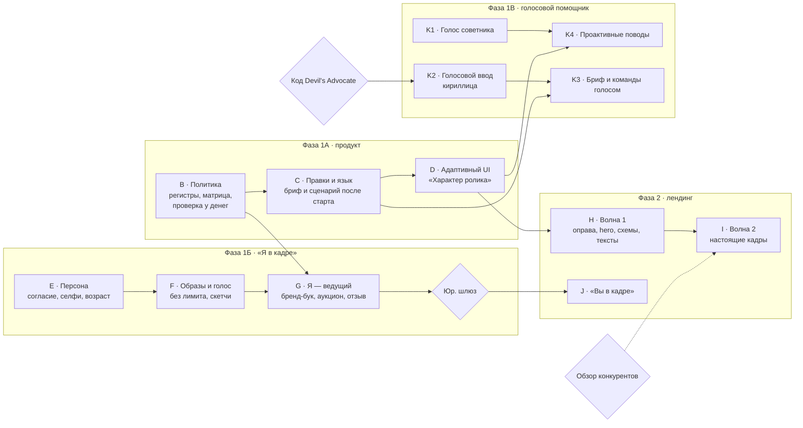

# ТЗ Greeting 2.0: адаптивные правила, личный бренд-бук и аватары «Я в кадре», лендинг по образцу обучалки

Версия 1.4 · 29.09.2026 · **Этапы A, B и C реализованы (§12); остальное — предложение, код не написан.**

Редакция 1.4: сделан этап C (§12) — правка брифа и сценария после старта, язык поздравления; снята временная блокировка брифа этапа A.

Редакция 1.3: сделан этап B (§12); добавлена Фаза 1В — проактивный голосовой помощник по образцу Devil's Advocate (§4А), с этапами K1–K4, приёмкой и аудитом нового раздела (Т-23…Т-29).

Редакция 1.2: сделан этап A (§12).

Редакция 1.1: проведён аудит редакции 1.0 свежим взглядом — 22 находки, все исправлены в тексте, перечень в §10.

Greeting ломается в трёх местах: правила ролика не согласованы с поводом (шутливое соболезнование проходит через «Особый повод»), правки после старта сессии молча не доходят до ролика, а бренд-бук и аватар почти не участвуют в генерации. Фаза 1А чинит правила и делает шаг адаптивным, Фаза 1Б добавляет режим «Я в кадре» (селфи, свой голос, возраст, образы без лимита), Фаза 1В — проактивного голосового помощника по образцу Devil's Advocate, Фаза 2 приводит лендинг к стандарту лендинга обучалки.

---

## 1. Контекст и границы

Запрос владельца продукта от 29.09.2026 (пунктуация выправлена, слова сохранены):

> «В greeting очень много проблем и несоответствий, и нужно добавить новые breaking features. Набор guidelines для генерации greeting позволяет задать соболезнование в юмористическом стиле и т. д. Нужно перебрать все варианты и сделать адаптивным этот шаг. Необходимо дать возможность создать как личный brand book, так и аватара и скетч-аватара без ограничений по количеству (например, девушка может это сделать в разных образах). Фото-селфи и собственный голос для этого режима, ИИ-определение возраста и возможность подстроить возраст для аватара. Фаза 2 — привести greeting landing в соответствие по образцу tutorial landing.»

Как этот документ соотносится с соседними:

| Документ | Что с ним |
| --- | --- |
| `docs-tz/AUDIT-Greeting-Landing-And-Upgrade-Plan.md` | Действует. Этапы 1–5 и ветка H не отменяются. Три его принципа — проверка на сервере, а не в интерфейсе; честный отказ вместо тихой подмены; лендинг не обещает того, чего нет в проде — распространяются на все новые правила. |
| `docs-tz/AUDIT-Greeting-Video-Full-Pipeline.md` | Действует. Его находка 3 (устаревший доккомментарий ввёл аудит в заблуждение) — причина пункта Г-12 ниже. |
| `doc/AI-ACTORS-NO-REFERENCE-SPEC.md` §0 и §2 | Модель согласия «по объекту, а не по аккаунту» (`consentGivenAt` + `consentText`) берётся оттуда. Обученный «цифровой двойник» (§2.3) НЕ делается: режим «Я в кадре» остаётся на референс-изображениях, и тексты не обещают «то же лицо в каждом кадре». |
| `doc/AI-SKETCH-SPEC.md` §4 п.3 | Меняется в одном месте, с обоснованием: для проверенной персоны появляется скетч без замены лица (§4.5). Для всех остальных слотов инвариант «лицо с фото всегда меняется» остаётся. |
| `docs-tz/TZ-Enterprise-Tutorial-Landing.md`, `docs-tz/TZ-Client-Site-Tutorial-Landing.md` | Образец для Фазы 2. Запрет §4.5 на правку общих селекторов `globals.css` соблюдается. |
| `TZ-Greeting-Video-Project-Type.md`, `…-Landing.md`, `…-Upgrade-40-Features.md` | В репозитории отсутствуют, хотя на них ссылаются код и аудиты (Г-13). Этот документ самодостаточен и на их §-номера не опирается. |

**Метод.** Каждое утверждение о коде проверено чтением файла 29.09.2026 и дано с путём и строкой. Компиляция и тесты не запускались. Всё, что зависит от поведения внешних провайдеров (xAI, Hedra, Gemini, Resemble), помечено «проверить», а не выдано за факт.

**Термины:**

- **Правила ролика** (guidelines) — всё, что задаёт характер ролика помимо слов: повод, тон, сеттинг, выражение лица ведущего, раскадровка, голос, музыка, наклейка, карточки.
- **Регистр повода** — класс повода по настроению: праздничный, тёплый нейтральный, торжественный, деликатный, траурный. Новое понятие Фазы 1А.
- **Персона** — реальный человек, который сам снялся на селфи, дал согласие и по желанию записал голос. В этой редакции персона — только сам владелец аккаунта.
- **Образ** — вариант внешности персоны: фото-аватар и, по желанию, его скетч. Образов у персоны сколько угодно.
- **Личный бренд-бук** — `BrandManifest` нового вида `PERSONAL`, привязанный к персоне.

---

## 2. Аудит текущего greeting

Четырнадцать находок, четыре из них высокой серьёзности. Главная причина одна: сервер сверяет с поводом только тон, а остальные семь правил ролика живут сами по себе.

| № | Серьёзность | Что не так и где | Следствие |
| --- | --- | --- | --- |
| Г-1 | Высокая | «Особый повод» (`OTHER`) разрешает FUNNY и считается праздничным: `backend/src/common/greeting-occasions.ts:244–251`. Проверка пары повод–тон (`greeting-brief.service.ts:106–113`, `project.service.ts:243–250`) сверяет именно с этим списком. | «Особый повод: похороны бабушки» + «с юмором» проходит. Сеттинг просят «праздничный» (`greeting-scene-settings.ts:53`), запрет шаров в кадре не включается (`greeting-frame-prompt.ts:80–85`), запасной текст — «…поздравляем с этим особым днём! Пусть всё будет хорошо.» (`greeting-occasions.ts:314–316`). Это ровно пример владельца. |
| Г-2 | Высокая | Кроме тона, ни одно правило не знает о поводе. Наклейки — свободный поиск Pixabay (`greeting-sticker.service.ts:77–80`). Музыка: тема с `occasions: null` подходит любому поводу (`common/greeting-music.ts:175`), загрузка, ссылка и библиотека повод не смотрят (`greeting-music.service.ts:196`, `:290`). Карточки — свободный текст без модерации (`greeting-cards.service.ts:45–60`). Раскадровка одна на все поводы, в трёхсценной «a smile» (`common/greeting-scenes.ts:82`). Сцена видео при нашей озвучке всегда «smiling» (`greeting-prompt.service.ts:357`), хотя кадр-референс для RESPECTFUL просит «no smile» (`greeting-frame-prompt.ts:99`). | Конфетти, праздничная музыка и улыбка в соболезновании при формально допустимом тоне. Кадр и видео одного ролика просят разное выражение лица. |
| Г-3 | Высокая | Правка брифа после старта сессии не доходит до ролика. Сессия получает копию брифа (`project-session.service.ts:229`), дальше копию пишут только музыка, карточки, голос и наклейка — каждый своё поле. В `BriefStep` поля «от кого», «тон», «текст», «дата» после старта не заблокированы (`frontend/src/features/projects/GreetingVideoWizard.tsx:579–612`, `:658–664`), сохранение показывает успех (`:682–687`). `frontend/src/lib/greeting-steps.ts:78–80` обещает: «к брифу возвращаются править повод и текст… именно так чинят помеченный модерацией сценарий», а сценарий читает копию (`greeting-prompt.service.ts:134`). Повод после старта вообще заблокирован. | Человек меняет тон или текст, видит «сохранено» и получает ролик со старыми. Сценарий, помеченный модерацией, из интерфейса не починить — только новым проектом. |
| Г-4 | Высокая | Сценарий нельзя поправить руками: `ScriptStep` — только показ и «перегенерировать» (`GreetingVideoWizard.tsx:1225–1270`). Общий `PATCH /sessions/:id/prompt` (`prompt.service.ts:761`) правку примет, но разведёт тексты: реплика вшита в `finalText` строкой «Spoken line…» (`greeting-prompt.service.ts:370–372`), а озвучка берёт `finalVoiceoverScript`. | Лендинг обещает «можно поправить руками до генерации» и «впишите свой текст на шаге сценария» — этого нет. С пресетным голосом модель произнесла бы старый текст, субтитры — новый. |
| Г-5 | Средняя | Сценарий пишется только по-русски (`greeting-prompt.service.ts:98`), запасные тексты тоже (`greeting-occasions.ts:296–317`). | Интерфейс на пяти языках, поздравление — на одном; язык озвучки потом угадывается по тексту. |
| Г-6 | Средняя | Бренд-бук копируется в сессию целиком, с персонажами и сценами (`project-session.service.ts:194–205`, `:231`), но поздравление читает из него только `voiceMode` (`greeting-prompt.service.ts:201`, `greeting-video.service.ts:269–271`). | Персонажи, сцены, `styleNotes`, `ttsVoiceId` в ролик не попадают. Выбор бренда в брифе открыт для любого повода (`GreetingVideoWizard.tsx:666–679`) и почти ничего не делает. |
| Г-7 | Средняя | Портрет говорящего аватара — «первое фото, какое есть» (`greeting-video.service.ts:340–343`). | Портретом станет фото места, торта или сгенерированный кадр. Проверки «на фото одно лицо» и согласия изображённого нет. |
| Г-8 | Средняя | Политика реальных лиц противоречива. Промпт кадра запрещает «any recognisable real person» (`greeting-frame-prompt.ts:78`), а загрузка фото людей в референсы открыта без согласия (`greeting-reference.service.ts:140–200`). Скетч такого фото считается слотом-сценой (`image-sketch/sketch-targets.ts:409`), поэтому принудительная замена лица к нему не применяется. Проверка «похож на знаменитость» смотрит только текст (`greeting-prompt.service.ts:153–155`). | Чужое лицо уходит в видеомодель без единой проверки. Режим «Я в кадре» нельзя строить поверх этого как есть. |
| Г-9 | Средняя | Скетч человека по фото всегда меняет лицо — это инвариант (`image-sketch.service.ts:242–249`, `common/sketch-prompts.ts:9–10`). | «Скетч-аватар себя» существующим скетчем даст чужое лицо. Нужен отдельный режим, см. §4.5. |
| Г-10 | Низкая | Лимит три клона голоса на пользователя (`user-voices.service.ts:47`) — из-за оплаты Resemble за голоса на общем аккаунте. | Сталкивается с «без ограничений», если голос вешать на образ, а не на персону. Решено в §4.2. |
| Г-11 | Низкая | `customOccasionText`: интерфейс режет до 120 символов (`GreetingVideoWizard.tsx:562`), DTO принимает 200 (`update-greeting-brief.dto.ts:46`). | Два источника правды об одном лимите. |
| Г-12 | Низкая | Доккомментарий «'hedra': NOT wired… refuses with a clear, honest error» (`greeting-video.service.ts:59–70`) устарел: ветка реализована (`:319–435`). | Такой же комментарий уже однажды сбил аудит (находка 3 аудита пайплайна). |
| Г-13 | Низкая | Исходных ТЗ поздравлений в репозитории нет (`find -name "TZ-Greeting*"` — пусто). | Ссылки кода на «§5.3 ТЗ» нечем проверить. |
| Г-14 | Средняя | Лендинг: шаг 3 и FAQ про правку сценария неверны (Г-4). FAQ «На каком языке» верен сегодня, но станет неверным после Фазы 1А. | Страница обещает то, чего нет, — нарушение главного правила плана лендинга. |

**Проверить на проде** (не находки, пока не подтверждено):

- «Бесплатно · Без регистрации» в hero: проекты закрыты `TelegramIdentityGuard` (`project.controller.ts:54`). Вход через Telegram можно считать «без регистрации», но путь из обычного браузера нужно пройти руками.
- «Сейчас нисколько… перегенерация ничего не стоит»: рендер проходит `renderAccess.assertCanRender` и кредиты (`greeting-video.service.ts:227–230`). Если бесплатный режим упирается в суточный лимит, FAQ врёт.

**В порядке и не трогается:** серверная проверка пары повод–тон на создании и правке; тон по умолчанию от повода; запрет праздничных декораций в кадре при `festive: false`; модерация сценария и отказ рендера по флагу; квота аватара и возврат кредита при сбое; принцип «снимок — копия, а не ссылка» (Г-3 — про интерфейс и отсутствие пересборки, а не про принцип). Вне объёма: формат только 9:16 (`greeting-video.service.ts:389`, `:626`) и отключённый перерендер tier B.

---

## 3. Фаза 1А — адаптивные правила ролика

Все девять правил ролика выводятся из одной таблицы-политики по регистру повода. Сервер проверяет каждое правило при записи и весь набор ещё раз перед списанием кредита; интерфейс строится из той же таблицы и объясняет недоступное.

### 3.1 Политика — один источник правды

- Новый файл `backend/src/common/greeting-policy.ts`. В `GreetingOccasionSpec` добавляется поле `register`; рядом — `REGISTER_POLICY: Record<GreetingRegister, RegisterPolicy>` со всеми строками матрицы §3.3.
- Чистая функция `evaluateGreetingPolicy(snapshot) → { ok, violations: [{ field, code, message }] }`. Вызывается в создании и правке брифа, в каждом `PATCH` музыки, наклейки, сцен, голоса и карточек, в `generateGreetingPrompt` и в `startVideo` — до `assertCanRender`, чтобы отказ не стоил кредита. Проверка у денег нужна по той же причине, что у тарифного гейта аватара (`greeting-video.service.ts:328–332`): снимок мог быть собран до вступления правила в силу.
- Публичный `GET /greeting/policy` отдаёт всю таблицу; фронтенд строит выбор из неё. Собственная копия `allowedTonesFor` во фронтенде (`frontend/src/types/project.ts:120`) удаляется: две копии правила — именно то, что уже дало Г-11.

### 3.2 Регистры — перебор всех 24 поводов

Пять регистров упорядочены по строгости: праздничный < тёплый нейтральный < торжественный < деликатный < траурный. Порядок нужен «Особому поводу» (§3.4): проверки могут только повысить регистр, но не понизить.

| Повод (код) | Регистр | Допустимые тоны (первый — по умолчанию) | Изменение против сегодня |
| --- | --- | --- | --- |
| BIRTHDAY, WEDDING, ANNIVERSARY, NEW_YEAR, CHRISTMAS, GRADUATION, VALENTINES_DAY, WOMENS_DAY, MOTHERS_DAY, FATHERS_DAY, TEACHERS_DAY, FIRST_SCHOOL_DAY, NEW_BABY, HOUSEWARMING, PROMOTION, RETIREMENT (16) | Праздничный | WARM, FUNNY, FORMAL | Тоны прежние. Меняются остальные правила по матрице §3.3. |
| CORPORATE | Праздничный | FORMAL, WARM, FUNNY | Умолчание FORMAL вместо WARM: схема уже называет FORMAL «в основном для CORPORATE» (`schema.prisma`, `enum GreetingTone`). |
| FAREWELL_COLLEAGUE | Тёплый нейтральный | WARM, FUNNY, FORMAL | Декор без праздничной атрибутики (`festive: false` уже сейчас). |
| DEFENDERS_DAY, BAPTISM | Торжественный | WARM, FORMAL, RESPECTFUL | Наклейки запрещены, сцен не больше трёх. |
| APOLOGY | Деликатный | RESPECTFUL, WARM | Умолчание RESPECTFUL (сейчас WARM). Наклейки запрещены, сцен не больше двух. |
| GET_WELL | Деликатный | SUPPORTIVE, WARM | Умолчание SUPPORTIVE (сейчас WARM). Наклейки запрещены, сцен не больше двух. |
| CONDOLENCE | Траурный | RESPECTFUL, SUPPORTIVE | Тоны прежние; запрещены наклейки, улыбка в кадре и более двух сцен; музыка по умолчанию выключена. |
| OTHER | По результату §3.4; до него — тёплый нейтральный | По регистру | Главное изменение (Г-1): сегодня всегда праздничный и с FUNNY. |

Смена умолчаний тона у CORPORATE, APOLOGY и GET_WELL делается перестановкой списка `tones`: `defaultToneFor` уже берёт первый элемент (`greeting-occasions.ts:287–289`). Уже сохранённые брифы не меняются: их тон остаётся допустимым.

### 3.3 Матрица «правило × регистр»

| Правило | Праздничный | Тёплый нейтральный | Торжественный | Деликатный | Траурный |
| --- | --- | --- | --- | --- | --- |
| Декор сцены | Праздничный | Без атрибутики праздника | Сдержанный, достойный | Спокойный (`CALM_SCENE`) | Спокойный, приглушённые цвета |
| Лицо ведущего (кадр и видео) | По тону | По тону | Собранное, без широкой улыбки | APOLOGY — серьёзное, без улыбки; GET_WELL — мягкое | Серьёзное, тихое, без улыбки |
| Раскадровка | 1–4 сцены, текущие `BEATS` | 1–4, `BEATS` без «smile» | 1–3, сдержанные | 1–2, сдержанные | 1–2, без улыбки и «жеста прощания» |
| Наклейки | Да | Да | Нет | Нет | Нет |
| Музыка из каталога | Темы повода + темы без поводов (`occasions: null`) | То же | Только темы, где повод указан явно | То же | То же; по умолчанию «без музыки» |
| Своя музыка (файл, ссылка, библиотека) | Да | Да | Да | Да, с предупреждением | Да, с предупреждением |
| Пресетный голос xAI | Любой | Любой | Любой | Любой | Любой |
| Карточки | Текст + модерация | То же | То же | То же | То же |
| Запасной текст | «Поздравляем…» | Нейтральный | Нейтральный | По поводу (как сейчас) | Соболезнование |
| Стили скетча | Все | Все | Все | Все | Все |

Два решения в таблице выглядят мягкими и приняты намеренно. Своя музыка в соболезновании не запрещена: любимая песня ушедшего — законный и частый случай, запрет сломал бы его. Пресетные голоса не ограничены: у роестра xAI нет данных о настроении голоса (`greeting-voice.service.ts:48` проверяет только формат id), а тон несёт текст. Наклейки запрещены уже с торжественного регистра, потому что свободный поиск Pixabay нельзя ограничить настроением; курируемый набор (голубь, свеча) — отдельная задача после этой фазы.

### 3.4 «Особый повод»: как определяется регистр

Итоговый регистр = самый строгий из трёх сигналов. Ни один сигнал не может понизить регистр, выбранный другим.

1. **Выбор человека.** После «Особый повод» — один обязательный вопрос: «Какое это событие по настроению?» — радостное / тёплое без праздника / торжественное / непростое / траурное. Без ответа бриф не сохраняется.
2. **Детерминированный пол по ключевым словам** на пяти языках. Только однозначные корни: «похорон», «помин», «соболезн», «співчут», «funeral», «condolence», «bereavement», «Beileid», «Beerdigung», «pésame», «condolencia» и подобные. Многозначные («смерт», «умер») в список не входят: «до смерти рада за тебя» не должно становиться трауром. Совпадение поднимает регистр до траурного. Приём тот же, что у `celebrity-likeness.ts`: узкие триггеры, высокая точность.
3. **Классификатор** — один дешёвый текстовый вызов Gemini при сохранении брифа (не на каждое нажатие клавиши). Возвращает регистр; учитывается, только если он строже выбора человека. Сбой или мусорный ответ игнорируется — остаются пункты 1 и 2.

Когда регистр поднят проверкой, экран говорит почему («в описании есть слово «похороны» — шутливый тон недоступен»). Данные: `GreetingBrief.occasionRegister` (обязателен при OTHER) и `registerSource` (`user` / `keywords` / `classifier`); то же — в снимке сессии. У поводов из списка регистр задаёт каталог, и поменять его нельзя.

### 3.5 Адаптивный интерфейс

- Порядок вопросов: повод → (для «Особого» — настроение) → всё остальное. Каждый контрол строится из `GET /greeting/policy`.
- Недоступное не прячется молча: тон «С юмором» у соболезнования виден серым с подписью «недоступен для этого повода», секция наклеек заменена одной строкой объяснения. Сегодня тон просто исчезает из списка (`GreetingVideoWizard.tsx:594`), и человек не понимает, куда он делся.
- Смена повода или настроения сбрасывает несовместимые выборы к умолчаниям регистра, и экран показывает список изменений («Тон: с юмором → уважительный; наклейка снята»). Сервер делает то же и возвращает `resetFields`.
- Кнопка «Рекомендуемые настройки» ставит умолчания регистра одним нажатием.
- Пять карточек после сценария (голос, музыка, карточки, наклейка, сцены — `GreetingVideoWizard.tsx:407–415`) объединяются в блок «Характер ролика» со сводкой выбранного сверху; в степпере остаются четыре шага (`greeting-steps.ts`).

### 3.6 Правка брифа и сценария после старта (Г-3, Г-4)

1. Новый `PATCH /sessions/:id/greeting-brief` правит снимок сессии и заодно бриф проекта, прогоняет политику и тарифный гейт `resolveGreetingConfig`.
    - Меняются повод, настроение, тон, получатель, отправитель, текст или язык → `generationPrompt` сбрасывается, сценарий собирается заново; несовместимые музыка, наклейка и число сцен сбрасываются с `resetFields`.
    - Во время рендера (`PENDING`/`PROCESSING`) — 409.
    - После готового ролика — новая сессия-версия с копией выбранного; старый ролик остаётся доступным, новый рендер стоит как обычный.
2. `BriefStep` после старта сессии сохраняет через этот эндпоинт; повод и получатель снова редактируются. «Сохранено» показывается с перечнем сброшенного. Лимит `customOccasionText` — 200 символов в обоих местах, со ссылкой на одну константу (Г-11).
3. Новый `PATCH /sessions/:id/greeting-script { speech }`: проверка `findCelebrityLikeness`, модерация, проверка регистра (§3.7), затем пересборка сцены через `buildSceneDescription`. `finalText` и `finalVoiceoverScript` меняются только вместе. `ScriptStep` получает поле редактирования.
4. Общий `PATCH /sessions/:id/prompt` для сессий с `greetingBriefSnapshot` отвечает 400 со ссылкой на правильный путь: иначе он разведёт тексты (Г-4).
5. Комментарий `greeting-steps.ts:78–80` переписывается под новое поведение.

### 3.7 Проверка готового текста на регистр

- Текст, написанный Gemini для деликатного и траурного регистров, проходит проверку: нет поздравлений, восклицательных знаков и шуток. Провал → одна перегенерация, затем запасной текст регистра. Правила уже есть в `intent` поводов (`greeting-occasions.ts:220–243`) — здесь они становятся проверкой, а не только просьбой.
- Свой текст человека за стиль не блокируется — это его слова. При несовпадении показывается мягкое предупреждение: «Текст звучит празднично, а повод — соболезнование. Оставить как есть?» Модерация по ключевым словам — как сейчас.
- Карточки (`title`, `closing`) проходят ту же `moderateText`, что и сценарий (Г-2).

### 3.8 Язык поздравления (Г-5)

- Новое поле `GreetingBrief.scriptLanguage`: `ru | uk | en | de | es`, по умолчанию — язык интерфейса автора. В брифе оно называется «Язык поздравления»: язык получателя не обязан совпадать с языком интерфейса.
- Промпт просит текст на этом языке; запасные тексты — по языку и регистру (5 × 5 = 25 строк). В TTS язык передаётся явно, `detectLanguage` остаётся запасным.

### 3.9 Промпты

- `buildSceneDescription`: убрать жёсткое «smiling» (`greeting-prompt.service.ts:357`). Выражение лица берётся из политики (регистр × тон) — одна таблица для кадра и видео вместо теперешних двух (`TONE_LOOK` в `greeting-frame-prompt.ts:94–100` и ветка `mood` в `buildSceneDescription`).
- `BEATS` (`common/greeting-scenes.ts:73`) — по регистру: для торжественного, деликатного и траурного свои наборы без «smile» и «farewell gesture».
- Выбранный сеттинг (фича №36) сохраняется в снимок как `sceneSetting` и идёт и в кадр, и в видео-промпт. Сегодня видео получает общий сеттинг повода (`greeting-prompt.service.ts:363`), а сгенерированный кадр подписан лишь «Сгенерированный кадр» (`greeting-reference.service.ts:91`, `description: null`) — выбранная обстановка в текст видео-промпта не попадает.
- `buildSettingsPrompt` берёт настроение из регистра (пять градаций), а не из `festive` (две).
- Доккомментарий `greeting-video.service.ts:59–70` переписывается под действительное поведение (Г-12).

---

## 4. Фаза 1Б — режим «Я в кадре»

Человек один раз снимает селфи, даёт согласие и по желанию записывает голос. После этого он создаёт сколько угодно образов, скетч-аватаров и личных бренд-буков и ставит себя ведущим любого поздравления. Режим строится на референс-изображениях, а не на обученной модели лица: сходство близкое, но не гарантированное, и тексты продукта это говорят.

### 4.1 Путь пользователя

1. **Согласие.** Экран «Создать себя»: что сервис делает с лицом и голосом, где они хранятся, как удалить. Галочка согласия — до камеры.
2. **Селфи с камеры**, не из галереи: фото анфас и ролик 3 с с поворотом головы.
3. **Автопроверка:** одно лицо, анфас, достаточный свет, не снимок экрана; ИИ-оценка возраста диапазоном.
4. **Базовый образ** — нейтральный портрет по селфи (ровный свет, чистый фон). Показывается рядом с селфи; принять или перегенерировать.
5. **Новые образы:** пресет (деловой, вечерний, праздничный, спортивный, зимний) или описание словами — одежда, причёска, макияж, фон — плюс желаемый возраст ползунком. Кнопка «Скетч» делает скетч-аватар этого образа в одном из четырёх стилей (`pencil`, `lineart`, `flat`, `watercolor` — `common/types/sketch.types.ts:12–17`).
6. **Голос:** запись в приложении с фразой согласия вслух. Один голос на персону, подходит ко всем образам.
7. **Личный бренд-бук:** подпись, образ по умолчанию, голос, стиль карточек, сцены, тон по умолчанию. Бренд-буков сколько угодно.
8. **В брифе поздравления** — «Кто в кадре»: ИИ-ведущий / я (образ …) / я (скетч …).

### 4.2 Что значит «без ограничений»

- **Число хранимых образов, скетч-аватаров и личных бренд-буков — без лимита.** Константы-потолка нет, как сегодня нет потолка на число `BrandManifest`.
- **Ограничены деньги, а не количество.** Генерация образа, скетча и возрастной правки расходует дневную и месячную квоту тарифа — по образцу квот скетча (`image-sketch.service.ts:295–308`). Без квоты один аккаунт может сжечь бюджет на картинки.
- **Персона на аккаунт — одна.** Это не лимит на образы (девушка делает тридцать образов одной персоны), а правило идентичности: вторая «я» — это чужое лицо.
- **Голос персоны не входит в лимит трёх клонов** (`user-voices.service.ts:47`): он один на персону. Сам лимит для остальных клонов — решение владельца (В-5).

### 4.3 Селфи, живость, согласие

- Согласие — по модели `AI-ACTORS-NO-REFERENCE-SPEC.md` §2.4: `consentGivenAt` и `consentText` обязательны, плюс `consentTextVersion`. Без них запись персоны не создаётся. Согласие на голос — уже существующий `UserVoice.consentAt`.
- Съёмка только камерой в приложении. Проверить, что камера открывается в WebView Telegram Mini App на iOS и Android; где нет — вести в веб-версию.
- Живость: ролик 3 с с поворотом головы, один мультимодальный вызов Gemini — тот же человек, что на фото, живое движение, не экран и не распечатка. **Это заслон от «загрузил чужое фото», а не проверка личности**, и тексты продукта не говорят «подтверждена личность».
- Персоны третьих лиц (мама, партнёр, ребёнок) в этой редакции не поддерживаются: их согласие нельзя получить через аккаунт отправителя (`AI-ACTORS-NO-REFERENCE-SPEC.md` §2.6.1).

### 4.4 Возраст

- **Оценка.** Один мультимодальный вызов по селфи → `{ ageMin, ageMax, faces, frontal, quality }`. Хранится диапазон, а не точное число, и показывается человеку: «ИИ оценил возраст на фото как 28–34».
- **Несовершеннолетие.** Нижняя граница оценки младше 18 → режим недоступен. Оценка ошибается у молодо выглядящих взрослых; порог и способ апелляции — решение владельца (В-4).
- **Желаемый возраст образа** — ползунок от 18 до 90. Нижняя граница 18 — всегда, независимо от оценки: сервис не создаёт несовершеннолетнюю версию реального человека. Правило совпадает с запретом на несовершеннолетних в каждом промпте скетча (`common/sketch-prompts.ts:11–12`).
- Смена возраста создаёт новый образ, исходный не перезаписывается. При сдвиге больше 20 лет — предупреждение, что сходство может упасть.
- Оценка возраста — данные, выведенные из лица. Она не используется ни для чего, кроме этого режима: не в аналитике, не в сегментации, не в маркетинге.

### 4.5 Образы и скетч-аватары

- Образ создаётся **только** из селфи персоны или из другого её образа (image-to-image, `gemini-3.1-flash-image` — `common/gemini-image-model.ts:26`). Загрузка произвольного фото как образа запрещена: иначе любая чужая фотография проходит мимо селфи и согласия.
- Промпт образа: сохранить черты лица; менять одежду, причёску, макияж, фон, свет, возраст. Запреты: откровенный контент, несовершеннолетие, текст и логотипы. Описание образа проходит `findCelebrityLikeness` («в образе Монро» — отказ с объяснением).
- **Скетч-аватар.** Новый тип слота `persona-look` в `image-sketch/sketch-targets.ts` с режимом `likeness: 'self'`: лицо не анонимизируется. Только для персоны с действующим согласием и пройденной живостью. Для всех остальных слотов принудительная замена лица (`image-sketch.service.ts:242–249`) остаётся. Инвариант в `common/sketch-prompts.ts:9–10` переписывается явно: «лицо меняется всегда, кроме слота persona-look проверенной персоны». Отдельный тест: `character`, `scene` и `product` не получают `likeness: 'self'` ни при каком входе клиента.
- Хранение — под `users/{userId}/personas/{personaId}/…`. Префикс `users` уже в `SWEEP_SCOPES` (`common/orphan-sweep.ts:56–62`), уборка осиротевших файлов работает без новой области.

### 4.6 Голос

- Запись в приложении, первой фразой — текст согласия вслух («Я, <имя>, разрешаю создать синтетическую копию моего голоса…»): запись сама становится свидетельством согласия. Поток — существующий `UserVoicesService` (presigned-загрузка → Resemble), плюс `personaId` на `UserVoice`.
- Проверить по документации Resemble требования к согласию, длине образца и API удаления голоса — не принимать на веру.
- Голос персоны подставляется в `senderVoice` автоматически при «Я в кадре»; человек может сменить. Hedra-путь синтезирует клон уже сейчас (`greeting-video.service.ts:446–483`).

### 4.7 Личный бренд-бук

- `BrandManifest.kind = PERSONAL` + `personaId` + `defaultLookId`. Новые поля: `signature` (строка «от кого» по умолчанию), `defaultTone`, `cardStyle` (шрифт и цвет карточек — сегодня жёстко Arial белым, `common/greeting-cards.ts:218–221`). Остальное уже есть: `voiceMode`, `styleNotes`, `BrandScene`.
- Образы живут у персоны, а не в `BrandCharacter`: один образ доступен из любого личного бренд-бука без копирования.
- **Аукцион.** Личный бренд-бук и ролики с персоной никогда не продаются: отказ на сервере при создании лота, признак `usesPersona` в снимке сессии. Сегодня аукцион продаёт связку «видео + бренд-бук» и закрепляет бренд-бук за покупателем (`BrandManifest.isLocked`, `auction-payment.service.ts:119`) — лицо и голос человека такой сделкой продаваться не могут.
- Тариф: сегодня `brandManifest` закрыт на LITE (`common/plans.ts:215`). Для личного — отдельный признак `personalBrand` (В-1).

### 4.8 Встраивание в поздравление (закрывает Г-6, Г-7, Г-8)

- Бриф: `presenter = { kind: 'ai' } | { kind: 'persona', lookId, variant: 'photo' | 'sketch' }`. Снимок сессии копирует образ (URL, pathname, вариант): удаление образа не ломает уже снятый ролик.
- **Grok:** образ — первый референс, и промпт говорит прямо: «The presenter is the person shown in <IMAGE_1>». Сегодня референсы идут «where they naturally fit the scene» (`greeting-prompt.service.ts:367–369`), и лицо может достаться не ведущему.
- **Hedra:** портрет — выбранный образ, а не «первое фото» (Г-7). Поддержку рисованных портретов у Hedra Character-3 — проверить до того, как предлагать скетч-ведущего на этом пути.
- Прочие референсы (места, предметы) остаются; общий потолок 7 (`MAX_GREETING_REFERENCE_IMAGES`), образ занимает один слот.
- Из бренд-бука в ролик наконец идут сцены, `styleNotes`, подпись и стиль карточек — и у личного, и у корпоративного (Г-6).
- **Реальные лица в обычных референсах (Г-8).** При загрузке референса тот же мультимодальный вызов отвечает, есть ли на фото лицо. Есть — человек подтверждает «у меня есть согласие этого человека», факт записывается в `SceneAsset`; без подтверждения фото можно только превратить в скетч с заменой лица. Запрет в промпте кадра (`greeting-frame-prompt.ts:78`) остаётся — он про то, чтобы модель не дорисовала знаменитость сама.

### 4.9 Отзыв, хранение, удаление

- `DELETE /personas/me` удаляет селфи, ролик живости, образы, скетчи и клон голоса (у Resemble — если API позволяет); личные бренд-буки остаются без персоны. Готовые ролики остаются у автора; опубликованные страницы экран предлагает снять одним нажатием.
- Селфи и ролик живости хранятся ограниченный срок (В-3); после его истечения источником новых образов служит базовый образ. Цена — накопление дрейфа сходства, и это сказано человеку заранее.
- URL селфи и ролика живости не отдаются на фронтенд после проверки: только образы.
- Витрина лендинга (`featured`): ролик с персоной попадает туда только с отдельной галочкой автора при публикации.

### 4.10 Юридический шлюз

Разработка идёт за флагом `PERSONA_ENABLED`. Выпуск для пользователей блокируется до двух проверок: юридического ревью по `AI-ACTORS-NO-REFERENCE-SPEC.md` §0 (маркировка ИИ-контента, согласие, обработка лица и оценка возраста) и проверки условий xAI, Hedra, Google и Resemble на использование лица и голоса реального человека и на редактирование возраста. Это тот же открытый вопрос, что ветка H плана поздравлений называет «не закрыт решением».

---

## 4А. Фаза 1В — проактивный голосовой помощник

Голосовой слой поверх уже работающего советника мастера: помощник сам проговаривает, что делать дальше, и принимает ответы голосом — повод, имя, текст поздравления, «сделай серьёзнее». Образец — проект Devil's Advocate, где решены проблемы распознавания кириллических текстов; эти решения переносятся, а не изобретаются заново.

### 4А.1 На чём строится (проверено чтением кода)

| Что уже есть | Где | Что берём |
| --- | --- | --- |
| Проактивный советник: строка подсказки на шаге, включается чекбоксом в начале сценария, кеш подсказок по классификации состояния | `frontend/src/components/HintLine.tsx`, `backend/src/modules/wizard-guide/wizard-hint.service.ts`, модель `WizardHintCache`; ТЗ `docs-tz/TZ-Tonkaya-Krasnaya-Liniya.md` | Когда и что говорить. Голос — второй канал того же советника, а не второй советник |
| Распознавание речи через Gemini: аудио `inlineData` + текстовая инструкция, все форматы `MediaRecorder` без перекодирования, запись удаляется после чтения | `backend/src/modules/voice/voice-transcription.service.ts`, `voice.service.ts` | Транспорт и контракт «никогда не бросает». Маршрут сейчас привязан к товару (`projects/:projectId/items/:itemId/voice`) — для поздравления нужен свой, сессионный |
| Запись с микрофона и корректное освобождение микрофона при уходе с экрана | `frontend/src/lib/mic-recorder.ts` | Как есть |
| Синтез речи: Resemble / ElevenLabs через `TtsProviderResolverService` | `backend/src/modules/tts/` | Голос помощника |
| Политика регистров (этап B) | `backend/src/common/greeting-policy.ts` | Тон самого помощника: в траурном регистре он говорит тихо и без шуток |

Чего в репозитории НЕТ: кода Devil's Advocate. Из него в этот проект уже переносили код (`frontend/src/lib/telegram.ts`, `admin/src/lib/admin-api.ts` — «перенесено из проекта Devil's Advocate»), но модуль распознавания не переносился. **Блокер этапа K2** — доступ к репозиторию Devil's Advocate или к файлам его распознавания (В-9).

### 4А.2 Что делает помощник

1. **Говорит сам, когда есть что сказать.** Поводы: вход на шаг; простой больше 20 секунд на шаге без действия; отказ сервера (недопустимый тон, модерация, квота) — помощник объясняет его человеческими словами; готовность ролика. Текст реплики — та же подсказка советника, из того же кеша.
2. **Слушает только по нажатию.** Кнопка «удерживать и говорить» (push-to-talk). Постоянного прослушивания нет.
3. **Заполняет бриф голосом.** «Поздравь маму с юбилеем, тепло, от Андрея» → повод, получатель, тон, отправитель. Разобранное показывается карточкой «я понял так» и применяется только после «Да». Ничего не применяется молча.
4. **Правит по команде.** «Серьёзнее», «короче», «без шуток», «другую музыку» — переводится в действия мастера, которые уже существуют (тон, пересборка сценария, выбор темы). Команда, которую политика регистра запрещает («сделай смешнее» на соболезновании), получает тот же отказ, что и кнопка, — голосом и с объяснением.
5. **Отвечает на вопросы о шаге** («зачем фото?», «сколько ждать?») — теми же фактами, что строка подсказки (`hint-facts.ts`), без выдумок.

### 4А.3 Кириллица: что должно быть решено

Ниже — классы проблем, которые ТЗ требует закрыть. Как именно они закрыты в Devil's Advocate, этот документ **не утверждает**: кода там никто не читал. При получении доступа каждый пункт сверяется с решением Devil's Advocate и переносится; расхождения записываются в §12.

| Проблема | Почему важна здесь | Требование |
| --- | --- | --- |
| Путаница русского и украинского | Пять локалей, две кириллические; «привітання» против «поздравления» | Язык распознавания задаётся явно — язык поздравления из брифа (§3.8), затем язык интерфейса; автоопределение — только запасное |
| Ответ латиницей (транслитерация) | Имя «Марина» превращается в «Marina» | Результат — в письменности заданного языка; латиница в кириллическом ответе — повод повторить разбор |
| Имена и склонения | Имя получателя — самое важное слово ролика | Имена из брифа передаются распознаванию как подсказка словаря; имя в ответе сверяется с брифом, а не подменяет его |
| Суржик и смешанная речь | Реальная речь части аудитории | Смешанный фрагмент не «исправляется» в литературный язык без спроса |
| Числа, даты, возраст | «Пятидесятилетие», «пятое октября» | Даты — в ISO для брифа, возраст — числом; неуверенность — вопрос, а не догадка |
| Тишина, шум, обрывок | Mini App в транспорте | Пустой результат — «не расслышал», а не выдуманный текст (контракт `cleanTranscript` уже такой) |
| Отсутствие Web Speech API | В WebView Telegram на iOS и в части Android распознавания в браузере нет | Распознавание — на сервере, через существующий путь Gemini; браузерное API не используется как основной путь |

### 4А.4 Голос помощника

- Синтез — существующий провайдер; голос помощника — отдельный пресет, не голос пользователя и не голос ведущего ролика (В-11).
- Реплики кешируются аудиофайлом по ключу кеша подсказки + голос + язык: одна и та же подсказка не синтезируется дважды.
- Автовоспроизведение в iOS и WebView без жеста пользователя запрещено браузером: первая реплика звучит только после первого касания; до него — текстом.
- Кнопка «без звука» всегда на виду; состояние запоминается на устройстве.
- В траурном и деликатном регистрах помощник говорит коротко и спокойно, без восклицаний: его реплики проходят `textFitsRegister` (§3.7), как и сценарий.

### 4А.5 Данные, приватность, деньги

- Запись голоса — транзитная, удаляется после распознавания (как сейчас в `voice.service.ts`). Хранится только текст, и только если он применён к брифу.
- Голос помощника включается тем же чекбоксом советника в начале сценария, отдельным переключателем «голосом»; по умолчанию выключен (В-10).
- Расход: распознавание — операция `voice-assistant-stt`, синтез — `voice-assistant-tts`, отдельными строками отчёта. Суточный лимит — тот же рубильник, что у советника; превышение — помощник замолкает, мастер работает.
- Новые эндпоинты: `POST /sessions/:id/voice/upload-url`, `POST /sessions/:id/voice/understand` → `{ transcript, intent, fields, confidence }`; `GET /wizard-guide/hint-audio?key=…` → аудио из кеша.

### 4А.6 Этапы фазы

| Этап | Что | Зависит от |
| --- | --- | --- |
| K1 | Голос советника: синтез подсказок, аудиокеш, кнопка «без звука», жест для автовоспроизведения | — |
| K2 | Голосовой ввод для поздравления: сессионный маршрут, распознавание с требованиями §4А.3 по решению Devil's Advocate | В-9 (код Devil's Advocate) |
| K3 | Заполнение брифа и команды голосом, карточка подтверждения | K2, B, C |
| K4 | Проактивные поводы: простой, отказ сервера, готовность ролика | K1, D |

---

## 5. Фаза 2 — лендинг по образцу обучалки

«По образцу» — это перенос визуальной системы, кадров продукта и дисциплины правды, а не копия списка секций. Аудитория другая: человек покупает подарок и решает за минуты (`TZ-Client-Site-Tutorial-Landing.md` §1), поэтому витрина примеров остаётся, а таблица сравнения ждёт обзора конкурентов.

### 5.1 Сравнение с образцом

| Элемент | Обучалка (образец) | Поздравления сегодня | Что делаем |
| --- | --- | --- | --- |
| Область стилей | `<main className="tutorial-page">`, типографика под ним (`landing/src/app/globals.css:2141` и далее) | Класса нет (`greetings/page.tsx:102`) | `greeting-page` со своим блоком правил; общие селекторы не трогаем |
| Hero | Текст + кадр продукта в оправе `.frame-shot`, `priority` (`site-tutorial/page.tsx:149–180`) | Только текст (`greetings/page.tsx:103–115`) | Кадр справа на ≥900 px, ниже — под текстом |
| «Как это работает» | 4 кадра в оправе, номер на кадре, ритм 1+2+1; схемы и настоящие кадры переключает один список (`lib/tutorial-frames.ts`) | 4 карточки с иконкой 16 px (`greetings/page.tsx:139–165`) | 4 кадра в той же оправе + `lib/greeting-frames.ts` с `REAL_FRAME_LOCALES` |
| Витрина примеров | Нет — нечем наполнить | `GreetingSampleGallery` | Оставить: сильнейшая сторона поздравлений |
| Сравнение с рынком | `CompetitorComparisonTable` | Нет | Только после обзора конкурентов; вторая волна |
| «Для кого» | Секция `audience` | Нет | Семья, друзья, коллеги и HR, деликатные поводы |
| Ответ на главное возражение | Секция «сайты за логином» | Нет | «Данные и деликатные поводы»: имя получателя, фото, сюрприз, соболезнование; после Фазы 1Б — лицо и голос |
| OG-карточки | Перевыпущены в новом языке | `public/og/greetings-*.jpg` старые | Перевыпустить тем же способом (вне приложения, SVG → JPG) |
| Токены | `--surface-raised`, `--shadow-lift` и др. в `:root` (`globals.css:1–33`) | Не используются | Использовать — они уже глобальные; `.frame-shot` тоже объявлен без области (`globals.css:1876`) |

### 5.2 Порядок секций

1. **Hero с кадром.** Статичный файл в `public/`, а не ролик из витрины: витрину меняет оператор, а лица из пользовательских роликов в рекламном первом экране требуют отдельного согласия.
2. **Витрина примеров** — как сейчас; пустая — не рендерится.
3. **«Как это работает»** — четыре кадра: повод и бриф; характер ролика (адаптивный блок Фазы 1А); сценарий; готовый ролик.
4. **Поводы** — сгруппированы по регистрам: «Праздники», «Без праздника», «Деликатные». Группировка берётся из того же каталога и закрепляется тестом, как уже закреплены коды поводов.
5. **«Вы в кадре»** — только когда Фаза 1Б в проде и юридический шлюз пройден. Включается одной константой с тестом — тем же приёмом, что `REAL_FRAME_LOCALES`; до того секции нет в разметке.
6. **Возможности** — существующие пять карточек.
7. **Для кого.**
8. **Данные и деликатные поводы.**
9. **Цена** — текст сверен с продом (§2, «Проверить на проде»).
10. **FAQ** — с исправлениями §5.4, без `data-faq-index`.
11. **Финальный CTA** и свой футер — как сейчас.

### 5.3 Кадры

- **Волна 1 — схемы.** SVG `greet-frame-{1..4}.svg` и `greet-hero.svg` по правилам Уровня 1 обучалки: без текста, имён, цифр и доменов, с глубиной слоями; холст 840×540, как у схем обучалки (`lib/tutorial-frames.ts`, `SCHEME`). Оговорка «это схемы, а не снимки» — в подводке секции и переключается вместе с картинками.
- **Волна 2 — настоящие кадры.** Конвейер снимков уже умеет маршрут `greeting-video` (`backend/src/modules/tutorial-runner/route-templates.ts:224–227`), но фикстура проекта четвёртого типа не заводится (`tutorial-scenario-runner.service.ts:1743`). Нужны: фикстурный GREETING_VIDEO-проект (upsert по фиксированному id); `data-qa-mask` на полях с именами и текстом в `GreetingVideoWizard` — выдуманные имена на маркетинговом кадре запрещены правилом §5.5 образца; `greeting-video` в список предлагаемых маршрутов.
- Кадр «готовый ролик» — из ролика, снятого на фикстуре с ИИ-ведущим, не из роликов пользователей.
- Бюджеты — как у образца (`TZ-Enterprise-Tutorial-Landing.md` §5): ≤90 КБ на hero, ≤120 КБ на кадр в AVIF, ноль новых npm-пакетов, ноль новых `'use client'`, немецкая локаль на 360 px без горизонтальной прокрутки.

### 5.4 Тексты

- Шаг 3 «его можно поправить руками до генерации» становится правдой с выпуском §3.6. До него — «его можно собрать заново». Эта правка выходит сразу (этап A), не дожидаясь Фазы 2.
- FAQ «Впишите свой текст на шаге сценария» — исправить сразу на «на шаге брифа, до сборки сценария». FAQ «На каком языке?» — после §3.8: «на любом из пяти, выбирается в брифе».
- FAQ «Можно ли записать не поздравление?» — после Фазы 1А дополнить: «шутливый тон, наклейки и праздничная музыка для таких поводов недоступны».
- Бейдж «Без регистрации» и цена — по итогам проверки на проде (§2).
- Новые секции — в пяти словарях, с программной проверкой совпадения ключей.
- Правило очерёдности: текст о новой возможности выходит в том же релизе, что и сама возможность, не раньше.

### 5.5 Чего на странице не будет

- ИИ-консультанта — причина прежняя: его база и `faqIndex` принадлежат главной (`greetings/page.tsx:34–39`).
- Таблицы сравнения в первой волне: обзора конкурентов для поздравлений в репозитории нет, а таблица без него была бы выдуманной (В-8).
- Анимаций по скроллу, каруселей, веб-шрифтов — по тем же причинам, что у образца (§4.4, §6).

---

## 6. Данные и API

Все новые колонки необязательные или со значением по умолчанию: миграции не требуют перезаписи существующих строк. TS-зеркала Prisma-енумов (`common/types/greeting.types.ts`) обновляются в том же коммите — их расхождение уже описано как риск в самом файле.

| Изменение схемы и типов | Фаза | Примечание |
| --- | --- | --- |
| `enum GreetingRegister { CELEBRATORY WARM_NEUTRAL SOLEMN SENSITIVE MOURNING }` | 1А | Порядок значений = порядок строгости |
| `GreetingBrief.occasionRegister`, `registerSource`, `scriptLanguage` | 1А | `occasionRegister` обязателен при OTHER — проверка в сервисе |
| `GreetingBriefSnapshot`: `register`, `scriptLanguage`, `sceneSetting` | 1А | JSON сессии, без миграции |
| `model Persona`: `userId @unique`, `consentGivenAt`, `consentText`, `consentTextVersion`, `selfiePathname`, `livenessPathname`, `livenessCheckedAt`, `ageMin`, `ageMax`, `ageEstimatedAt`, `revokedAt` | 1Б | Поля согласия — NOT NULL |
| `model PersonaLook`: `personaId`, `label`, `prompt`, `targetAge`, `sourceLookId`, `photoPathname`, `photoUrl`, `activeSketchId @unique` → `ImageSketch`, `status`, `deletedAt` | 1Б | Скетч — тем же приёмом, что у `BrandCharacter.activeSketchId` |
| `UserVoice.personaId` | 1Б | Голос персоны не считается в `MAX_USER_VOICES` |
| `enum BrandManifestKind { COMPANY PERSONAL }`; `BrandManifest.kind @default(COMPANY)`, `personaId`, `defaultLookId`, `signature`, `defaultTone`, `cardStyle Json` | 1Б | Существующие бренд-буки становятся COMPANY |
| `GreetingBrief.presenterLookId`, `presenterVariant`; в снимке — `presenter` (копия образа) и `usesPersona` | 1Б | Копия, не ссылка |
| `SceneAsset.faceConsentAt` | 1Б | Факт подтверждения согласия для фото с лицом (Г-8) |
| Признак тарифа `personalBrand`; квота `persona-look` (день/месяц по тарифу) | 1Б | `common/plans.ts`, по образцу квот скетча |

| Эндпоинт | Фаза | Что делает |
| --- | --- | --- |
| `GET /greeting/policy` | 1А | Вся матрица регистров и поводов; публичный, кешируемый |
| `PATCH /sessions/:id/greeting-brief` | 1А | Правка снимка и брифа → `{ sessionId, newVersion, brief, resetFields, promptCleared }`; 409 во время рендера; после готового ролика — новая версия сессии |
| `PATCH /sessions/:id/greeting-script` | 1А | `{ speech }` → проверки и пересборка сцены → `{ sessionId, newVersion, prompt, registerMismatch, registerWarning }` |
| `PATCH /sessions/:id/prompt` (существующий) | 1А | Для сессий поздравления — 400 со ссылкой на `greeting-script` |
| `POST /personas` | 1Б | Согласие → `{ personaId, selfieUploadUrl, livenessUploadUrl }` |
| `POST /personas/me/verify` | 1Б | Одно лицо, живость, возраст → базовый образ; отказ при `ageMin < 18` |
| `GET /personas/me` | 1Б | Персона, образы, голос, квота; без URL селфи |
| `POST /personas/me/looks` | 1Б | `{ preset?, description?, targetAge?, sourceLookId? }` → новый образ; расходует квоту |
| `PATCH` / `DELETE /personas/me/looks/:id` | 1Б | Переименование, мягкое удаление |
| `POST /sketches` (существующий) | 1Б | Новый `target.type = 'persona-look'` |
| `DELETE /personas/me` | 1Б | Отзыв согласия и удаление (§4.9) |
| `POST /brand-manifests` (существующий) | 1Б | Принимает `kind: 'PERSONAL'`, `defaultLookId` |
| Создание лота аукциона (существующее) | 1Б | Отказ для `PERSONAL` и для роликов с `usesPersona` |

---

## 7. Этапы

Лендинг меняет тексты только после того, как Фаза 1А в проде, а режим «Я в кадре» строится параллельно за флагом и открывается людям только через юридический шлюз. Сроки не проставлены намеренно — их ставит исполнитель, как и в плане поздравлений.

Этап A — правка неверных текстов лендинга и устаревших комментариев — ни от чего не зависит и выходит первым.

| Этап | Что входит | Зависит от | Закрывает |
| --- | --- | --- | --- |
| A ✅ | Тексты лендинга про правку сценария; доккомментарии `greeting-video.service.ts:59–70` и `greeting-steps.ts:78–80`; один лимит `customOccasionText`; временная блокировка брифа после старта сессии (§12) | — | Г-11, Г-12, часть Г-3 и Г-14 |
| B ✅ | `greeting-policy.ts`, регистры, матрица, «Особый повод», проверка в `startVideo`, промпты §3.9, модерация карточек, `GET /greeting/policy` | — | Г-1, Г-2 |
| C ✅ | `PATCH …/greeting-brief`, `PATCH …/greeting-script`, запрет общего `PATCH …/prompt`, язык поздравления | B | Г-3, Г-4, Г-5 |
| D | Адаптивный интерфейс, блок «Характер ролика», выбор из `GET /greeting/policy` | B, C | — |
| E | `Persona`, согласие, селфи, живость, оценка возраста, флаг `PERSONA_ENABLED` | — | — |
| F | Образы, возрастная правка, слот скетча `persona-look`, голос персоны, квоты | E | Г-9, Г-10 |
| G | Личный бренд-бук, ведущий-образ в Grok и Hedra, бренд-бук в ролике, лица в референсах, запрет аукциона, отзыв | F, B | Г-6, Г-7, Г-8 |
| Шлюз | Юридическое ревью и условия провайдеров | G | Выпуск E–G пользователям |
| H | `greeting-page`, hero с кадром, схемы, группы поводов, «Для кого», «Данные», OG, тексты после 1А | D | Г-14 |
| I | Фикстура GREETING_VIDEO, маски, настоящие кадры; таблица сравнения — после обзора конкурентов | H | — |
| J | Секция «Вы в кадре» | G, шлюз | — |
| K1–K4 | Голосовой помощник (§4А.6) | K2 — код Devil's Advocate; K3 — B, C; K4 — D | — |

---

## 8. Приёмка

Измеримое, а не «стало лучше». «Перебрать все варианты» из запроса владельца превращается в автоматический перебор, а не в ручную проверку.

### 8.1 Фаза 1А

- [ ] **Перебор комбинаций.** 24 повода × 5 тонов × наклейка {нет, есть} × музыка {тема повода, тема `occasions: null`, свой файл} × сцены 1–4 = 2880 комбинаций, плюс OTHER × 5 регистров. Для каждой ожидаемый вердикт из `REGISTER_POLICY` совпадает с ответом (а) `PATCH` брифа и сессии, (б) проверки в `startVideo`.
- [ ] OTHER «похороны бабушки» + FUNNY → 400 с объяснением; без ответа на вопрос о настроении бриф не сохраняется.
- [ ] Snapshot-тесты видео- и кадр-промптов по пяти регистрам: в траурном и деликатном нет «smil», «farewell gesture», «festive», «confetti».
- [ ] Запасной текст в 25 комбинациях «язык × регистр» не содержит поздравления вне праздничного регистра.
- [ ] Классификатор: размеченный набор из 50 описаний «Особого повода» на пяти языках — ни одного траурного, определённого как праздничный.
- [ ] Правка тона после старта сессии меняет следующий сценарий; интерфейс показывает `resetFields`.
- [ ] Правка сценария: новая реплика стоит и в `finalText`, и в `finalVoiceoverScript`; общий `PATCH /sessions/:id/prompt` на сессии поздравления → 400.
- [ ] Карточка с запрещённым словом → флаг модерации, рендер отклонён.
- [ ] Сценарий пишется на выбранном языке из пяти; TTS получает язык явно.
- [ ] Отказ политики в `startVideo` не списывает кредит.

### 8.2 Фаза 1Б

- [ ] Без согласия запись персоны не создаётся (NOT NULL + тест сервиса).
- [ ] Файл из галереи вместо камеры не проходит; снимок экрана и распечатка отклоняются (ручная проверка на 10 примерах каждого вида).
- [ ] `ageMin < 18` → режим недоступен; `targetAge < 18` → 400.
- [ ] Слоты `character`, `scene`, `product` никогда не получают `likeness: 'self'`; `persona-look` получает его только при действующем согласии.
- [ ] Тридцать образов одной персоны создаются без ошибки лимита; при исчерпании квоты — 429 с понятным текстом.
- [ ] Голос персоны не уменьшает лимит обычных клонов.
- [ ] Лот аукциона с `PERSONAL` бренд-буком или роликом `usesPersona` → отказ.
- [ ] `DELETE /personas/me` удаляет файлы (проверка по префиксу в хранилище) и клон голоса.
- [ ] Grok-промпт с персоной содержит «The presenter is the person shown in <IMAGE_1>»; Hedra берёт портрет из образа.
- [ ] Юридический шлюз подписан до включения `PERSONA_ENABLED` на проде.

### 8.3 Фаза 1В

- [ ] Проверочный набор записей: не меньше 100 фраз на русском и 100 на украинском, с именами, датами, возрастом и суржиком. Пороги ошибки распознавания задаются по результату Devil's Advocate на том же наборе, а не заранее; без базовой цифры приёмка не подписывается.
- [ ] Ни одного ответа латиницей для кириллической речи на наборе.
- [ ] Язык ответа совпадает с языком брифа во всех записях набора, где говорящий не переключал язык.
- [ ] Имя получателя из брифа не подменяется распознанным вариантом.
- [ ] Ничего не применяется к брифу без подтверждения человеком.
- [ ] Микрофон включается только по нажатию; уход с экрана освобождает его (`releaseMicrophone`).
- [ ] До первого касания реплики помощника не звучат; «без звука» переживает перезагрузку.
- [ ] В траурном регистре ни одна реплика помощника не содержит восклицательных знаков и праздничных слов (тот же тест, что для сценария).
- [ ] Команда, запрещённая регистром, получает тот же отказ, что и кнопка.
- [ ] Запись голоса удалена из хранилища после распознавания (проверка по префиксу).

### 8.4 Фаза 2

- [ ] Ни одного обещания, которого нет в проде: каждый пункт словаря `greetingsLanding` сверен с продуктом в пяти локалях.
- [ ] Hero ≤90 КБ, кадр ≤120 КБ, ноль новых npm-пакетов и `'use client'`; LCP замерен до и после, цифры в приёмке.
- [ ] Немецкая локаль на 360 px без горизонтальной прокрутки.
- [ ] Общие селекторы `globals.css` не изменены (проверка по diff).
- [ ] Коды и регистры поводов на лендинге совпадают с каталогом (тест).
- [ ] Секции «Вы в кадре» нет в разметке, пока константа выключена (тест).
- [ ] OG-карточки перевыпущены для пяти локалей.

---

## 9. Решения владельца

| № | Вопрос | Рекомендация |
| --- | --- | --- |
| В-1 | Доступны ли персона и личный бренд-бук на LITE? | Персона и образы — на всех тарифах, различаются квоты; клон голоса — Standard и выше; говорящий аватар — PREMIUM, как сейчас. |
| В-2 | Разрешать ли шутливый траур «по желанию семьи» с подтверждением? | Нет — так же, как у CONDOLENCE сегодня. |
| В-3 | Срок хранения селфи и ролика живости | 30 дней после создания последнего образа, затем удаление. |
| В-4 | Порог возраста и апелляция | Отказ при `ageMin < 18`; апелляция через поддержку, без загрузки документов в этой фазе. |
| В-5 | Лимит обычных клонов голоса (3) | Оставить; голос персоны — вне лимита. |
| В-6 | Маркировка ИИ в ролике с персоной (строка в закрывающей карточке, метаданные) | Решает юрист в рамках шлюза §4.10. |
| В-7 | Размер квот образов по тарифам | Дневная и месячная, как у скетча; числа — от фактической цены `gemini-3.1-flash-image` в `common/ai-pricing.ts`. |
| В-8 | Заказывать ли обзор конкурентов для таблицы сравнения | Да, в формате `OBZOR-Konkurentov-Client-Site-Tutorial.md`, до волны 2 лендинга. |
| В-9 | Доступ к коду Devil's Advocate (репозиторий или файлы модуля распознавания) | Нужен до начала этапа K2: без него §4А.3 — требования без проверенного решения. |
| В-10 | Голос помощника включён по умолчанию? | Нет: включается вместе с советником, отдельным переключателем «голосом». |
| В-11 | Какой голос у помощника | Отдельный пресет провайдера синтеза, один на локаль; не голос пользователя и не голос ведущего. |

---

## 10. Аудит этого ТЗ

Редакция 1.0 перечитана свежим взглядом против кода и против самой себя — двадцать две находки (Т-1…Т-22). Раздел §4А, добавленный в редакции 1.3, прошёл тот же разбор — ещё семь (Т-23…Т-29). Все исправлены в тексте выше, здесь — что было не так и что сделано.

| № | Что было в редакции 1.0 | Почему это ошибка | Исправление |
| --- | --- | --- | --- |
| Т-1 | Своя музыка в траурном регистре запрещена | Любимая песня ушедшего — законный и частый случай; запрет сломал бы его | Разрешена с предупреждением (§3.3) |
| Т-2 | Пресетные голоса xAI ограничены тегами настроения | У роестра нет данных о настроении (`greeting-voice.service.ts:48` проверяет только формат id) — правило неисполнимо | Ограничение снято, тон несёт текст (§3.3) |
| Т-3 | Скетч-аватар делается существующим ИИ-скетчем | Скетч человека по фото всегда анонимизирует лицо (`image-sketch.service.ts:242–249`) — получилось бы чужое лицо | Новый слот `persona-look` с `likeness: 'self'`; инвариант для остальных слотов сохранён и закреплён тестом (§4.5) |
| Т-4 | «Без ограничений» понято буквально: без квот | Каждый образ — платный вызов картинки; бюджет не ограничен ничем | Без лимита — число хранимых сущностей; генерация — по квотам тарифа (§4.2) |
| Т-5 | Образ можно загрузить готовым фото | Любое чужое фото обходит селфи и согласие | Образ — только из селфи или другого образа персоны (§4.5) |
| Т-6 | Возраст образа регулируется в обе стороны без нижней границы | Можно было бы создать несовершеннолетнюю версию реального человека | Нижняя граница 18 всегда; при оценке младше 18 режим недоступен (§4.4) |
| Т-7 | Правка сценария — через общий `PATCH /sessions/:id/prompt` | Он правит `finalVoiceoverScript` отдельно от `finalText`, где реплика вшита (`greeting-prompt.service.ts:370–372`) | Свой эндпоинт с пересборкой сцены; общий для поздравлений → 400 (§3.6) |
| Т-8 | Личный бренд-бук — обычный `BrandManifest` без оговорок | Аукцион продаёт связку «видео + бренд-бук» и блокирует бренд-бук за покупателем (`auction-payment.service.ts:119`) — лицо и голос ушли бы в продажу | Запрет на сервере для `PERSONAL` и роликов `usesPersona` (§4.7) |
| Т-9 | Секции лендинга скопированы с образца, включая таблицу сравнения | Обзора конкурентов для поздравлений нет — таблица была бы выдуманной | Таблица — во вторую волну, после обзора (§5.5, В-8) |
| Т-10 | Настоящие кадры мастера — без оговорок | На них фикстурные имена, а образец запрещает выдуманные имена на изображениях (§5.5 образца) | `data-qa-mask` на полях имён и текста (§5.3) |
| Т-11 | Секция «Вы в кадре» — в первой волне лендинга | Обещание раньше продукта и раньше юридического шлюза | Включается константой с тестом только после шлюза (§5.2) |
| Т-12 | Регистр «Особого повода» определяет только классификатор | Сбой вызова оставлял бы праздничный регистр — ровно Г-1 | Вопрос человеку + пол по ключевым словам + классификатор только вверх; безопасное умолчание — тёплый нейтральный (§3.4) |
| Т-13 | В ключевых словах были «смерт», «умер» | «До смерти рада за тебя» стало бы трауром | Только однозначные корни (§3.4) |
| Т-14 | Hero — кадр из ролика витрины | Динамический контент в LCP-слоте и лица пользователей в рекламе без согласия на эту цель | Статичный кадр в `public/` (§5.2) |
| Т-15 | Селфи удаляется сразу после оценки возраста | Новые образы потом не из чего делать | Ограниченный срок хранения + базовый образ как источник, с честной оговоркой о дрейфе (§4.9, В-3) |
| Т-16 | Живость названа «подтверждением личности» | Трёхсекундный ролик с проверкой моделью — не KYC; тексты обещали бы больше, чем есть | Формулировка «заслон от чужого фото», запрет слова «подтверждена» в продукте (§4.3) |
| Т-17 | Образ идёт в Grok как обычный референс | Сегодня референсы вставляются «where they naturally fit» — лицо могло достаться не ведущему | Явная инструкция «The presenter is the person shown in <IMAGE_1>» (§4.8) |
| Т-18 | Фронтенд держит свою копию политики, как сейчас `allowedTonesFor` | Две копии правила — источник расхождений того же рода, что Г-11 | `GET /greeting/policy`, копия во фронтенде удаляется (§3.1) |
| Т-19 | «Без регистрации» и «бесплатно» на лендинге объявлены ложью | Не проверено: вход через Telegram может считаться «без регистрации», лимит рендеров на бесплатном режиме не проверялся на проде | Перенесено в «Проверить на проде» (§2) |
| Т-20 | Фактические неточности: «остальные восемь правил», `greeting-voice.service.ts:47`, `sketch-prompts.ts:8–10`, «≥9 сотнях px» | Правил помимо повода и тона — семь; константа на строке 48; инвариант лица — строки 9–10; опечатка в размере | Исправлено по месту |
| Т-21 | Персоны третьих лиц (мама, партнёр) — в объёме | Их согласие нельзя получить через аккаунт отправителя (`AI-ACTORS-NO-REFERENCE-SPEC.md` §2.6.1) | Исключены из этой редакции (§4.3) |
| Т-22 | Смена умолчаний тона у CORPORATE, APOLOGY, GET_WELL без оговорки | Неясно, меняются ли уже сохранённые брифы | Явно: меняется только умолчание для новых, сохранённые тоны остаются допустимыми (§3.2) |
| Т-23 | Черновик §4А описывал, КАК Devil's Advocate решил кириллицу | Кода Devil's Advocate в репозитории нет; описание было бы выдумкой | §4А.3 — классы проблем и требования; решение переносится после получения кода (В-9), блокер K2 назван |
| Т-24 | Распознавание — браузерным Web Speech API | В WebView Telegram на iOS его нет; основной канал продукта остался бы без голоса | Распознавание на сервере через существующий путь Gemini (§4А.3) |
| Т-25 | Помощник «слушает постоянно», чтобы быть проактивным | Постоянный микрофон — вопрос приватности и батареи; проактивность — про речь помощника, а не про слух | Только push-to-talk (§4А.2 п.2) |
| Т-26 | Помощник сразу применяет разобранные поля | Ошибка распознавания молча переписала бы бриф — например, имя получателя | Карточка «я понял так» и явное «Да» (§4А.2 п.3) |
| Т-27 | Реплики звучат сразу при входе на шаг | Браузеры запрещают автовоспроизведение без жеста; первая реплика потерялась бы или упала с ошибкой | Звук после первого касания, до него — текст (§4А.4) |
| Т-28 | Голос помощника вне политики регистров | Бодрая реплика «Отлично!» на экране соболезнования | Реплики проходят `textFitsRegister` (§4А.4) |
| Т-29 | Пороги точности распознавания заданы числами заранее | Без базовой цифры на своём наборе число — выдуманное | Порог — по результату Devil's Advocate на том же наборе (§8.3) |

Что проверено и оказалось в порядке: все ссылки `файл:строка` в §2 перечитаны после правок; матрица §3.3 не противоречит таблице §3.2 ни в одной ячейке; каждая находка Г-1…Г-14 закрыта хотя бы одним этапом таблицы §7, кроме Г-13 (документальная — закрывается самим этим файлом).

Ограничение аудита: он сделан тем же автором, что и ТЗ, чтением кода без запуска. Перед реализацией этапов E–G стоит отдельное ревью человеком, не видевшим черновик, — это самая рискованная часть документа.

---

## 11. Источники

Код (прочитан 29.09.2026):

- `backend/src/common/greeting-occasions.ts`, `common/types/greeting.types.ts`, `common/greeting-scenes.ts`, `common/greeting-music.ts`, `common/greeting-cards.ts`, `common/celebrity-likeness.ts`, `common/plans.ts`, `common/sketch-prompts.ts`, `common/types/sketch.types.ts`, `common/gemini-image-model.ts`, `common/orphan-sweep.ts`
- `backend/src/modules/greeting-brief/greeting-brief.service.ts`, `project/project.service.ts`, `project/greeting-config.ts`, `project/dto/update-greeting-brief.dto.ts`, `project/project.controller.ts`
- `backend/src/modules/greeting-prompt/greeting-prompt.service.ts`, `greeting-video/greeting-video.service.ts`, `greeting-reference/greeting-reference.service.ts`, `greeting-reference/greeting-frame-prompt.ts`, `greeting-reference/greeting-scene-settings.ts`
- `backend/src/modules/greeting-sticker/greeting-sticker.service.ts`, `greeting-music/greeting-music.service.ts`, `greeting-cards/greeting-cards.service.ts`, `greeting-voice/greeting-voice.service.ts`
- `backend/src/modules/project-session/project-session.service.ts`, `project-session/snapshot.ts`, `prompt/prompt.service.ts`, `prompt/prompt.controller.ts`
- `backend/src/modules/image-sketch/image-sketch.service.ts`, `image-sketch/sketch-targets.ts`, `user-voices/user-voices.service.ts`, `auction/auction-payment.service.ts`
- `backend/src/modules/tutorial-runner/route-templates.ts`, `tutorial-runner/tutorial-scenario-runner.service.ts`
- `backend/prisma/schema.prisma` (модели `GreetingBrief`, `BrandManifest`, `BrandCharacter`, `UserVoice`, енумы `GreetingOccasion`, `GreetingTone`)
- `frontend/src/features/projects/GreetingVideoWizard.tsx`, `frontend/src/lib/greeting-steps.ts`, `frontend/src/types/project.ts`
- Голосовой помощник: `backend/src/modules/voice/voice-transcription.service.ts`, `voice/voice.service.ts`, `voice/voice.controller.ts`, `backend/src/modules/wizard-guide/wizard-hint.service.ts`, `frontend/src/components/HintLine.tsx`, `frontend/src/lib/mic-recorder.ts`, `frontend/src/lib/telegram.ts` (пометка о переносе из Devil's Advocate)
- `landing/src/app/[locale]/greetings/page.tsx`, `landing/src/app/[locale]/site-tutorial/page.tsx`, `landing/src/app/globals.css`, `landing/src/lib/tutorial-frames.ts`, `landing/src/dictionaries/ru.json` (`greetingsLanding`)

Документы:

- `docs-tz/AUDIT-Greeting-Landing-And-Upgrade-Plan.md`
- `docs-tz/AUDIT-Greeting-Video-Full-Pipeline.md`
- `docs-tz/TZ-Enterprise-Tutorial-Landing.md`
- `docs-tz/TZ-Client-Site-Tutorial-Landing.md`
- `doc/AI-ACTORS-NO-REFERENCE-SPEC.md`
- `doc/AI-SKETCH-SPEC.md`
- `docs-tz/TZ-Tonkaya-Krasnaya-Liniya.md` (советник мастера)

---

## 12. Ход реализации

### Этап A ✅ сделан 29.09.2026

Что изменено (патч `greeting-stage-a.patch`, 20 файлов):

- **Лендинг, пять локалей** (`landing/src/dictionaries/*.json`, `greetingsLanding`). Шаг 3: «можно поправить руками до генерации» → «если не подошёл — сервис соберёт его заново». FAQ «На каком языке?»: свой текст вписывается в поле «Текст поздравления» на первом шаге, до начала сборки ролика — а не «на шаге сценария». FAQ «Если не понравится?»: «собрать заново» вместо «поправить». Других копий этих обещаний в репозитории нет (поиск по всему дереву).
- **Единый лимит `customOccasionText`** (Г-11): `MAX_CUSTOM_OCCASION_LENGTH = 200` в `backend/src/common/types/greeting.types.ts`, оба DTO ссылаются на него; зеркало с тем же именем в `frontend/src/types/project.ts`, оба экрана (`GreetingVideoWizard`, `ProjectCreateScreen`) режут по нему вместо 120.
- **Устаревший доккомментарий Hedra** (Г-12) в `greeting-video.service.ts` переписан под действительное поведение и ссылается на решение от 23.09 и на Г-7.
- **Комментарий `greeting-steps.ts`** больше не обещает «так чинят помеченный модерацией сценарий».

**Отступление от таблицы §7, осознанное: временная блокировка брифа (часть Г-3).** В исходном этапе A её не было, но оставлять до этапа C экран, который отвечает «Сохранено» на правку, не доходящую до ролика, — значит сознательно продолжать врать. Поэтому до появления `PATCH /sessions/:id/greeting-brief`:

- в `BriefStep` после старта сессии закрыты все поля (раньше — только повод, получатель, провайдер, разрешение, бренд), кнопки «Сохранить» нет, вместо неё — пояснение `briefLockedHint` (пять локалей): изменить повод, тон или текст можно новым поздравлением;
- отказ рендера по флагу модерации (`GreetingVideoService.startVideo`) советует создать новое поздравление, а не «изменить текст на шаге брифа»;
- пункт готовности «Подписаться: от кого» (`wizard-readiness.session.ts`) засчитывается и по закрывающей карточке: после блокировки брифа она — единственный способ подписаться, и без этого пункт стал бы невыполнимым советом. Три теста в `wizard-readiness.session.spec.ts`.

Этап C снимает блокировку и возвращает правку — уже с доставкой в сессию.

**Проверка.** `npm install` в этой среде падает с 403 (то же ограничение, что во всех прошлых аудитах), поэтому полный `tsc`/`jest` не запускались. Запущено: `frontend/scripts` — `dictionary-parity`, `i18n`, `greeting-steps`, `greeting-entry`, `landing-entry` (все зелёные); `wizard-readiness.spec.ts` и `wizard-readiness.session.spec.ts` через минимальную подмену jest (34 проверки, все зелёные); синтаксис всех изменённых `.ts/.tsx` — через esbuild. Перед деплоем — прогнать `npm test` и `tsc` в обоих пакетах.

### Этап B ✅ сделан 29.09.2026

Патч `greeting-stage-b.patch` (41 файл, применяется поверх этапа A).

**Что сделано.**

- `backend/src/common/greeting-policy.ts` — таблица `REGISTER_POLICY` на пять регистров и все производные: тоны, сцена, лицо ведущего, раскадровка, наклейки, музыка каталога, потолок сцен, проверка текста модели. `evaluateGreetingPolicy` проверяет весь набор правил одним вызовом.
- Регистр у каждого из 24 поводов (`greeting-occasions.ts`); умолчания тона: CORPORATE — FORMAL, APOLOGY — RESPECTFUL, GET_WELL — SUPPORTIVE. «Особый повод» больше не праздничный (`festive: false`, регистр по умолчанию — тёплый нейтральный).
- «Особый повод»: регистр = самый строгий из выбора человека, ключевых слов на пяти языках и классификатора Gemini (`GreetingRegisterClassifier`, операция `greeting-register`). Колонки `occasionRegister`, `registerSource` в `greeting_briefs`, миграция `20270112090000_greeting_occasion_register`; оба поля копируются в снимок сессии.
- Проверки на сервере: тон — при создании и правке брифа, с объяснением («В описании повода есть «похорон». Тон … недоступен…»); наклейка, число сцен, тема каталога — при записи; весь набор ещё раз — в `startVideo` до права на рендер, то есть отказ не стоит кредита.
- Промпты: «smiling» в видео заменён лицом из политики; раскадровка по регистру (праздничная — байт в байт прежняя); сеттинг и кадр читают регистр; запрос текста для «Особого повода» получает замысел регистра; текст модели для деликатного и траурного регистров проверяется, при провале — одна перегенерация, затем запасной текст регистра.
- Музыка: общая тема каталога (`occasions: null`) больше не предлагается торжественному, деликатному и траурному регистрам; поводы темы копируются в выбор, чтобы проверка перед рендером не читала каталог.
- Карточки проходят тот же фильтр модерации, что и сценарий.
- `GET /greeting/policy` — публичная таблица для интерфейса этапа D.
- Интерфейс (минимально, до этапа D): поиск наклеек скрыт, если регистр их запрещает; число сцен уже берётся из ответа сервера; зеркало тонов во фронтенде обновлено и сверяется с сервером тестом.
- Лендинг, пять локалей: ответ «Можно ли записать не поздравление?» теперь говорит, что шутливый тон и праздничная музыка каталога для таких поводов недоступны и что свой повод вроде поминок сервис ведёт как траурный. Наклейки не упомянуты — на лендинге их нет, пока не заданы ключи (комментарий в `greetings/page.tsx`).

**Отступления от §3, осознанные.**

- Вопрос «какое это событие по настроению» (§3.4 п.1) сервер принимает (`occasionRegister` в обоих DTO), но пока не требует: интерфейс его ещё не задаёт (этап D). Без ответа действуют ключевые слова и классификатор поверх безопасного умолчания — тёплого нейтрального. Обязательным поле станет вместе с этапом D.
- Недоступная секция наклеек пока скрывается молча, а не заменяется строкой объяснения (§3.5) — объяснения появятся с адаптивным блоком этапа D.
- В замысел GET_WELL добавлено «не используй восклицательные знаки»: иначе проверка текста §3.7 отбраковывала бы обычные пожелания и тратила вторую попытку впустую.
- Отказ по тону называет тон и подписью, и кодом (`«…» (SUPPORTIVE)`): подпись нужна человеку, код — клиенту API.

**Проверка.** `npm install` здесь по-прежнему падает с 403. Тесты прогнаны через минимальную подмену jest и заглушки пакетов:

- новый `greeting-policy.spec.ts` — 56 проверок, включая перебор 2880 комбинаций против отдельно записанной таблицы ожиданий; мутационная проверка (траурному регистру разрешён шутливый тон, торжественному — наклейки) роняет 122 проверки;
- `greeting-occasions`, `greeting-music`, `greeting-scenes`, `greeting-cards`, `greeting-frame-prompt`, `greeting-scene-settings`, `greeting-prompt` (+4 новых), `wizard-readiness*`, `text-moderation`, `greeting-config` — зелёные;
- сервисные спеки сравнены с исходной веткой: новых падений нет, добавлены проверки отказа перед рендером (3), потолка сцен (2), модерации карточек (1). Остальные падения в сервисных спеках есть и на исходной ветке — это ограничения подмены (`expect.objectContaining`, Prisma без клиента), а не код;
- `tsc` глобальной версией без установленных зависимостей: в изменённых файлах ошибок, кроме следствий отсутствующих пакетов, нет.

Перед деплоем: `npx prisma migrate deploy`, `npm test` и `tsc` в обоих пакетах.

### Этап C ✅ сделан 29.09.2026

Патч `greeting-stage-c.patch` (применяется поверх этапов A и B).

**Что сделано.**

- **`PATCH /sessions/:id/greeting-brief`** (новый модуль `greeting-session-edit`). Правка идёт в снимок сессии и в бриф проекта одной и той же проверкой: `GreetingBriefService.resolveNext` теперь общая для обоих путей — тон против регистра, классификатор «Особого повода», тарифный гейт провайдера и качества. Порядок: замок `prompt` → перечитать сессию → проверить → записать сессию → записать бриф проекта. Отказ по замку приходит до любой записи.
  - Смысл текста поменялся (повод, регистр, тон, получатель, отправитель, свой текст, язык) — собранный сценарий стирается, `promptCleared: true`. Провайдер и качество смыслом не считаются.
  - Несовместимое с новым регистром сбрасывается и перечисляется в `resetFields`: наклейка, праздничная тема каталога, лишние сцены (урезаются до потолка регистра). Своя музыка не сбрасывается — для неё политика только предупреждает.
  - Во время рендера — 409. После готового ролика — новая сессия-версия: снимок, бренд, фото, наклейка и музыка копируются, причём файлы из папки старой сессии копируются в папку новой (уборка удалённой сессии чистит папку целиком). Не скопировалось — поле в `resetFields`. Сценарий переносится, только если смысл не менялся и все фото на месте.
- **`PATCH /sessions/:id/greeting-script { speech }`.** Проверка чужого образа, пересборка сцены через `buildSceneDescription`, модерация, мягкая проверка регистра (§3.7): праздничный текст при трауре сохраняется, но с предупреждением. `finalText` и `finalVoiceoverScript` меняются только вместе. Исходник модели (`generatedText`, `voiceoverScript`) сохраняется для сравнения. После готового ролика правка уходит в новую версию.
- **Общий `PATCH /sessions/:id/prompt`** для сессии-поздравления отвечает 400 и называет правильный путь.
- **Язык поздравления** (`common/greeting-language.ts`): колонка `greeting_briefs.scriptLanguage` (миграция `20270113090000_greeting_script_language`), оба DTO, снимок. Порядок: язык брифа → язык интерфейса сессии → `ru`. Промпт просит текст на языке явным названием («на украинском языке (Ukrainian)») и для нерусского языка отдельно требует писать только на нём. Запасные тексты — 5 языков × 5 регистров плюс извинение и выздоровление (35 строк); праздничная строка больше не склеивает «поздравляем с День рождения». TTS — в обоих путях (аватар и постобработка) — получает язык явно; `detectLanguage` решает, только если алфавит текста спорит с выбранным языком. Приметы праздника для проверки §3.7 дополнены немецкими и испанскими.
- **Интерфейс.**
  - Блокировка этапа A снята: поля брифа после старта редактируются, сохранение идёт в сессию. Рядом с «Сохранено» — перечень сброшенного, «сценарий нужно собрать заново» и «ушло в новую версию».
  - После старта отправляются только изменённые поля (`lib/greeting-brief-diff.ts`).
  - Поле «Язык поздравления»; при создании проекта язык по умолчанию — язык интерфейса.
  - Шаг «Сценарий» — с полем правки текста; предупреждение о регистре — из словаря, на языке интерфейса.
  - Шаги после сценария перемонтируются после правки, чтобы не показывать сброшенное.
  - Словари — пять локалей.
- **Тексты.**
  - Отказ рендера по флагу модерации снова советует исправить текст.
  - Лендинг, пять локалей: шаг 3 «можно поправить руками», FAQ о языке — «на том, который вы выберете», FAQ «если не понравится» — правка или пересборка, после готового ролика — новая версия.
  - Доккомментарии `greeting-steps.ts` и `wizard-readiness.session.ts` переписаны под новое поведение.

**Отступления от §3.6/§3.8, осознанные.**

- Бренд этим путём не меняется — 400 со ссылкой на `PATCH /sessions/:id/brand-manifest`. Бренд — отдельный снимок сессии, и смена одной ссылки разошлась бы с ним.
- Правка сценария не пишет текст в `personalMessage` брифа. Первый вариант писал — ревью нашло два следствия:
  - следующее «Сохранить» брифа приходило с прежним текстом и стирало правку;
  - «Пересобрать сценарий» возвращал её слово в слово.

  Теперь правка живёт в сценарии; смена смысла брифа стирает её вместе со сценарием, и так и задумано.
- «Пересобрать сценарий» (`POST /sessions/:id/greeting-prompt`) подчиняется тем же правилам: 409 во время рендера и после готового ролика. Там текст меняется правкой, которая заводит версию. В интерфейсе кнопка после готового ролика скрыта.
- Сгенерированные ранее кадры-референсы при смене повода не сбрасываются: это видимые человеку картинки, их можно удалить или пересоздать.
- Остаточное окно, известное: наклейка, музыка, голос и карточки пишут снимок без замка `prompt`. Параллельная запись в тот же миг, что правка брифа, может потерять одну из двух правок. Окно — между перечитыванием под замком и записью. Закрывается общим замком на снимок, отдельной задачей.

**Ревью.** После реализации отдельный агент проверил изменения независимо. Подтверждено и исправлено:

- расхождение правки сценария с брифом;
- ложные срабатывания «feier» на «Trauerfeier» и «celebr» на «celebrate his life»;
- запись брифа проекта до замка и по устаревшему чтению;
- непоказанная потеря фото в новой версии;
- отправка всех полей: тарифная проверка запускалась на опечатке, и сессия на другом языке интерфейса теряла сценарий;
- русская строка предупреждения в других локалях;
- пересборка сценария готового ролика на месте;
- устаревший комментарий в `wizard-readiness.session.ts`.

**Проверка.** `npm install` по-прежнему падает с 403; тесты — через подмену jest.

- `greeting-session-edit.service.spec.ts` — 38 проверок: чистые решения, оба эндпоинта, 409, новая версия с копией файлов, потеря фото, замок до записи. Мутационная проверка (устаревший `finalText`, нет записи брифа проекта, нет версий, `PENDING` пропущен, нет копии наклейки) роняет от 1 до 3 проверок на каждую мутацию.
- `greeting-language.spec.ts` — 27 проверок: порядок выбора языка, озвучка (испанский не становится английским, короткий украинский — русским), все 35 запасных строк против проверки регистра, приметы праздника не задевают траур, язык в снимке.
- `greeting-prompt.spec.ts` (+4, язык в запросе) и `prompt.greeting-guard.spec.ts` (2, отказ общего `PATCH …/prompt`; мутация роняет проверку).
- `greeting-policy`, `greeting-occasions`, `wizard-readiness*` и остальные чистые спеки поздравлений — зелёные. Сервисные спеки сравнены с веткой A+B: новых падений нет.
- Фронтенд: новый `scripts/greeting-brief-diff.test.ts`; `dictionary-parity`, `greeting-steps`, `wizard-steps` и остальные сценарии — зелёные; синтаксис изменённых `.ts/.tsx` проверен через esbuild.
- `tsc` без установленных зависимостей: в изменённых файлах ошибок, кроме следствий отсутствующих пакетов, нет.

Приёмка §8.1, закрытая тестами этого этапа:

- запасной текст «язык × регистр»;
- правка тона после старта и `resetFields`;
- правка сценария в `finalText` и `finalVoiceoverScript`;
- 400 общего `PATCH …/prompt`;
- язык в промпте и в TTS.

Ручная проверка на стенде по-прежнему нужна.

Перед деплоем: `npx prisma migrate deploy` (миграции этапов B и C), `npm test` и `tsc` в обоих пакетах.

### Мердж в проект и аудит после него (29.09.2026)

Этапы A, B и C приехали в проект отдельной передачей (архив
`greeting-2.0-handoff`) и вливались в дерево, которое с тех пор ушло
вперёд. Что выяснилось и что сделано.

**Как вливали — патчем, а не копированием файлов.** Передача предлагала
два равноправных способа: скопировать `files/` поверх корня или
применить `patches/greeting-stages-a-b-c.patch`. Равноправны они были
только для того дерева, от которого собирались. В нашем к тому дню
появилась колонка `client_site_tutorial_drafts.roundVideoFrames`, и
копирование `schema.prisma` целиком снесло бы её: миграция осталась бы
в папке, схема разошлась бы с базой, а заметили бы это на первом
`prisma generate` после деплоя. Патч трогает только свои строки и лёг
на дерево весь, без единого отклонённого куска. После этого каждый из
67 файлов сверен с переданным побайтно: совпали все, кроме
`schema.prisma`, который отличается ровно той колонкой.

Единственный кусок патча, которому не на что было лечь, — само ТЗ:
в нашем репозитории этого файла не существовало ни в песочнице, ни на
Маке. Положен отдельно.

**Столкновение меток миграций.** `20270111090000_greeting_occasion_register`
совпал по штампу с нашей `20270111090000_client_site_round_video_frames`.
Prisma сортирует по полному имени папки, и молча это не сломалось бы, но
читающий `ls migrations` не смог бы сказать, что за чем шло. Обе
миграции поздравлений сдвинуты на сутки: теперь
`20270112090000_greeting_occasion_register` и
`20270113090000_greeting_script_language`. Ни одна ещё не применена
нигде, так что переименование бесплатно.

**Правки, понадобившиеся при вливании.** Передача собиралась там, где
`npm install` падал с 403, поэтому ни `tsc`, ни prettier, ни eslint по
ней не проходили.

- `greeting-session-edit.service.spec.ts`: мок `copyBlob` выводился как
  `Promise<string>`, и `mockResolvedValue(null)` не проходил `tsc`.
  Настоящий `BlobService.copyBlob` возвращает `string | null` — тип мока
  приведён к нему, а не к обратному.
- prettier по всем файлам передачи (кроме `landing/` и `admin/`, где он
  не запускается по правилам репозитория).
- Четыре ошибки eslint, которые `--fix` не берёт: два условных `expect`
  и `require` вместо импорта. Условные `expect` переписаны по существу,
  а не заглушены правилом: проверка раскадровки теперь копит список
  нарушений и называет регистр и число сцен, на которых упала.

**Находка аудита: разбор ответа классификатора терял ответ.**
`parseRegisterAnswer` брал ПЕРВОЕ слово длиннее четырёх заглавных букв и,
если оно не оказывалось названием регистра, возвращал «сигнала нет». На
ответе `Answer: MOURNING` первым словом было `ANSWER`, и траурный повод
оставался с мягким регистром — ошибка ровно в ту сторону, ради которой
этап B и написан. Проверок у функции не было вовсе.

Разбор переписан: ответом считается РОВНО ОДНО название регистра во всём
тексте. Это лечит приставку и заодно закрывает обратную ловушку —
перепечатку списка вариантов из запроса, где первым стоит `CELEBRATORY`,
самый мягкий. Ответ с двумя названиями — не ответ.
`greeting-register-classifier.spec.ts`, 8 проверок (разбор и подстановка
описания как данных); мутации — старый разбор, `>= 1` вместо `=== 1`, без
дедупликации, без снятия переводов строк, без обрезки 300, без замены
кавычек — роняют от 1 до 2 проверок каждая.

**Уточнение, а не правка: классификатор зовётся чаще, чем обещал
комментарий.** Прошлый ответ переиспользуется, только если он тогда
ПОБЕДИЛ (`registerSource === 'classifier'`). В обычном случае —
классификатор согласился с базовым регистром и потому не записан — он
зовётся заново при каждом сохранении брифа. Оставлено как есть: отличить
«ответил, но не поднял» от «не ответил вовсе» негде, победивший сигнал
хранится, проигравший нет. Считать оба за «уже спрашивали» значило бы,
что один сбой Gemini навсегда выключает третий сигнал для этого брифа.
Лишний короткий вызов дешевле. Комментарий приведён в соответствие с
поведением.

**Новый шов: порядок строгости регистров — один на три файла.**
`GREETING_REGISTERS` — не список значений, а порядок: вся защита
«Особого повода» стоит на том, что сигнал может поднять регистр по этому
списку и не может опустить (`stricterRegister` сравнивает `indexOf`).
Тот же набор живёт ещё в двух местах, куда TypeScript не смотрит: enum в
схеме Prisma и `CREATE TYPE` в миграции. Разойтись они могут молча и в
опасную сторону: значение из базы, которого нет в списке, даёт
`indexOf === -1`, то есть «мягче всех», а `REGISTER_POLICY` по такому
ключу — `undefined`, и проверка перед рендером падает пятисоткой у самых
денег. Шов сверяет три списка как СПИСКИ, а не как множества — порядок и
есть смысл. Мутации (перестановка двух значений в типах, удаление
значения из схемы, опечатка в миграции, переименование enum и
переименование папки миграции) роняют шов все пять, причём последние две
— с сообщением «поправьте шов, а не код».

**Проверка.** `make ci` целиком зелёный: **5947 тестов / 343 набора**,
115 миграций, 78 таблиц, 440 маршрутов / 79 контроллеров, 45
unit-скриптов фронтенда, `check-docs` без расхождений.

**Замечено, не сделано.** `doc/API.md` не описывает ни один маршрут
поздравлений — ни новые, ни те, что были до этой передачи. Пробел не
этого этапа: greeting в этом документе не появлялся никогда.
