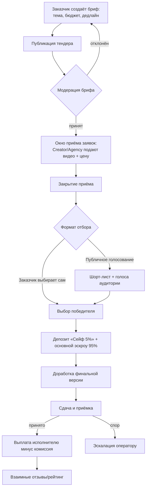
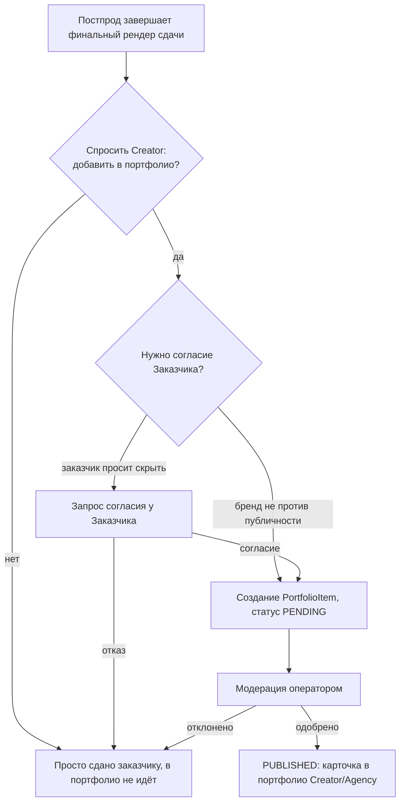

# UGC-маркетплейс: анализ и краткое ТЗ

2026-09-19 · @Someone

> **Аудит (19 сентября 2026, раунды 1–4):** согласованы §4/§6/§7/§11.3 — эскроу везде теперь единообразно называется «Сейф 5%» (депозит) + основной платёж 95%; в §5 добавлена отсутствовавшая сущность `CreatorProfile`, а поля `Contract` и `Escrow/Payment` дополнены статусами и типом (`DEPOSIT`/`MAIN`), которые уже использовались в §11.2–11.3, но не попадали в таблицу сущностей; объём MVP в §7 приведён в соответствие с приоритетами §15; в §8 сняты уже отвеченные вопросы; в §14 курс «Verified Partner» переименован в «Certified Partner», чтобы не путать платную сертификацию с платной KYC-верификацией (§14 №9) и бесплатным поисковым бейджем Verified (§13 №11) — это три разные механики. Разделы 12–14 расширены с 20 до 30 фич каждый. Раунд 3: добавлена форма брифа с подбором исполнителя и ИИ-советом по формату генерации (§21); исправлена нестыковка в отдельном ТЗ на бэкенд — `PortfolioItem.contractId` был обязательным, что делало невозможной публикацию портфолио в Фазе 1 без тендера, — сделан опциональным. **Раунд 4:** §7 переписан заново — прежняя «Фаза 1» там уже включала Tender/Escrow, что противоречило принятому позже решению §19 ограничиться витриной; следом приведены в соответствие §5 (PortfolioItem), §8 (роль Agency — Фаза 2, не «Фаза 3»), §10 (разделены флоу Фазы 1 и Фазы 2 для публикации портфолио), §15 (P0-статус тендера/эскроу помечен устаревшим) и §16 (ИИ-помощник по брифу на Этапе 0 нацелен на `CreatorInquiry`, а не `Tender`).

## 1. Вывод

Реализовать можно, но это фактически отдельный продукт рядом с текущим сервисом, а не доработка существующего функционала. Сегодня viral4creators — self-serve инструмент «один пользователь → AI генерирует видео под его товар»: нет разделения на заказчика и исполнителя, нет понятия сделки между сторонами, нет тендера, ставки, эскроу или рейтинга. Из платформы переиспользуется инфраструктурный слой (генерация видео, биллинг, модерация, авторизация, i18n), но доменная модель маркетплейса и почти вся бизнес-логика тендера создаются с нуля. Финальная рекомендация по объёму инвестиций в маркетплейс — в §19.

## 2. Что переиспользуем из viral4creators

| Модуль в текущем коде | Что переиспользуем в маркетплейсе |
| --- | --- |
| `billing` (Payment, Subscription, credit ledger, Telegram Stars + WayForPay) | транспорт платежей — база для расчётов между сторонами, но нужна новая сущность «холд/эскроу» вместо прямой подписки |
| `publication` (PublicationRequest + очередь модератора) | паттерн для модерации заявок на тендер и финальных роликов |
| `admin-panel` (users, moderation, telemetry, costs) | расширяется под модерацию тендеров, споры, финансовую отчётность по сделкам |
| `telegram-auth` / `telegram-login` | готовый слой идентификации для всех трёх ролей |
| `generation` (пайплайн Veo/Grok) | опциональный инструмент ускорения: креатор может сгенерировать черновик заявки через AI, а не как замена ручной съёмке |
| `project` / `product` (карточка товара, фото, цена) | становится вложением брифа тендера от заказчика |
| `notify`, `storage`, `i18n` | инфраструктура без изменений |

Вывод: переиспользуется транспортный и инфраструктурный слой, но не доменные сущности — User, Project, Session сегодня не рассчитаны на роли и сделки между независимыми сторонами.

## 3. Чего не хватает: роли и новая доменная модель

Сейчас модель `User` в схеме БД содержит только `telegramId` и флаг `isOperator` (админ/не админ) — ролей заказчика, креатора и агентства нет в принципе. Нужно добавить:

- **Роль пользователя**: CUSTOMER / CREATOR / AGENCY (один аккаунт может совмещать роли, например креатор тоже иногда заказывает).
- **Agency**: юрлицо/команда, объединяющая нескольких Creator, с распределением выплат (комиссия агентства сверх комиссии платформы).
- **CreatorProfile**: портфолио (прошлые работы), ниши/навыки, ценник, статистика побед в тендерах.
- **Tender (бриф)**: заявка заказчика с бюджетом, дедлайном, ТЗ, референсами.
- **Submission (заявка на тендер)**: видео/концепт + цена от Creator или Agency.
- **Contract**: фиксирует выбранного победителя и условия сделки.
- **Escrow/Payment**: удержание и последующая выплата с удержанием комиссии.
- **Review/Rating**: двусторонние отзывы после сделки.
- **Dispute**: спор, эскалируемый оператору.
- **Message/Chat**: переписка в рамках тендера/сделки.

Ни одной из этих сущностей в текущей Prisma-схеме нет — это новый набор таблиц и модулей, а не расширение существующих.

## 4. Тендерный / соревновательный флоу



Публичное голосование усиливает именно «соревновательный» и «привлечение внимания» эффект из цели — шорт-лист с открытым голосованием сам становится точкой привлечения новых заказчиков и креаторов на площадку.

## 5. Модель данных: ключевые сущности

| Сущность | Ключевые поля | Связи |
| --- | --- | --- |
| User | role(s), telegramId, KYC-статус | 1—N Tender (как заказчик), 1—N Submission (как креатор) |
| Agency | название, % комиссии агентства | 1—N Creator (участники команды) |
| Tender | заголовок, бриф, бюджет, дедлайн, категория, статус | принадлежит Customer, 1—N Submission |
| Submission | ссылка на видео/черновик, цена, статус | принадлежит Tender + Creator/Agency |
| Contract | tenderId, winningSubmissionId, сумма, status (AWAITING\_DEPOSIT / IN\_PROGRESS / DELIVERED / DISPUTED / COMPLETED / CANCELLED), paymentStatus, paidViaPlatform | 1:1 с Tender после выбора победителя |
| Escrow/Payment | сумма, type (DEPOSIT / MAIN), дата holds, дата выплаты (RELEASED), комиссия | принадлежит Contract |
| Review | рейтинг, комментарий, направление (заказчик↔исполнитель) | принадлежит Contract |
| Message | threadId, senderId, текст | принадлежит Tender/Contract |
| Dispute | причина, статус, кто разрешил (оператор) | принадлежит Contract |
| PortfolioItem | sourceType (CONTRACT/SELF\_UPLOAD), contractId опционален, inquiryId — связь с CreatorInquiry §21 при наличии, статус PENDING/PUBLISHED/REJECTED, согласие Creator, согласие Заказчика (актуально только для CONTRACT), анонимизация | принадлежит Creator/Agency + Contract; строится на паттерне SharedVideoPage |
| CreatorProfile | ниши/специализация, ценовой диапазон, статистика побед, ссылки на PortfolioItem | 1:1 с User в роли Creator (или с участником Agency); публикуется на странице профиля §9 |

Все перечисленные таблицы отсутствуют в текущей `schema.prisma` — потребуется отдельный набор миграций и NestJS-модулей (`tender`, `submission`, `escrow`, `review`, `dispute`), спроектированных по образцу существующих `publication` и `billing`, но с новой доменной логикой.

## 6. Монетизация, эскроу и комиссии

- **Комиссия платформы**: процент с выплаты исполнителю при закрытии сделки (например 10–20%), опционально + отдельная небольшая комиссия с заказчика за публикацию тендера.
- **Эскроу**: после выбора победителя заказчик вносит депозит «Сейф 5%», затем — основной платёж 95% в общий холд; оба блокируются платформой до приёмки финальной версии, дальше выплата исполнителю за вычетом комиссии (детали депозита — §11.3). Существующий транспорт (Telegram Stars, WayForPay из модуля `billing`) можно переиспользовать как способ оплаты, но нужна новая сущность холда вместо прямой подписки/кредита.
- **Агентский сплит**: если заявку подаёт Agency, выплата делится между агентством и исполнителем-креатором по внутренней договорённости, которую хранит платформа.
- **Монетизация привлечения внимания** (под цель «привлечь заказчиков»): полный перечень платных механик продвижения и монетизации вынесен в §13 и §14 отдельными таблицами — здесь достаточно зафиксировать принцип: соревновательный формат тендера сам по себе создаёт спрос на видимость (буст заявки, буст тендера, статусные бейджи), и этот спрос — самостоятельный источник дохода помимо комиссии со сделки.

## 7. MVP: объём и этапы

**Пересмотрено под §19:** более ранняя версия этого раздела уже включала Tender/Escrow в Фазу 1, что противоречит принятому позже решению ограничиться витриной.

1. **MVP / Фаза 1 (= Этап 0, в разработке сейчас)** — без Tender, Contract, Escrow, Agency вообще. Публичные профили Creator с портфолио (§9), лайки (§11.1), публичная витрина-галерея на лендинге (§12 №2), форма брифа и подбор исполнителя без тендера (§21), мастер брендбука без Project (§21.7), квиз становления исполнителем после первой генерации (§21.8), модерация портфолио и брифов в admin-panel по образцу очереди `publication`. Отзывы и эскроу «Сейф 5%» из §11.2–11.3 в этой фазе не действуют — они относятся к Фазе 2.
2. **Фаза 2 (только по сигналу §19.4)** — весь тендерный контур из отдельного ТЗ на бэкенд: роли Customer/Creator + Agency, Tender/Submission, Contract, эскроу «Сейф 5%» (§11.3), отзывы с гейтом по оплате (§11.2), автопубликация в портфолио из завершённых сделок с двойным согласием (§10, `sourceType: CONTRACT`), встроенный чат по тендеру, Dispute.
3. **Дальше** — публичное голосование как альтернатива закрытому выбору заказчика, Verified-бейдж и остальная платная верификация, подписки и прочие фичи монетизации (§14), реферальная программа и платное продвижение (§12 №1, §13), встраивание AI-пайплайна (Veo/Grok) как опционального инструмента для Creator.

## 8. Риски и открытые вопросы

- **Юридическое**: выплаты исполнителям-физлицам через эскроу требуют KYC и, вероятно, налоговой отчётности — текущая публичная оферта рассчитана на пару «сервис–пользователь», а не на трёхстороннюю сделку.
- **Холодный старт**: классическая проблема двустороннего маркетплейса — нужен одновременный приток и заказчиков, и креаторов/агентств, иначе тендеры остаются без заявок.
- **Каннибализация текущего продукта**: сегодня viral4creators учит заказчика самому генерировать AI-видео за пару кликов — есть риск, что для многих задач заказчик просто сделает видео сам, а не будет платить за тендер. Возможное решение — позиционировать AI-пайплайн как инструмент ускорения для Creator, а не как альтернативу самому маркетплейсу.
- **Открытые вопросы**: формат отбора победителя в будущем тендере (§4) — закрытый выбор заказчиком или публичное голосование — остаётся открытым до начала Фазы 2, решать по факту наблюдений с витрины; роль Agency и весь тендерный контур целиком отнесены к Фазе 2 (§7, §19.4), а не к отдельной «Фазе 3» — количественный порог запуска (просмотры, обращения «связаться») определён качественно в §19.4, но без точных цифр; остаётся открытым, будет ли маркетплейс отдельным доменом/брендом или разделом внутри viral4creators; из §18.4 — не проверено, доступна ли многоколоночная десктоп-раскладка внутри самого Telegram-клиента на десктопе.
- **Конфиденциальность работ заказчика**: часть брендов не захочет публичности до официального запуска кампании — нужен явный чекбокс согласия на портфолио на уровне Tender и повторный запрос согласия у Creator на уровне сдачи, иначе профили останутся пустыми либо возникнут конфликты с заказчиками

## 9. Профили и портфолио Creator/Agency (мини-соцсеть)

В коде уже есть близкая по духу, но более узкая функция — `doc/SOCIAL-FEED-SPEC.md`: лента опубликованных роликов (`SharedVideoPage`) с лайками (`SharedVideoLike`), модерацией `PENDING → PUBLISHED/REJECTED` и правом публикации только у платных пользователей. Это ровно тот кирпич, на котором можно строить портфолио, но с тремя принципиальными отличиями от текущей реализации:

1. **Группировка по автору, а не плоская лента.** Сегодня `SharedVideoPage` — отдельные карточки без объединения в профиль; для маркетплейса нужна публичная страница-профиль Creator/Agency, на которой ролики агрегированы в портфолио.
2. **Публичный, а не только внутрипродуктовый доступ.** Текущая лента живёт только внутри TMA и завязана на Telegram-идентичность (`TelegramIdentityGuard`) — для привлечения заказчиков «снаружи» профиль креатора/агентства должен быть публичной страницей на лендинге (по образцу уже существующей `landing/video/[id]`), доступной без логина, как визитка для внешнего трафика.
3. **Не требует платного тарифа.** Публикация в общей ленте сейчас доступна от Standard-плана (`assertUser(userId,'publication')`); для витрины маркетплейса это ограничение неуместно — портфолио должно быть доступно любому активному Creator/Agency, иначе смысл привлечения заказчиков теряется.

Структура страницы профиля: аватар/лого, ниши и специализация, ценовой диапазон, статистика (число тендеров, побед, средний рейтинг), сетка портфолио (карточки в духе `SharedVideoPage`: превью, лайки, счётчик просмотров). Профиль Agency дополнительно агрегирует портфолио всех участников команды. Отдельно нужна страница-каталог для обзора/поиска creators и agencies по нише, рейтингу и цене — сегодня такой витрины-галереи на лендинге нет ни для видео, ни тем более для авторов (в `SOCIAL-FEED-SPEC.md` она прямо вынесена как «отдельное ТЗ, если понадобится»).

## 10. Автопубликация из постпрода: согласие и попадание в портфолио

**Важно:** описанный ниже флоу с двойным согласием относится к Фазе 2 — публикации из завершённой сделки (`sourceType: CONTRACT`). На Этапе 0 (Фаза 1, в разработке сейчас) действует более простой путь: Creator публикует в портфолио собственную работу напрямую (`sourceType: SELF_UPLOAD`) — нужно согласие только самого Creator, ровно как в сегодняшнем `SharedVideoPage`, потому что стороннего заказчика на платформе ещё нет.



Технически это расширение уже существующего постпрод-пайплайна (`postprod`, `postprod-videos`) и паттерна `SharedVideoPage` (`status PENDING → PUBLISHED/REJECTED`, тот же переиспользуемый цикл модерации, что и у публикации на YouTube/TikTok и у общей ленты), а не новая подсистема с нуля.

Важный нюанс, которого нет у обычной ленты: у ролика в маркетплейсе **два заинтересованных лица**, а не один автор. Сегодня `SharedVideoService.create()` спрашивает согласие только у владельца ролика (Standard-плана достаточно) — здесь ролик показывает продукт и бренд Заказчика, поэтому:

- по умолчанию для попадания в портфолио нужно явное согласие Creator (обязательно) **и** Заказчика (обязательно либо по умолчанию, либо настраиваемо в брифе тендера — «согласен(на) на публичное портфолио» как чекбокс при создании Tender, чтобы не спрашивать по каждой сдаче отдельно);
- если бренд просит анонимизацию — допустимый компромисс: публикация без названия товара/бренда, только с указанием ниши и работы креатора;
- запрос согласия у Creator логично встраивать сразу в экран приёмки/сдачи работы (после `postprod`), а не отдельным напоминанием позже — иначе конверсия в наполнение портфолио будет низкой.

## 11. Лайки, отзывы «при оплате через платформу» и эскроу «Сейф 5%»

### 11.1. Лайки под видео

Переиспользуется готовый паттерн `SharedVideoLike` (`userId` + `sharedVideoPageId`, уникальный индекс на пару, счётчик `likeCount` на самой странице) — переносится на `PortfolioItem` без изменений в логике, только смена сущности-владельца. Лайк доступен любому залогиненному пользователю (заказчику, креатору, гостю Telegram-логина), не только участникам сделки — это социальный сигнал для витрины и ранжирования в поиске.

### 11.2. Отзывы только при оплате через платформу

Отзыв (`Review`) создаётся исключительно из `Contract`, у которого связанный `Escrow/Payment` в статусе `RELEASED` (деньги реально прошли через платформу и выплачены). Технически: `ReviewService.create()` проверяет `Contract.paymentStatus === 'RELEASED'` и `Contract.paidViaPlatform === true`, иначе `403`. Смысл ограничения: (1) отсечь фиктивные отзывы без реальной сделки; (2) защитить платформу от «увода» сделки в оффлайн-оплату — если оплата прошла мимо эскроу, ни заказчик, ни исполнитель не получают возможность оставить отзыв и повысить рейтинг, что стимулирует держать расчёты внутри платформы.

### 11.3. Эскроу «Сейф 5%»

Расширяет общий эскроу-механизм из раздела 6 конкретным правилом:

1. Сразу после выбора победителя тендера (`Contract` создан, статус `AWAITING_DEPOSIT`) заказчик обязан внести депозит в размере **5% от суммы сделки** — эти деньги блокируются на платформе немедленно («Сейф»).
2. Депозит подтверждает намерение заказчика — без него исполнитель не начинает работу, `Contract` не переходит в `IN_PROGRESS`.
3. Оставшиеся 95% вносятся в эскроу отдельным платежом либо сразу вместе с депозитом (настраиваемо), но удерживаются до приёмки результата — как описано в общем флоу раздела 4.
4. Если заказчик отменяет сделку после внесения депозита и до сдачи работы **по своей инициативе** — 5% не возвращаются и переходят исполнителю как компенсация за начатую работу; если отменяет исполнитель или тендер отменён по вине платформы — депозит возвращается заказчику полностью.
5. Депозит технически — отдельная запись в `Escrow` с `type: 'DEPOSIT'`, отличная от основной эскроу-суммы (`type: 'MAIN'`), чтобы независимо управлять условиями возврата каждой части.

## 12. 30 маркетинговых фич (привлечение заказчиков и креаторов)

| № | Фича | Эффект |
| --- | --- | --- |
| 1 | Реферальная программа (бонус и заказчику, и креатору за приглашённого) | снижает CAC, вирусный рост |
| 2 | Публичная витрина-галерея лучших роликов на лендинге (без логина, индексируется) | входящий SEO-трафик |
| 3 | Блог-кейсы «как бренд X получил вирусное видео» (расширение уже существующего модуля `blog`) | контент-маркетинг, доверие |
| 4 | Еженедельная email/Telegram-рассылка с топ-тендерами и лучшими работами | удержание, повторные визиты |
| 5 | UGC-конкурсы с призовым фондом от платформы | приток новых креаторов |
| 6 | Программа амбассадоров среди топ-креторов (% с их рефералов) | органичный охват в соцсетях креаторов |
| 7 | Публичные success-story с цифрами (ER, просмотры, продажи) | social proof для новых заказчиков |
| 8 | One-click шеринг портфолио/тендера в Instagram/TikTok/X | виральность |
| 9 | Брендированный watermark «Made on \[платформа\]» с опцией отключения за доплату | бесплатная реклама на каждом ролике |
| 10 | Партнёрская программа для агентств (co-marketing, вебинары) | привлечение B2B-сегмента |
| 11 | Открытый API/вебхуки для брендов (интеграция с их CRM) | привлечение крупных заказчиков |
| 12 | Лендинг-калькулятор «сколько будет стоить UGC-видео» | лид-магнит, сбор контактов |
| 13 | Публичный топ-чарт «Креаторы месяца» (Hall of Fame) | мотивация и PR одновременно |
| 14 | Рубрика «Тендер недели» с разбором в блоге/соцсетях платформы | регулярный инфоповод |
| 15 | Партнёрство с e-commerce площадками (Shopify и аналоги) как источник заказчиков | канал привлечения B2B |
| 16 | Реф-ссылки с UTM-метками для креаторов, которыми они делятся сами | измеримая вирусность |
| 17 | Бесплатный первый тендер без комиссии платформы для новых заказчиков | снижение порога входа |
| 18 | Геймифицированный онбординг-чеклист с прогресс-баром | выше конверсия в первое действие |
| 19 | Пресс-кит и медиа-страница для журналистов и блогеров | PR-охват |
| 20 | Кросс-промо с существующим AI-видео-пайплайном (Veo/Grok) как отдельным лид-магнитом | трафик от текущего продукта в маркетплейс |
| 21 | Локализация под несколько языков и рынков (готовая i18n-инфраструктура: ru/uk/en/de/es) | выход на новые гео почти без доработок |
| 22 | Публикация тендера в Telegram-канал бренда одним кликом | вовлекает уже существующую аудиторию бренда |
| 23 | Бонус за приведённое агентство целиком, а не одного креатора | крупный приток исполнителей за один реферал |
| 24 | Витрина «было/стало» — обычный контент бренда против результата с площадки | наглядный аргумент для новых заказчиков |
| 25 | Партнёрство с образовательными платформами и курсами по маркетингу | приток начинающих креаторов через учебные кейсы |
| 26 | Регулярные AMA/вебинары с топ-креаторами площадки | вовлечение и приток новых creators |
| 27 | Демонстрационные видео-кейсы, сгенерированные тем же AI-пайплайном (Veo/Grok) | наглядная демонстрация возможностей площадки |
| 28 | Мультиязычный контент-маркетинг через уже готовый Grok Batch перевод блога | дешёвый выход контента на несколько рынков сразу |
| 29 | Партнёрство и кросс-постинг тендеров с фриланс-биржами | дополнительный канал притока заявок и заказчиков |
| 30 | Собственный годовой отчёт/рейтинг рынка UGC-видео от площадки | инфоповод и цитируемость в медиа |

## 13. 30 фич продвижения внутри маркетплейса

| № | Фича | Эффект |
| --- | --- | --- |
| 1 | Платное продвижение тендера в топ ленты (буст) | видимость для заказчика, доход платформе |
| 2 | Бейджи «Топ-креатор», «Выбор редакции», «Восходящая звезда» | доверие и выделение среди конкурентов |
| 3 | Featured-агентства на главной странице | видимость крупных игроков |
| 4 | Push/Telegram-уведомления о новых тендерах по подписанным нишам | быстрый отклик креаторов |
| 5 | Персональные рекомендации тендеров для креаторов (по нише/истории) | релевантность, меньше «холостых» заявок |
| 6 | Персональные рекомендации креаторов для заказчиков при создании тендера | ускоряет подбор исполнителя |
| 7 | Публичный leaderboard по нишам (beauty, tech, food и т.д.) | навигация и соревновательный элемент |
| 8 | Лента активности на главной («витрина» новых работ и побед) | ощущение живой площадки |
| 9 | Блок «похожие тендеры» на странице тендера | больше заявок на смежные тендеры |
| 10 | SEO публичных профилей (индексация по нише + городу) | органический трафик на профили |
| 11 | Значок Verified для агентств, прошедших KYC | доверие заказчиков |
| 12 | Платное выделение конкретной заявки в списке заявок тендера («Featured submission») | доп. видимость заявки, доход |
| 13 | Встраиваемый виджет портфолио (embed) для сайта креатора | внешний трафик на платформу |
| 14 | Уведомления заказчику в реальном времени о новых заявках | удержание внимания заказчика |
| 15 | Блок «похожие креаторы» на странице профиля | больше просмотров профилей |
| 16 | Бонусное продвижение за реферал (пригласи 3 заказчиков — неделя буста бесплатно) | стимул к рефералам |
| 17 | Авто-постинг готовой работы в TikTok/Instagram с отметкой платформы (через существующие OAuth-модули publishing-channel) | охваты за пределами платформы |
| 18 | Тематические подборки/коллекции («Лучшее для fitness-брендов») | навигация и вовлечение |
| 19 | Ранжирование в поиске по активности (скорость отклика, рейтинг) | стимулирует качество сервиса |
| 20 | Красивые OG-превью для шеринга портфолио в соцсети | больше кликов из внешних ссылок |
| 21 | Статус «Быстрый ответ» в профиле (среднее время отклика влияет на позицию в поиске) | стимулирует скорость реакции creator |
| 22 | Календарь доступности creator (занят/свободен) | точнее подбор, меньше отказов по загрузке |
| 23 | Уведомление заказчику, когда понравившийся creator освобождается | возврат заказчика к конкретному исполнителю |
| 24 | Отдельная витрина «новых» creators/agencies | шанс новичкам попасть в фокус без истории побед |
| 25 | A/B показ обложки портфолио (какая превьюшка кликабельнее) | самообслуживаемый инструмент роста конверсии профиля |
| 26 | Значок «Быстрая сдача» на основе истории соблюдения дедлайнов | дифференциация по надёжности |
| 27 | Промокод на буст, зашитый в реферальную ссылку | объединяет реферальную и промо-механики |
| 28 | Индикатор «сейчас смотрят N заказчиков» на карточке тендера/профиля | социальное доказательство, стимул подать заявку быстрее |
| 29 | Тематические ивенты/хакатоны с временным приоритетом в ленте для участников | всплеск активности и вовлечения |
| 30 | Быстрый фильтр «уложусь в бюджет X» на стороне заказчика | ускоряет подбор исполнителя под бюджет |

## 14. 30 фич для увеличения монетизации

| № | Фича | Источник дохода |
| --- | --- | --- |
| 1 | Базовая комиссия платформы со сделки (10–20%) | ядро бизнес-модели |
| 2 | Депозит «Сейф 5%» — комиссия за обработку удерживается и с депозита тоже | доп. доход с каждой выбранной заявки |
| 3 | Pro-подписка для заказчиков (сниженная комиссия, безлимит тендеров) | recurring revenue |
| 4 | Подписка для креаторов/агентств за приоритет в поиске | recurring revenue |
| 5 | Платное продвижение тендера в топ (буст) | разовые платежи |
| 6 | Платное «Featured submission» для заявки | разовые платежи |
| 7 | Rush fee — доплата за сокращённые сроки тендера | наценка за срочность |
| 8 | Отдельная эскроу-комиссия за обработку платежа (помимо основной комиссии) | доп. маржа с транзакции |
| 9 | Платная верификация Verified для агентств (KYC + бейдж) | разовый платёж |
| 10 | Платная аналитика рынка для агентств (средние цены по нише, спрос) | B2B-подписка |
| 11 | White-label мини-маркетплейс для крупных агентств поверх платформы | enterprise-контракты |
| 12 | Продажа доступа к контактам заказчиков агентствам (lead gen) | комиссия за лид |
| 13 | Fee за досрочный (instant) вывод средств исполнителем | комиссия за скорость |
| 14 | Платные обучающие материалы «как выигрывать тендеры» | продажа курсов |
| 15 | Апсейл доп. услуг через существующие модули TTS/постпрод (озвучка, субтитры, монтаж) с комиссией платформы | маржа с апсейла |
| 16 | Нативная реклама брендов внутри ленты портфолио | рекламная модель |
| 17 | Платная страховка сделки для крупных бюджетов | доп. страховой продукт |
| 18 | Платный API-доступ для агентств, встраивающих тендеры в свои системы | B2B API-тариф |
| 19 | Динамическая комиссия (выше % для мелких сделок, ниже для крупных) | оптимизация среднего чека |
| 20 | Retainer-контракты с брендами (фиксированное число тендеров в месяц по фикс. комиссии) | предсказуемый recurring revenue |
| 21 | Комиссия за экспресс-модерацию тендера/портфолио (пропуск очереди за доплату) | доп. платёж за скорость |
| 22 | Продажа готовых шаблонов брифов по нишам | разовые платежи, продукт с нулевой предельной стоимостью |
| 23 | Fee за перевод брифа/сдачи на другой язык при международных тендерах (Grok Batch) | апсейл на трансграничных сделках |
| 24 | Комиссия с AI-черновика заявки: Creator платит за генерацию через встроенный Veo/Grok-пайплайн | маржа с использования готовой инфраструктуры генерации |
| 25 | Freemium-лимит бесплатных тендеров/заявок в месяц, дальше платно | конверсия активных пользователей в платящих |
| 26 | Платная расширенная аналитика по конкретному тендеру (бенчмарки просмотров, сравнение с рынком) | апсейл для заказчика на самом тендере |
| 27 | Небольшая комиссия платформы с выплаченных реферальных бонусов | доп. маржа на растущем реферальном обороте |
| 28 | Платный сертификационный курс/экзамен для статуса «Certified Partner» (отдельно от KYC-верификации Verified, §14 №9 — это две разные механики доверия) | продажа обучения, привязанная к статусу доверия |
| 29 | Платная приоритетная поддержка/выделенный менеджер для крупных агентств | upsell для верхнего сегмента B2B |
| 30 | Партнёрская комиссия от сторонних сервисов (монтаж, стоки), интегрированных в платформу | доход без прямых затрат на разработку сервиса |

## 15. Приоритизация фич по степени полезности

Оценка по двум осям: **Польза** (влияние на выручку/удержание/привлечение) и **Усилия** (с учётом того, что часть кода уже есть в viral4creators — переиспользование резко снижает усилия). Приоритет: P0 — делать в первую очередь (высокая польза, низкие/средние усилия за счёт готового кода), P1 — следующая волна, P2 — бэклог/поздний этап.

**Обновление:** таблица ниже составлялась до итогового решения §19. Строки «Роли Customer/Creator + Tender/Submission (ядро)» и «Escrow «Сейф 5%»» с пометкой P0 фактически отложены в Фазу 2 по §19.4 — таблица оставлена как есть для истории рассуждений (порядок внутри будущей Фазы 2 она по-прежнему верно отражает), актуальный статус смотрите в §7/§19.3.

| Приоритет | Фича | Раздел | Польза | Усилия | Почему |
| --- | --- | --- | --- | --- | --- |
| P0 | Роли Customer/Creator + Tender/Submission (ядро) | §3–4 | Высокая | Средние | без этого нет продукта |
| P0 | Escrow «Сейф 5%» | §11.3 | Высокая | Средние | защищает обе стороны, доверие к площадке |
| P0 | Отзывы только при оплате через платформу | §11.2 | Высокая | Низкие | простая проверка статуса, сразу защищает от увода сделок в обход |
| P0 | Лайки под видео (`SharedVideoLike`→`PortfolioItem`) | §11.1 | Средняя | Низкие | код уже есть, копипаст сущности |
| P0 | Публичные профили Creator/Agency + портфолио | §9 | Высокая | Средние | строится на готовом `SharedVideoPage` |
| P0 | Публичная витрина-галерея на лендинге (маркетинг №2) | §12 | Высокая | Низкие | тот же паттерн, что уже описан в `SOCIAL-FEED-SPEC.md` как «отдельное ТЗ при необходимости» |
| P0 | ИИ-помощник при создании тендера | §16 | Высокая | Низкие | модуль `assistant` уже в проде на лендинге, нужно расширить область применения |
| P1 | Автопубликация из постпрода с двойным согласием | §10 | Высокая | Средние | зависит от готового портфолио (P0) |
| P1 | Реферальная программа (маркетинг №1) | §12 | Высокая | Средние | классический рычаг роста для two-sided маркетплейса |
| P1 | Платное продвижение тендера / заявки (буст) | §13 №1, №12 | Высокая | Низкие | простая флаг-фича поверх ленты, быстрый доход |
| P1 | Verified-бейдж для агентств (KYC) | §13 №11 | Средняя | Средние | требует процесса проверки, но повышает доверие заказчиков |
| P1 | Rush fee за срочность | §14 №7 | Средняя | Низкие | наценка почти без разработки — просто множитель к цене |
| P1 | Динамическая комиссия по размеру сделки | §14 №19 | Средняя | Низкие | настройка формулы, не новая подсистема |
| P1 | Push/Telegram-уведомления о новых тендерах по нишам | §13 №4 | Средняя | Низкие | модуль `notify` уже есть, добавить фильтр по нише |
| P1 | Апсейл через существующие TTS/постпрод (озвучка/субтитры) | §14 №15 | Средняя | Низкие | сервисы уже реализованы для другого продукта, только тарификация новая |
| P2 | White-label мини-маркетплейс для агентств | §14 №11 | Высокая, но узкая | Высокие | enterprise-фича, имеет смысл только после traction |
| P2 | Платная аналитика рынка для агентств | §14 №10 | Средняя | Высокие | нужен накопленный массив сделок для честных цифр |
| P2 | Публичное голосование как альтернатива выбору заказчика | §4 | Средняя | Средние | усложняет флоу выбора, лучше проверить на P0-версии сначала |
| P2 | Страхование сделки | §14 №17 | Низкая/средняя | Высокие | требует юридической проработки и, вероятно, партнёра-страховщика |
| P2 | Встраиваемый виджет портфолио (embed) | §13 №13 | Низкая | Средние | приятная, но не критичная для роста фича |
| P1 | Freemium-лимит бесплатных тендеров в месяц | §14 №25 | Средняя | Низкие | простой числовой лимит поверх уже существующей модели User |
| P1 | Календарь доступности creator | §13 №22 | Средняя | Низкие | заметно снижает долю отказов при подборе исполнителя |
| P2 | Комиссия с AI-черновика заявки через Veo/Grok | §14 №24 | Средняя | Средние | технически готово (generation-модуль), но имеет смысл только после появления массового спроса Creator на черновики |

Остальные пункты разделов 12–14 остаются полным бэклогом — приоритизировать точечно после первых метрик MVP (конверсия тендер → сделка, retention creators, доля повторных заказчиков).

## 16. ИИ-ассистент в маркетплейсе

В проекте уже есть готовый ИИ-консультант (`assistant`-модуль, `doc/LANDING-TUTORIAL-AI-CONSULTANT-SPEC.md`): стриминг ответов Gemini через SSE и протокол `<<<actions>>>`, которым ассистент не просто отвечает текстом, а сам выполняет действия в интерфейсе. Это готовая архитектура для распространения ИИ-помощи на весь маркетплейс, а не отдельная разработка с нуля.

| Где применяем | Что делает ИИ | На чём строится |
| --- | --- | --- |
| Создание тендера (бриф) | Диалоговый мастер: задаёт уточняющие вопросы (ниша, бюджет, дедлайн, референсы, тон бренда) и сам заполняет поля формы через `<<<actions>>>`, а не просто советует; на Этапе 0 это конкретно поля брифа CreatorInquiry (§21.2), actions под полноценный Tender добавляются в Фазе 2 | тот же `AssistantService` + новый набор actions под `Tender` |
| Подсказка бюджета | Предлагает рыночный диапазон цены по категории на основе истории похожих тендеров | агрегаты по завершённым `Contract` |
| Помощь Creator в заявке | Помогает сформулировать питч/сопроводительное сообщение к `Submission`, указывает на несоответствия брифу | тот же ассистент, промпт под роль Creator |
| Предмодерация брифа/заявки | Быстрая ИИ-проверка на соответствие правилам площадки до отправки оператору — снижает очередь ручной модерации | пайплайн Gemini, аналогичный уже существующему `video-audit` |
| Подбор исполнителей | Рекомендует заказчику подходящих Creator/Agency по нише и истории побед; в Фазе 1 это конкретно реализовано как шаг после брифа в §21.3, без ожидания полноценного тендера | логика в духе существующего `relevance`-модуля (сопоставление аудитории) |
| Автогенерация описания портфолио | Пишет черновик описания работы/профиля на основе прошлых сдач — Creator только правит | тот же Gemini-пайплайн, новый промпт |
| Драфт ответа в споре (Dispute) | Готовит оператору сжатую сводку конфликта и предлагаемое решение | использует `Message`-историю тендера как контекст |
| Итоговая сводка тендера | Короткое сравнение всех заявок для заказчика перед выбором победителя (сильные/слабые стороны каждой) | тот же ассистент, отдельный режим |

Важно: экономика этого — не бесплатная. Каждый вызов ИИ уже учитывается в существующем `ai-usage`-модуле (леджер стоимости токенов) — тот же принцип daily spend caps, который сегодня защищает генерацию видео, должен защищать и ассистента маркетплейса от неограниченного расхода.

## 17. Интерфейс: стиль, дизайн-система, ключевые экраны

### 17.1. Переиспользуем, а не строим с нуля

Во frontend уже есть свой UI-кит (`components/ui`: Card, Badge, Button, Tabs, Stepper, ConfirmDialog, EmptyState, Spinner, Field) и поддержка тёмной/светлой темы (`theme.ts`, `theme-context.ts`, `ThemeToggle.tsx`). Разумный путь — расширить этот кит новыми компонентами маркетплейса (карточка тендера, карточка портфолио, чат-виджет), а не заводить отдельную дизайн-систему для новой части продукта: пользователь не должен ощущать, что попал в другое приложение.

### 17.2. Направление стиля

Две разные по духу зоны интерфейса требуют разного тона, но одной визуальной грамматики (шрифты, радиусы, отступы — общие):

- **Портфолио и лента тендеров** — визуально насыщенная, видео-ориентированная подача (крупные превью, автовоспроизведение при наведении/скролле, плотная grid-раскладка в духе Behance/Dribbble) — это точка привлечения внимания заказчиков.
- **Управление сделкой, эскроу, споры** — сдержанный, «деловой» тон в духе уже существующей admin-панели (чистые таблицы, статус-бейджи, минимум декоративных элементов) — здесь важна прозрачность и доверие, а не впечатление.
- Отдельный акцентный цвет для зоны маркетплейса (на базе текущей палитры фронтенда), чтобы пользователь ментально отличал «сгенерировать видео» от «нанять исполнителя» — это разные продуктовые режимы внутри одного приложения.

### 17.3. Ключевые новые экраны

| Экран | Назначение | Переиспользуемые компоненты |
| --- | --- | --- |
| Лента тендеров | Карточки: превью брифа, бюджет, дедлайн, число заявок | Card, Badge, Pills (фильтры по нише) |
| Страница тендера | Бриф + список заявок + чат + статус сделки | Tabs, Card, новый ChatWidget |
| Мастер создания тендера | Пошаговый бриф + ИИ-ассистент (§16) | уже существующий Stepper, PromptEditor как образец диалогового UI |
| Профиль Creator/Agency | Портфолио-грид + статистика + отзывы | Card, Badge, новый PortfolioGrid |
| Каталог Creator/Agency | Поиск и фильтры по нише/цене/рейтингу | Pills, Field, EmptyState |
| Эскроу и платежи | Статусы холда/выплаты, история | таблица в духе admin `costs`/`payments`, money.ts для форматирования сумм |

### 17.4. Общее правило

Любой новый компонент маркетплейса сначала проверяется на соответствие уже принятым паттернам (`frontend/src/components/ui`, `admin/src/components`), и только при отсутствии подходящего — проектируется заново.

## 18. Режим ТМА + десктоп одновременно, авторизация Telegram

### 18.1. Уже готовая архитектура

Сегодня `frontend/` — это один React SPA, который работает и как обычный сайт в браузере, и как Telegram Mini App, без раздвоения кода: обёртка `lib/telegram.ts` сама определяет контекст — есть ли `window.Telegram.WebApp`. Внутри Telegram она берёт `initData` и валидирует его на бэкенде (`telegram-auth`); в обычном браузере анонимная сессия по UUID продолжает работать без единого auth-заголовка, и поверх неё уже добавлена опциональная кнопка «Войти через Telegram» (`telegram-login`, Login Widget). Для маркетплейса эта же схема — правильная основа, менять её не нужно, нужно только ужесточить требования там, где это касается денег.

### 18.2. Что меняется для маркетплейса

- **Просмотр — анонимно и публично.** Лента тендеров, каталог Creator/Agency, публичные профили-портфолио остаются доступны без входа (и даже без Telegram) — это нужно для SEO и внешнего маркетингового трафика (§12 п.2).
- **Действия со сделкой — только настоящая Telegram-идентичность.** Создать тендер, подать заявку, внести депозит «Сейф 5%» — везде обязателен провалидированный `initData` (или Login Widget вне Telegram), в отличие от текущего продукта, где анонимный пользователь может свободно генерировать видео. Деньги и репутация не могут висеть на анонимном UUID.
- **Непрерывность между десктопом и Telegram.** Поскольку личность одна и та же (Telegram-аккаунт), заказчик может создать тендер в браузере на десктопе через Login Widget, а уведомления о новых заявках получать в Telegram-боте (готовый модуль `notify`) и продолжить работу в ТМА на телефоне — без повторного входа.

### 18.3. Адаптация раскладки

Сегодняшний интерфейс спроектирован под узкий вьюпорт ТМА. Для десктопа нужна не отдельная сборка, а более широкие брейкпоинты у тех же экранов: лента тендеров и каталог Creator/Agency получают многоколоночную сетку на широких экранах вместо одноколоночной мобильной, а мастер создания тендера (Stepper) остаётся линейным в обоих случаях — это самый безопасный сценарий для формы. Специфичные для десктопа удобства (hover-превью на карточках портфолио, более широкие фильтры сбоку вместо выпадающих Pills) включаются по media query, а не по отдельной ветке кода.

### 18.4. Открытый вопрос

Telegram-клиент на десктопе показывает ТМА в собственном (тоже не всегда широком) окне — нужно на раннем этапе проверить, действительно ли многоколоночная раскладка доступна внутри Telegram-desktop, или широкий режим имеет смысл только для обычного браузера вне Telegram; это влияет на то, сколько адаптивных состояний реально закладывать в вёрстку.

## 19. Рекомендация: полный маркетплейс или витрина исполнителей

### 19.1. Честный ответ на вопрос про профит

Профит у полного маркетплейса (тендер + эскроу + комиссия) структурно есть, но он не гарантирован в разумные сроки, и стоит непропорционально дорого относительно вероятности его получить. Комиссия — единственный источник дохода, который реально зависит от объёма сделок (GMV), а не от косвенных эффектов вроде SEO или PR. Но GMV появляется только при одновременном наличии живого спроса (заказчики) и живого предложения (креаторы) — классическая проблема холодного старта двустороннего маркетплейса, уже отмеченная в §8, которую 60 фич из §12–14 не решают сами по себе, а лишь ускоряют при уже существующей базовой ликвидности.

К этому добавляются три конкретных барьера, тоже уже зафиксированных в документе, но здесь стоит явно свести их вместе:

1. **Инженерная стоимость.** Полный бэкенд (см. отдельное ТЗ на бэкенд) — это 5 волн миграций, 9 новых модулей, новая система ролей и guard'ов, интеграция эскроу с `billing`. Это заметно больше, чем доработка уже работающего self-serve продукта.
2. **Юридический и операционный риск.** Удержание чужих денег (эскроу) и их последующая выплата физлицам почти всегда означает KYC, налоговую отчётность и, в части юрисдикций, требования к оператору платежей — это не только код, а постоянные операционные обязательства (см. §8, «Юридическое»).
3. **Каннибализация текущего продукта.** viral4creators сегодня в одно действие даёт заказчику AI-видео без найма человека — прямой конкурент ценностному предложению тендера («найми креатора»). Часть спроса, который мог бы пойти в маркетплейс, скорее всего проще и дешевле закроется существующим продуктом.

### 19.2. Рекомендация: поэтапная ставка, а не единовременная

Ограничиться сейчас **только витриной исполнителей и агентств** (§9 — публичные профили и портфолио, §11.1 — лайки) — обоснованный выбор, и вот почему это не компромисс, а осмысленно меньший риск:

- Витрина почти целиком строится на уже существующем `SharedVideoPage`/`SharedVideoLike` (см. §9) — на порядок дешевле в разработке, чем тендер+эскроу.
- У витрины нет денег на балансе платформы — юридический риск §8 «Юридическое» снимается полностью, а не смягчается.
- Витрина не конкурирует с текущим продуктом, а наоборот работает на него: публичные страницы креаторов — это SEO- и PR-поверхность (§12 №2), которая приводит трафик в том числе на self-serve AI-генерацию.
- Витрина — это дешёвый способ **проверить спрос до того, как строить дорогой тендер**: если профили и портфолио набирают просмотры, лайки и органические обращения «свяжитесь со мной напрямую» — это реальный сигнал, что рынок есть, и уже тогда имеет смысл финансировать тендер и эскроу. Если трафика и обращений нет — деньги на бэкенд тендера не потрачены впустую.

### 19.3. Что именно строить, если выбор — витрина

Из всего документа это означает: делать §9 (профили Creator/Agency), §10 (автопубликация из постпрода с согласием), §11.1 (лайки) и №2 из §12 (публичная витрина-галерея на лендинге) — и **не строить** Tender/Submission/Contract/Escrow/Review/Dispute из отдельного ТЗ на бэкенд вообще, пока не появится измеримый сигнал спроса. Из монетизации в этом сценарии доступна только часть, не требующая денег на платформе: платное продвижение профиля в каталоге (§13 №1 в адаптации под профиль, а не тендер) и, возможно, Verified-бейдж (§13 №11) — обе фичи не требуют эскроу и юридической подготовки.

### 19.4. Когда пересматривать это решение

Если после запуска витрины устойчиво накапливаются: (а) органические просмотры профилей на уровне, сопоставимом с трафиком на текущий продукт, (б) заметное число исходящих кликов «связаться с исполнителем», (в) неформальные сделки, о которых сообщают сами креаторы (даже заключённые в обход платформы) — это и есть основание вернуться к отдельному ТЗ на бэкенд тендера и запускать его как фазу 2, а не как часть первого релиза.

## 20. 20 фич первого этапа (витрина): публикации и шеринг

Специально под решение §19 — только то, что не требует тендера/эскроу, с акцентом на публикацию в соцсети и шеринг портфолио по ссылке.

| № | Фича | Переиспользуем / зачем |
| --- | --- | --- |
| 1 | Персональная vanity-ссылка профиля (`/creator/@username`) | легко запомнить и передать вручную |
| 2 | One-click «Поделиться профилем» — короткая ссылка + готовый текст для Telegram/WhatsApp | снижает трение при шеринге |
| 3 | Автогенерация OG-превью (картинка + заголовок) для каждой карточки портфолио и профиля | ссылка красиво разворачивается в мессенджерах и соцсетях |
| 4 | One-click кросспостинг конкретной работы в Instagram/TikTok/X | переиспользует готовые OAuth-модули `publishing-channel` |
| 5 | Встраиваемый (embed) виджет портфолио для личного сайта креатора | код на JS/iframe, отдельная точка входа во внешний трафик |
| 6 | QR-код профиля для офлайн-нетворкинга | визитки, мероприятия, конференции |
| 7 | Экспорт портфолио в PDF-подборку кейсов | удобно отправить бренду по email вне платформы |
| 8 | Автопубликация лучших работ недели в Telegram-канал платформы | переиспользует существующий модуль `marketing` (marketing-broadcast) |
| 9 | Персональный deep-link в Telegram-бота платформы («визитка» креатора) | быстрый контакт без захода на сайт |
| 10 | Кнопка «Связаться» на профиле (mailto/Telegram-диплинк) | прямой контакт в обход тендера, раз тендера ещё нет |
| 11 | Открытая RSS/JSON-лента новых работ по нише | канал для агрегаторов и партнёрских сайтов |
| 12 | Готовый шаблон для Stories (Instagram/TikTok) с работой и ссылкой на профиль | виральный формат, нативный для площадок |
| 13 | Публичный счётчик просмотров профиля и портфолио | социальное доказательство активности |
| 14 | Копирование ссылки в один тап + аналитика кликов для самого креатора | творцу видно, работает ли его шеринг |
| 15 | Мультиязычные публичные страницы профиля (готовая i18n-инфраструктура: ru/uk/en/de/es) | сразу открывает зарубежную аудиторию |
| 16 | SEO-метатеги и структурированные данные (schema.org Person/CreativeWork) | лучшая индексация в Google |
| 17 | Блок «похожие работы» / «похожие креаторы» в конце публичной страницы | увеличивает глубину просмотра |
| 18 | Уведомление креатору в Telegram о лайках/шеринге/порогах просмотров | мотивирует самому продвигать свою страницу |
| 19 | Редакционный бейдж «Featured» на витрине (без оплаты, выбор оператора) | продвижение без денег на платформе — не путать с платным буст-функционалом §13/§14 |
| 20 | Тематические подборки портфолио («fitness», «food») со своей шарабельной ссылкой | навигация + отдельная точка входа для шеринга подборки целиком |

Общий принцип: каждая фича здесь либо не требует новых денежных потоков вовсе, либо переиспользует уже существующий модуль (`publishing-channel`, `marketing`, `notify`, `i18n`), что держит первый этап дешёвым и укладывается в решение §19.3 не строить тендер/эскроу до появления сигнала спроса.

## 21. Форма заказа (бриф) для этапа 1: подбор исполнителя и ИИ-советы по формату

### 21.1. Зачем это в Фазе 1, а не отдельный тендер

Это не Tender/Submission/Contract из §19.3 (та подсистема сознательно не строится сейчас) — это лёгкий небиржевой флоу: заказчик описывает задачу, платформа помогает сформулировать бриф, показывает подходящих исполнителей из каталога (§9) и сразу даёт техническую подсказку по формату съёмки/генерации. Сама сделка и оплата происходят вне платформы — через кнопку «Связаться» (§20 №10), без бид-окна, эскроу и заявок. Отдельно стоит зафиксировать сам принцип: лёгкая сущность «заказчик» (\`CreatorInquiry\`) хороша именно тем, что снижает порог входа на сервис — не нужна регистрация под роль, достаточно описать задачу. Симметричный принцип применён и к появлению исполнителей — см. §21.8.

### 21.2. Форма брифа

Переиспользует существующую инфраструктуру `Project`/`ProductItem` (фото, категория, аналоги и цены через SerpApi, голосовое описание через Gemini-транскрипцию) — заказчик заводит товар в точности как сегодня в self-serve продукте. Добавляются только новые поля под маркетплейс:

- тип рекламы: одиночный товар или товарная линия;
- цель (охваты / продажи / узнаваемость);
- целевая площадка публикации (Instagram Reels, TikTok, YouTube Shorts, YouTube — обычный ролик, другое) — от неё зависит совет по формату в §21.4;
- ориентировочный бюджет (диапазон, необязательный — это не платёж, а фильтр для подбора исполнителя по цене).

### 21.3. Подбор исполнителя (без тендера)

После заполнения брифа — отфильтрованный и ранжированный список Creator/Agency из каталога (§9) по нише, категории и ценовому диапазону. Это ровно та ИИ-логика, что уже описана в §16 в строке «Подбор исполнителей» — здесь она получает конкретную точку входа: не абстрактная рекомендация, а прямой шаг сразу после брифа. Заказчик жмёт «Связаться» на понравившемся профиле — без подачи заявки, без бид-окна, без Contract.

### 21.4. ИИ-советы по формату генерации

Сразу после выбора целевой площадки — короткая техническая рекомендация: соотношение сторон и уровень качества. Это не новая логика генерации, а переиспользование уже существующего выбора формата и модели Veo (`common/aspect-ratio.ts`, `common/veo-model-choice.ts`) — тех же правил, что сегодня применяются в мастере генерации self-serve продукта, только вынесенных на шаг раньше и озвученных через `assistant`. Пример: «Для Reels/TikTok — вертикальные 9:16, стандартного качества достаточно; для preroll на YouTube — 16:9, лучше повышенный тир Veo». Совет полезен в обоих сценариях: и если заказчик нанимает Creator (это и есть техзадание для съёмки), и если решит сгенерировать сам через существующий self-serve пайплайн — просто раньше в воронке, до первой неудачной попытки.

### 21.5. Минимальная модель данных

```prisma
model CreatorInquiry {
  id                 String   @id @default(cuid())
  customerId         String
  projectId          String?           // если создан поверх существующего Project
  productDescription String   @db.Text
  isProductLine      Boolean  @default(false)
  goal               String?
  targetPlatform     String            // instagram_reels / tiktok / youtube_shorts / youtube_long / other
  budgetHint         Float?
  status             InquiryStatus @default(DRAFT)
  contactedCreatorId String?
  contactedAgencyId  String?
  createdAt          DateTime @default(now())
}

enum InquiryStatus {
  DRAFT
  SENT
  CONTACTED
}
```

Ни `Payment`, ни `Escrow`, ни `Contract` не участвуют — `status` чисто информационный и нужен только для аналитики воронки (сколько брифов → сколько дошло до «Связаться»). Это и есть тот самый измеримый сигнал спроса, по которому §19.4 предлагает принимать решение о запуске полного тендера.

### 21.6. Отличие от будущего тендера — явно

|  | Бриф этапа 1 (`CreatorInquiry`) | Тендер (отложено, §19.3) |
| --- | --- | --- |
| Заявки от нескольких исполнителей | Нет — прямой контакт с одним выбранным | Да, окно приёма заявок |
| Оплата на платформе | Нет | Да, эскроу «Сейф 5%» |
| Юридические обязательства платформы | Минимальные — платформа не держит деньги | KYC, отчётность, споры |
| Что фиксирует система | Только факт брифа и контакта | Полный жизненный цикл сделки |

### 21.7. Мастер создания брендбука — без Project

Подтверждено по коду: существующий модуль `brand-manifest` уже спроектирован независимо от `Project` — `BrandManifest.userId` указывает прямо на `User`, а привязка к проекту делается опционально с другой стороны (`PATCH /projects/:id { brandManifestId }`, комментарий в самом контроллере: «Linking a manifest to a project is on the PROJECT side»). Значит, мастер брендбука для заказчика маркетплейса не требует ни `Project`, ни новых сущностей данных — только новый фронтенд-флоу поверх уже готового REST API.

Что уже входит в брендбук сегодня (переиспользуем как есть, ничего не добавляем в схему):

- название и текстовое описание стиля (`styleNotes`);
- голос и тон озвучки (`voiceNotes`, `voiceMode`, `ttsVoiceId`/`ttsProvider`);
- фильтры, эффекты, движение камеры;
- персонажи бренда — `BrandCharacter` (фото или текстовое описание внешности);
- фирменные локации/сцены — `BrandScene` (фото или описание).

Мастер (степпер, переиспользуем существующий компонент `Stepper` — §17.3): 1) название и общее описание бренда, 2) стиль и цвета (можно голосом — уже есть готовая Gemini-транскрипция), 3) голос/тон озвучки, 4) персонажи бренда — опционально, с фото, 5) фирменные локации — опционально, с фото. ИИ-помощь при заполнении переиспользует `assistant`-модуль (§16): заказчик пишет абзацем описание бренда, а ассистент через `<<<actions>>>` сам раскладывает текст по полям формы, а не заставляет заполнять их вручную одно за другим.

Куда это ведёт в маркетплейсе: заполненный брендбук можно приложить к брифу `CreatorInquiry` (§21.2) — исполнитель сразу видит фирменный стиль, а не только описание товара; тот же брендбук работает и без маркетплейса — он уже используется в self-serve генерации, если заказчик решит делать ролик сам. Со стороны бэкенда правок нет вообще — только новый экран мастера, вызывающий существующие `POST /brand-manifests`, `.../characters`, `.../scenes`, без прохождения через создание `Project`.

### 21.8. Как пользователь становится Creator: квиз после первой генерации

Симметрично низкому порогу входа для заказчика (§21.1) — вход в роль исполнителя тоже не требует отдельной регистрации, а предлагается в наиболее уместный момент: сразу после того, как пользователь self-serve продукта успешно сгенерировал свой первый ролик. Роль не включается автоматически — платформа явно предлагает, пользователь явно соглашается.

Флоу:

1. После первой успешно завершённой генерации (у пользователя ещё нет `CreatorProfile`, и это первая такая генерация) показывается предложение: «Хотите принимать заказы на такие ролики от других брендов?».
2. Согласие — не один клик, а короткий квиз исполнителя: ниши/специализация, обязательная хотя бы одна публичная ссылка на соцсеть, контакт для связи (по умолчанию — уже привязанный Telegram-аккаунт, можно добавить другой), явный чекбокс согласия на публичный профиль.
3. Пользователь при этом остаётся кем угодно ещё в продукте — тот же аккаунт может параллельно быть заказчиком в других проектах (роли не взаимоисключающие, см. §2 бэкенд-ТЗ).
4. Решение обратимо в любой момент — переключатель «принимаю заказы» в настройках профиля; выключение сразу прячет профиль из каталога и подбора в §21.3, но не удаляет накопленные лайки и портфолио.

Технически «стать исполнителем» на этом этапе — создание `CreatorProfile` с явным `consentGivenAt` и обратимым `isAcceptingOrders`, плюс отметка `CREATOR` в `User.roles`. Решено не откладывать `roles` до Фазы 2: если единственным сигналом «это Creator» временно остаётся факт существования `CreatorProfile`, при переходе к Фазе 2 придётся мигрировать уже накопленных исполнителей и какое-то время держать два параллельных способа определить роль — это усложнение хуже, чем добавить одну колонку сразу. `roles` вводится на Этапе 0, но реально используется для гейтов на `Tender`/`Submission` только с Фазы 2 (см. правку в §2/§10 бэкенд-ТЗ).

## 22. Аукцион готовых видео — можно начинать; Тендер (Фаза 2) остаётся отложен

**Решение (развожу два разных трека, которые раньше шли одним пунктом «Фаза 2»):**

- **Тендер на производство** (роли Customer/Creator/Agency, `Tender`/`Submission`, полноценный `Contract`/`Escrow` «Сейф 5%» — весь контур из отдельного ТЗ на бэкенд §2–§11) — по-прежнему отложен до сигнала §19.4, без изменений.
- **Аукцион готовых видео** (этот раздел) — можно начинать сейчас, не дожидаясь тендера.

Это разворачивает логику §22.3 ниже: аукцион продаёт существующий инвентарь витрины, а витрина ещё не проверена на спрос. Запуск раньше сигнала оправдан только одним явным допущением — что сама возможность заработать на уже снятом ролике станет для исполнителей стимулом наполнять витрину, а не тем, что происходит только ПОСЛЕ того, как витрина докажет свою состоятельность. Это ставка, не доказанный факт — фиксирую её здесь, а не молчу о ней.

Важное следствие независимости от тендера: аукцион не может опираться на `Contract`/`Escrow` «Сейф 5%» тендера, если сам тендер не строится — см. правку в §22.5 ниже, аукциону нужен свой, более простой контур оплаты.

### 22.1. Модель

**Исправление неточности:** ниже раньше было написано, что аукцион создаёт заказчик, разово, под свои 5 слотов. Неверно с обеих сторон — инициатор Creator, и это постоянный раздел витрины, а не разовое событие.

Не тендер на новое производство — аукцион уже существующих `PortfolioItem`, и не разовое событие под конкретного заказчика, а **постоянный раздел витрины** (по аналогии с `/collections`, §20 №20) — не создаётся заказчиком и не исчезает после одной сделки. Инициатор — Creator: исполнитель сам, когда захочет, ставит в очередь сколько угодно кандидатов — без ограничения на подачу. «5 и 3» — не лимит на исполнителя, а размер самой витрины: одновременно ACTIVE (опубликовано, принимает ставки) может быть не больше 5 лотов сайта в целом, и не больше 3 из них с включённым брендбуком (эксклюзив) — при текущем малом спросе разумнее держать витрину маленькой и насыщенной, чем размазывать немногих покупателей по множеству лотов сразу. Это осознанно временное число, а не архитектурная константа — по мере роста спроса его логично поднимать.

Дальше — обычный аукцион, а не выбор заказчиком среди предложений: любой покупатель делает ставку на активный лот, побеждает наибольшая ставка к моменту истечения (`expiresAt`, зависит от типа — блиц/стандарт, см. ниже). Выигравшее видео продаётся как есть, эксклюзивно — по итогам обсуждения решено: **сразу снимается с публичной витрины после подтверждённой оплаты**.

**Три разные цены, а не одна** — иначе «побеждает наибольшая ставка» выше звучит понятнее, чем есть на самом деле:

- **Начальная цена** (`startingPrice`) — с неё стартуют торги, минимальная сумма первой ставки. Уже была в наброске раньше.
- **Минимальная цена продажи** (`reservePrice`, необязательна) — если к моменту истечения ни одна ставка её не достигла, сделка НЕ состоится, даже если ставки были: лот уходит в `EXPIRED`, а не `WON`, несмотря на активность. Покупателям видна не сама цифра, а факт «резерв не достигнут» — иначе резерв теряет смысл как защита продавца от вынужденной продажи ниже приемлемого. Если не задана — равна `startingPrice`: любая ставка от стартовой уже приводит к продаже.
- **Цена «Купить сейчас»** (`buyNowPrice`, необязательна) — ставка на эту сумму сразу завершает аукцион как `WON`, не дожидаясь `expiresAt` и не оглядываясь на другие ставки. Технически это обычная `Bid` с `amount = buyNowPrice`, просто триггерящая немедленное завершение вместо ожидания дедлайна — дальше та же последовательность `WON → AuctionPayment → SOLD`, без особого случая.

Если `buyNowPrice` задана, она обязана быть не меньше `reservePrice` (или `startingPrice`, если резерв не задан) — иначе «купить сейчас» позволяло бы обойти собственный минимум продавца, что бессмысленно.

Брендбук участвует в лоте не автоматически, а опционально — отдельная галочка на стороне продавца в момент выставления работы на аукцион: «включить брендбук в продажу». Если исполнитель хочет продать конкретное видео эксклюзивно, но сохранить брендбук для будущих работ с другими заказчиками — он оставляет галочку выключенной, продаётся только видео. Если галочка включена, лот на витрине аукциона помечается бейджем «Эксклюзив» — сигнал покупателям, что здесь продаётся не только ролик, но и сам стиль/голос/персонажи: после продажи исполнитель не сможет использовать этот брендбук ни для кого другого. Без галочки такой гарантии нет — исполнитель технически волен сделать похожий ролик по тому же брендбуку для другого клиента позже, и это должно быть видно покупателю ДО ставки, а не выясняться постфактум.

На стороне продавца проданный лот не исчезает бесследно, а остаётся записью в его же «Моё портфолио» (§9, §11) — но в особом, заблокированном виде: статус «Продано», дата и сумма продажи, только превью-аватар без возможности проигрывания, публикации обратно на витрину или редактирования. Тот же принцип применяется и к брендбуку, если он был частью связки — исполнитель теряет право использовать именно этот брендбук в новых работах после продажи, не только само видео.

Ещё одна галочка продавца, независимая от брендбука — **тип аукциона**:

- **Блиц** — дедлайн до 48 часов, лот на витрине помечается бейджем «🔥 Горящая цена». Комиссия площадки — 30%.
- **Стандарт** — дедлайн от 3 до 7 дней. Комиссия площадки — 20%.

**Аудит-фикс:** комиссия списывается через `AuctionPayment` (§22.5), не через `Contract`/`Escrow` тендера — та инфраструктура остаётся отложена вместе с тендером (см. решение в начале §22). В обоих случаях (BLITZ/STANDARD) — по факту сделки, а не за само выставление лота — выставить видео на аукцион ничего не стоит независимо от типа, платит только тот, кто действительно продал. Два бейджа независимы друг от друга: лот может быть одновременно «Эксклюзив» (брендбук включён) и «Горящая цена» (блиц), либо любая другая комбинация из четырёх.

**Очередь кандидатов, ИИ-оценка и публикация по свободному месту.** Заявка исполнителя (`AuctionListing`) проходит три разных состояния, а не сразу становится активным лотом:

1. **Подача** — исполнитель ставит в очередь сколько угодно кандидатов, без ограничения на подачу (лимит только на то, сколько из них одновременно ACTIVE, см. выше).
2. **ИИ-оценка + модерация оператора** — тот же Gemini-пайплайн, что уже используется для предмодерации в §16 (по образцу `video-audit`), оценивает ролик и передаёт оператору сжатую сводку вместе с заявкой, а не решает вместо него. Если включён брендбук (includeBrandManifest: true) — отдельный ИИ-аудит именно брендбука, не только видео: включение необратимо (брендбук блокируется после продажи навсегда, §22.1), и исполнителю важно понимать, что именно он отдаёт — не слишком ли скудный/незавершённый брендбук, нет ли в нём проблем с правами (персонажи, фото), которые всплывут уже после продажи. Оба результата — по видео и по брендбуку — видны не только оператору, но и самому исполнителю в его заявке (по аналогии с тем, как причина отказа уже видна создателю на /my-portfolio, §9): если ИИ что-то находит, разумнее показать это исполнителю сразу, а не после безмолвного отказа. Технически это подразумевает свою страницу-список у исполнителя для заявок на аукцион (по аналогии с /my-portfolio, §9) — отдельной точки, где показывать статус/ИИ-сводку/причину отказа для AuctionListing, в этом наброске ещё нет, и её тоже предстоит завести. Финальное решение (approve/reject) — всегда за оператором, тот же паттерн, что у `admin/portfolio-items`. `BLITZ` — приоритет в очереди перед `STANDARD`, иначе модерационная задержка съедала бы заметную часть 48-часового окна блица.
3. **Публикация по свободному месту** — одобренная заявка получает статус `QUEUED`, а не `ACTIVE` автоматически: она ждёт, пока не освободится место (одно из 5 общих, с учётом отдельного подлимита в 3 для брендбук-эксклюзивных). Место освобождается тремя способами, не двумя: лот продан (`WON`), истёк (`EXPIRED`) или исполнитель сам его снял (`WITHDRAWN`) — в любом из трёх случаев берётся следующая одобренная заявка из очереди `QUEUED`, снова с приоритетом `BLITZ` над `STANDARD`.

Это отдельная модерация, а не повторная проверка уже одобренного `PortfolioItem`: публикация в портфолио когда-то подтвердила, что видео допустимо показывать публично, но ничего не говорила про цену (не спам ли, не шутка) и про чекбокс подтверждения прав на эксклюзивную перепродажу (§22.6) — именно это и проверяют ИИ-оценка и оператор здесь.

**Публичные страницы и sitemap.** Раз это постоянный раздел, а не одноразовая страница под конкретного заказчика — нужны ровно те же две страницы, что и у `/collections` (§20 №20): `/auctions` (список всех действующих лотов от всех исполнителей) и `/auctions/[id]` (карточка конкретного лота с текущей ставкой).

`/auctions/[id]` рендерится только пока `status: ACTIVE` — тот же принцип, что уже действует для `/item/[id]` и непубличных `PortfolioItem` (§20): как только лот уходит в `WON`/`EXPIRED`/`REJECTED`/`WITHDRAWN`, страница отдаёт 404, а не «аукцион завершён» — товар уже либо продан и делистится с витрины (§22.1), либо просто больше не актуален. Сама витрина не должна оставлять после себя мёртвые публичные ссылки.

Обычный `sitemap.xml` перечисляет все действующие лоты, независимо от типа. Лоты с `auctionType: BLITZ` дополнительно попадают в `sitemap-news.xml` — тот формат, который уже используется в `landing/` для срочного контента: у Google News Sitemap ограничение по свежести около 48 часов, что один в один совпадает с окном блица, а `STANDARD` с его 3–7 днями для этого формата не подходит и туда не включается.

**Аудит-фикс:** не было сказано, как часто sitemap обновляется — при 48-часовом окне блица и живых ставках список действующих лотов может измениться быстрее, чем сам аукцион-раздел успевает это отразить. Оба sitemap отдаются тем же способом, что и остальные динамические маршруты витрины (`next: { revalidate }`, §20), но с более коротким окном, чем у общего каталога — вровень с `PROFILE_REVALIDATE_SECONDS` (60 секунд, §20 №11), а не с более длинным `CATALOG_REVALIDATE_SECONDS`: обновление витрины (новый ACTIVE-лот, WON, EXPIRED) должно попадать в sitemap в течение примерно минуты, а не пяти.

**Google Ads для блиц-лотов.** Раз блиц обещает продажу за 48 часов, площадка не может просто ждать органического трафика — и здесь находится содержательное объяснение, почему комиссия блица (30%) выше комиссии стандарта (20%): разница в 10 п.п. финансирует платное продвижение именно этого лота, а не остаётся отдельной строкой расходов площадки.

Механика: как только заявка проходит модерацию и переходит в `ACTIVE` (см. выше), автоматически включается кампания в Google Ads — через товарный фид (Dynamic Remarketing/Performance Max), а не ручная настройка на каждый лот оператором, иначе просто не успеть за 48-часовое окно. При переходе лота в `WON`/`EXPIRED`/`REJECTED` кампания сразу приостанавливается — показывать рекламу того, что уже продано или снято, означало бы тратить бюджет и вводить пользователя в заблуждение.

**Аудит-фикс:** `price` в фиде был не уточнён — теперь, когда у лота три разные цены (§22.1), это неоднозначно. Товарный фид — ещё один экспортный маршрут по уже устоявшемуся в проекте принципу (`feed.xml`, `sitemap-news.xml`): `/auctions/feed/google-ads.xml`, с `id`, `price` = `buyNowPrice`, если задана, иначе `startingPrice` (в момент публикации ставок может ещё не быть вообще, рекламировать нечего показывать кроме стартовой или мгновенной цены), `availability` (`in_stock`, пока `ACTIVE`) и `expiration_date` = `expiresAt`. Бюджет кампании — фиксированный небольшой лимит на 48 часов на лот, а не открытый расход.

### 22.2. Почему это лучше тендера на производство

- **Нет спек-работы.** Исполнитель не делает бесплатную работу в надежде выиграть — просто выставляет то, что уже есть. Это снимает главный риск, из-за которого производственный тендер выглядел сомнительно с точки зрения предложения.
- **WYSIWYG снижает риск эскроу.** Аудит-фикс: было «заказчик» — роль называется «покупатель» с тех пор, как аукцион перестал быть тендером с заказчиком-инициатором (см. §22.1). Покупатель видит финальный результат ДО оплаты, а не после — споров «не то сделали» в принципе меньше, чем у тендера на производство.
- **Переиспользует готовую инфраструктуру Этапа 0** — `PortfolioItem`, модерация, лайки уже есть; не нужен контур производства с нуля.

### 22.3. Но это не отменяет главного условия

Аукцион продаёт СУЩЕСТВУЮЩИЙ инвентарь. Если на витрине почти нет опубликованных работ — а мы ещё не проверили даже спрос на саму витрину (§19.4) — аукциону просто нечего продавать. Это наблюдение по-прежнему верно и решением в начале §22 не отменяется — просто мы сознательно решили не ждать его подтверждения, а сделать ставку на обратную причинность (аукцион наполняет витрину, а не витрина наполняет аукцион). Если ставка не сыграет — это и есть проверка: пустая очередь кандидатов надёжнее покажет, что аукцион был преждевременным, чем рассуждения заранее.

### 22.4. Цена без потолка — ответ на риск «продадут только слабое»

Изначальное опасение: раз продажа означает делистинг с публичной витрины, исполнители будут выставлять на аукцион только слабые работы, которые и так не приносят просмотров, а не лучшее, что у них есть. По итогам обсуждения — верхнего предела цены нет: исполнитель сам оценивает шедевр и ставит любую цену, соразмерную потере публичной репутации и просмотров. Сделка происходит только тогда, когда цена устраивает обе стороны — рынок сам решает вопрос «стоит ли расставаться с лучшей работой», а не платформа искусственным потолком. Дилемма «репутация или разовая выплата» никуда не девается, но теперь она честно ценовая, а не тупиковая: цена — это и есть ответ на вопрос, оправдана ли потеря публичности.

### 22.5. Набросок модели данных (не для реализации сейчас)

```prisma
enum PortfolioItemStatus {
  PENDING
  PUBLISHED
  REJECTED
  SOLD // новое значение — везде, где публичные списки фильтруют PUBLISHED, SOLD исключается автоматически
}

// Аудит-фикс: Auction/AuctionSlot убраны целиком — раньше подразумевали,
// что лот заводит заказчик под разовое событие. На деле это постоянный
// раздел витрины (§22.1), инициатор — Creator, подающий сколько угодно
// кандидатов в очередь. "5" и "3 из них с брендбуком" — не лимит на
// исполнителя (было неверно и в предыдущей версии этого комментария),
// а размер самой витрины сайта в целом — см. правило после AuctionListing.

enum AuctionType {
  BLITZ    // до 48 часов, бейдж «🔥 Горящая цена», комиссия 30%
  STANDARD // 3–7 дней, комиссия 20%
}

enum AuctionListingStatus {
  PENDING_MODERATION // ИИ-оценка + очередь оператора; BLITZ — приоритет в очереди перед STANDARD
  QUEUED             // одобрен, но все 5 (или все 3 брендбук-) мест заняты — ждёт своей очереди
  ACTIVE             // получил свободное место, виден на /auctions и в sitemap, принимает ставки
  WON
  EXPIRED            // expiresAt прошёл без ставок, удовлетворяющих reservePrice — включая случай, когда ставок не было вообще (только для ACTIVE)
  REJECTED
  WITHDRAWN          // исполнитель сам снял лот в любой момент до WON
}

model AuctionListing {
  id                    String  @id @default(cuid())
  creatorProfileId      String  // инициатор — исполнитель, не заказчик
  portfolioItemId       String
  brandManifestId       String? // тот брендбук, по которому снято видео, если был
  includeBrandManifest  Boolean @default(false) // явная галочка продавца — включать ли brandManifestId в сделку
  auctionType           AuctionType @default(STANDARD) // ещё одна галочка продавца, независимая от includeBrandManifest
  expiresAt             DateTime // из auctionType: created + 48ч (BLITZ) либо + 3..7 дней, выбранных продавцом (STANDARD)
  googleAdsCampaignId   String? // только для BLITZ — заполняется при переходе в ACTIVE, обнуляется при WON/EXPIRED/REJECTED/WITHDRAWN
  aiAssessment          String? // сводка по видео от Gemini-пайплайна (§16, по образцу video-audit) — не автоматическое решение
  brandManifestAiAudit  String? // отдельный аудит брендбука, только если includeBrandManifest: true — необратимость продажи брендбука требует отдельной проверки
  // Оба поля выше видны не только оператору в очереди модерации, но и
  // самому исполнителю в его заявке (та же прозрачность, что уже есть
  // у rejectionReason на /my-portfolio, §9) — не только после отказа.
  startingPrice         Float   // без верхнего предела — исполнитель сам оценивает шедевр (§22.4); с неё стартуют торги
  reservePrice          Float?  // null = равен startingPrice; ставки ниже не приводят к продаже, лот уходит в EXPIRED
  buyNowPrice           Float?  // ставка на эту сумму сразу завершает торги (WON), минуя expiresAt; должна быть >= reservePrice
  status                AuctionListingStatus @default(PENDING_MODERATION)
  bids                  Bid[]
}

// Настоящие торги — покупатели соревнуются ставками за лот исполнителя,
// а не заказчик выбирает среди нескольких исполнителей (старая, неверная
// версия модели). Аудит-фикс: было "Побеждает наибольшая ставка на
// момент expiresAt" — неполно с тех пор, как появились reservePrice и
// buyNowPrice; точная логика победы — в разделе ниже про AuctionPayment,
// не дублируется здесь во избежание расхождения.
model Bid {
  id         String   @id @default(cuid())
  listingId  String
  buyerId    String
  amount     Float
  createdAt  DateTime @default(now())
}

// Развязка от тендера: НЕ Contract/Escrow из §11.3 (тендерного «Сейф 5%»,
// который остаётся отложен) — свой минимальный контур. Одношаговый
// платёж через существующий транспорт billing (Telegram Stars/WayForPay),
// без депозита: риска недопоставки нет, товар уже готов и просмотрен.
model AuctionPayment {
  id           String   @id @default(cuid())
  listingId    String
  winningBidId String
  amount       Float    // = выигравшая Bid.amount
  commission   Float    // 30% для BLITZ, 20% для STANDARD, от auctionType
  paymentId    String?  // ссылка на существующий Payment из billing
  paidAt       DateTime?
}

// Бизнес-правило, не колонка: не более 5 одновременно ACTIVE записей
// AuctionListing на весь сайт (не на исполнителя!), и не более 3 из них
// с includeBrandManifest: true — проверяется в сервисе при переводе
// заявки в ACTIVE (из QUEUED в порядке очереди, BLITZ первыми), а не
// ограничением на уровне схемы. Число временное — держит витрину
// насыщенной при нынешнем малом спросе, не архитектурный потолок.

// Комиссия при выплате (AuctionPayment.commission, не Escrow.commission —
// см. развязку от тендера выше) считается от auctionType выигравшего
// лота — 30% для BLITZ, 20% для STANDARD.

// isExclusiveBundle = includeBrandManifest — вынесено отдельным геттером,
// чтобы бейдж «Эксклюзив» на витрине аукциона читался из одного места,
// а не размазывался по фронтенду условием на два поля.

// Записываются после подтверждённой оплаты (не при выборе победителя) — видны только владельцу через /my-portfolio,
// публичные маршруты их не отдают (PortfolioItem.status уже не PUBLISHED).
model PortfolioItem {
  // ...существующие поля §3 бэкенд-ТЗ
  soldAt    DateTime?
  soldPrice Float?
}

// Существующая модель BrandManifest (вне маркетплейса) — требует того же
// замка, что и PortfolioItem, если брендбук был частью проданной связки.
model BrandManifest {
  // ...существующие поля
  isLocked Boolean @default(false) // true после продажи — не более доступен для новых видео
}
```

**Аудит-фикс:** раньше здесь было сказано, что `PortfolioItem.status → SOLD` наступает «при awarding слота» — то есть в момент, когда заказчик просто выбрал победителя, а не когда деньги реально прошли (плюс сама формулировка «заказчик выбирает» была ещё одним следом старой, неверной версии модели — на самом деле побеждает наибольшая ставка, а не выбор заказчика среди исполнителей). Правильная последовательность:

1. Побеждает либо (а) ставка на сумму `buyNowPrice` в любой момент — сразу `WON`, минуя ожидание дедлайна, либо (б) наибольшая `Bid.amount` к моменту `expiresAt`, если она достигает `reservePrice` → `AuctionListing.status → WON`. Если наибольшая ставка есть, но ниже `reservePrice` — `WON` не наступает, лот уходит в `EXPIRED` несмотря на активность.
2. Списывается сумма выигравшей ставки. **Аудит-фикс (развязка от тендера):** раньше здесь было «переиспользует §11.3» — но §11.3 это `Contract`/`Escrow` «Сейф 5%» тендера, а тендер остаётся отложен (см. решение в начале §22). Аукцион не может тихо зависеть от инфраструктуры, которая не строится. У аукциона свой, более простой контур: `AuctionPayment` — один платёж через уже существующий транспорт `billing` (Telegram Stars/WayForPay, как есть), без депозита и без отдельной сущности `Contract`. Риска недопоставки нет (товар уже готов и просмотрен), поэтому и не нужен весь аппарат тендерного эскроу — одношаговый платёж с удержанием комиссии площадки прямо в нём.
3. Только после подтверждённого списания через `AuctionPayment`: `PortfolioItem.status → SOLD` с записью `soldAt`/`soldPrice` (карточка «Продано» на `/my-portfolio` — дата, сумма, превью-аватар, без плеера и без публикации/редактирования), `BrandManifest.isLocked → true` при `includeBrandManifest: true`, комиссия считается по `auctionType` лота — 30% для BLITZ, 20% для STANDARD, списывается только по факту состоявшейся сделки.

### 22.6. Права на видео: чекбокс есть, ответственность — открытый вопрос

**Аудит-фикс:** раньше этот раздел целиком назывался «Открытый вопрос», хотя сам чекбокс уже перестал быть открытым — §22.1 прямо ссылается на него как на существующую часть очереди модерации («чекбокс подтверждения прав... именно это и проверяют ИИ-оценка и оператор»). Settled: исполнитель подтверждает явным чекбоксом при выставлении на аукцион, что имеет право эксклюзивно перепродать конкретное видео — например, если ролик изначально снимался для другого клиента или демонстрирует чужой продукт, без этого чекбокса продавать на него эксклюзив третьему лицу юридически спорно, по аналогии со стоковыми видео-площадками.

Действительно открытым остаётся не факт чекбокса, а что происходит, если он неправдив: чекбокс — это самозаявление исполнителя, не проверка прав платформой (проверить владение правами на видео технически нечем). Если после продажи выяснится, что исполнитель не имел права на эксклюзивную перепродажу — не решено, чья это ответственность и что происходит с уже совершённой сделкой (возврат покупателю? претензия к исполнителю? кто разбирает такой спор — тот же контур `Dispute`, что и у Фазы 2 тендера?).

### 22.7. Статус

**Аудит-фикс:** здесь раньше стояло «не начинать сейчас» — устарело решением в начале §22 (развели тендер и аукцион, аукцион запускается независимо). Актуально:

- **Тендер на производство** (§2–§11 бэкенд-ТЗ) — по-прежнему отложен до сигнала §19.4, без изменений.
- **Аукцион** — можно начинать: не зависит от тендерного `Contract`/`Escrow` (§22.5, `AuctionPayment` — свой контур), очередь и лимит 5/3 держат нагрузку низкой при нынешнем малом спросе, а не требуют его заранее доказывать.
- Явная ставка, а не гарантия (см. начало §22): аукцион предполагается стимулом для исполнителей наполнять витрину, а не наоборот. Если через разумный срок после запуска очередь кандидатов пустая или заявок почти нет — это и есть сигнал, что ставка не сыграла, тогда стоит вернуться к прежней логике «сначала докажи спрос на витрину».
